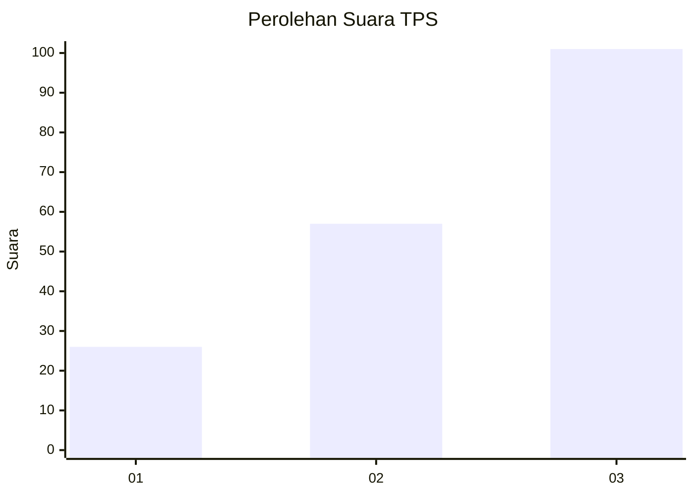
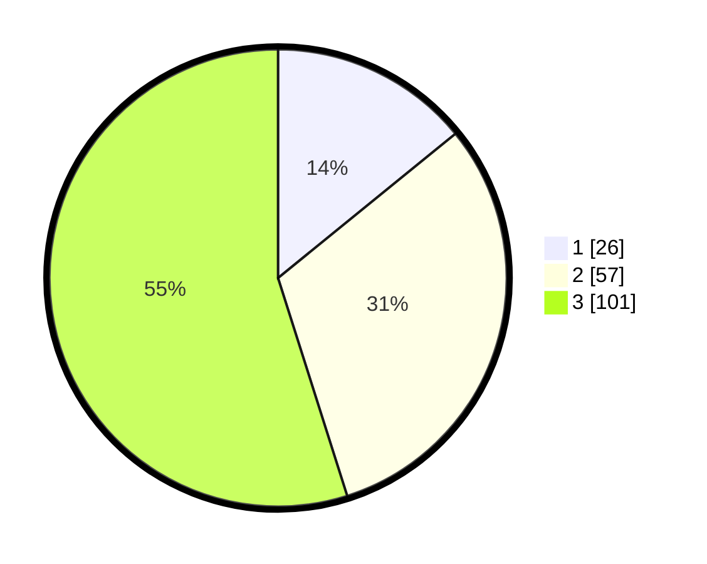

# Hasil

## Grafik

## Tabel

| No. | Nama Paslon    | Suara | Suara (raw) | Persentase |
|:--- |:-------------- | -----:| -----------:| ----------:|
| 1   | ANIES MUHAIMIN | 26    | [26][p-1]   | 14,13      |
| 2   | PRABOWO GIBRAN | 57    | [57][p-2]   | 30,98      |
| 3   | GANJAR MAHFUD  | 101   | [101][p-3]  | 54,89      |

[p-1]: https://github.com/gigit-pemilu/pemilu-2024/blob/main/pilpres/hitung-suara/sub/33-jawa-tengah/sub/08-magelang/sub/15-candimulyo/sub/2014-tampirwetan/sub/002-tps/sub/paslon-1.txt
[p-2]: https://github.com/gigit-pemilu/pemilu-2024/blob/main/pilpres/hitung-suara/sub/33-jawa-tengah/sub/08-magelang/sub/15-candimulyo/sub/2014-tampirwetan/sub/002-tps/sub/paslon-2.txt
[p-3]: https://github.com/gigit-pemilu/pemilu-2024/blob/main/pilpres/hitung-suara/sub/33-jawa-tengah/sub/08-magelang/sub/15-candimulyo/sub/2014-tampirwetan/sub/002-tps/sub/paslon-3.txt

## Foto C Plano

https://sirekap-obj-formc.kpu.go.id/9716/pemilu/ppwp/33/08/15/20/14/3308152014002-20240214-222100--d8beb5e5-9054-491e-9833-a32d0ea1dba4.jpg

https://sirekap-obj-formc.kpu.go.id/9716/pemilu/ppwp/33/08/15/20/14/3308152014002-20240214-222228--6ea3a407-a1c3-4df9-be8d-4ddb42877d8a.jpg

https://sirekap-obj-formc.kpu.go.id/9716/pemilu/ppwp/33/08/15/20/14/3308152014002-20240214-222603--78000452-7966-4bbe-afde-977faf7badd8.jpg

## Metadata

| Key        | Value               |
| ---------- | ------------------- |
| Time Stamp | 2024-02-16 13:30:32 |

