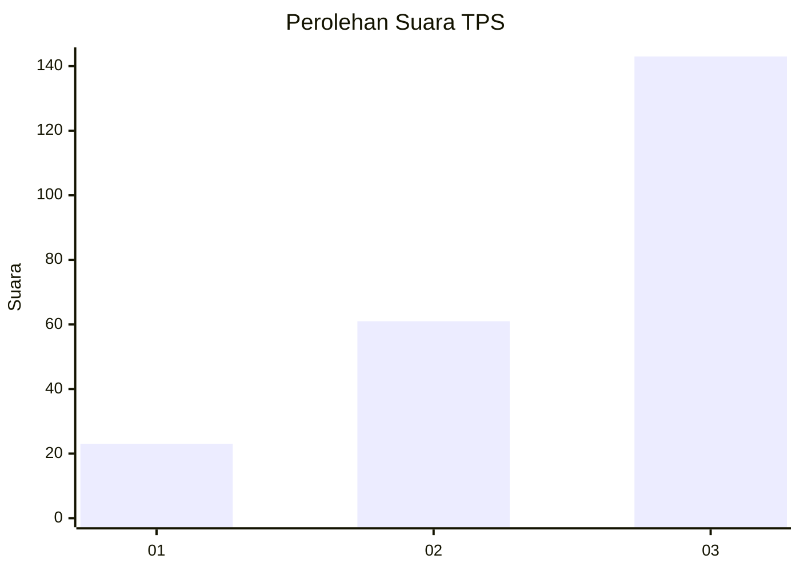
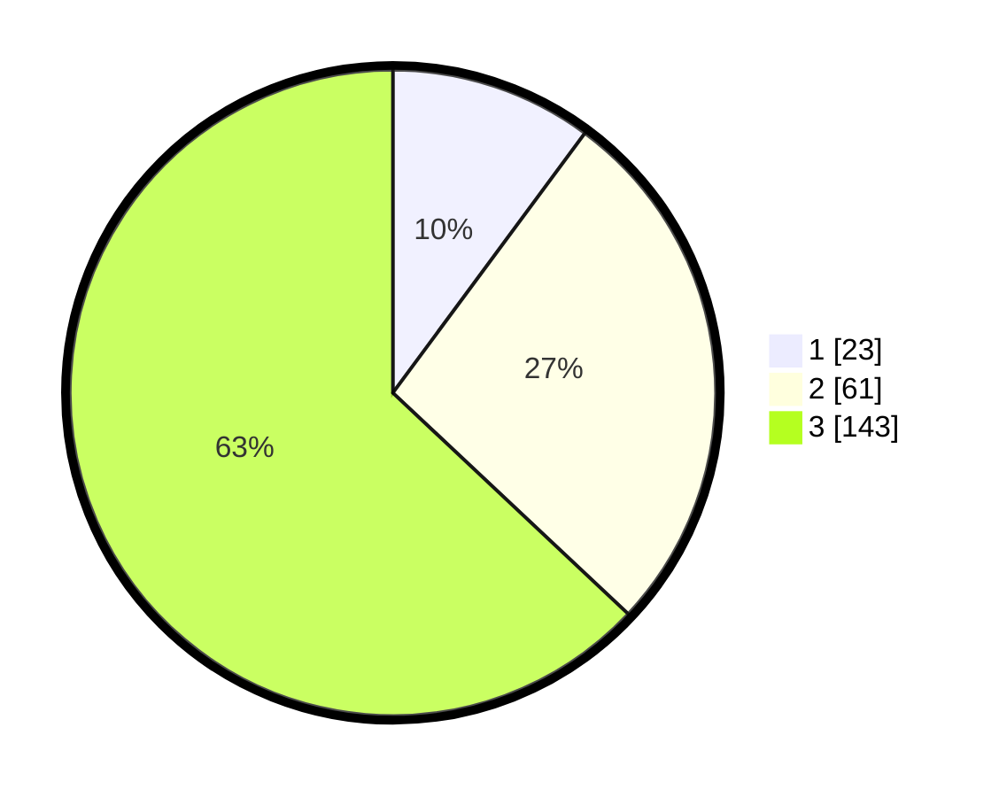

# Hasil

## Grafik

## Tabel

| No. | Nama Paslon    | Suara | Suara (raw) | Persentase |
|:--- |:-------------- | -----:| -----------:| ----------:|
| 1   | ANIES MUHAIMIN | 23    | [23][p-1]   | 10,13      |
| 2   | PRABOWO GIBRAN | 61    | [61][p-2]   | 26,87      |
| 3   | GANJAR MAHFUD  | 143   | [143][p-3]  | 63,00      |

[p-1]: https://github.com/gigit-pemilu/pemilu-2024/blob/main/pilpres/hitung-suara/sub/33-jawa-tengah/sub/08-magelang/sub/15-candimulyo/sub/2014-tampirwetan/sub/004-tps/sub/paslon-1.txt
[p-2]: https://github.com/gigit-pemilu/pemilu-2024/blob/main/pilpres/hitung-suara/sub/33-jawa-tengah/sub/08-magelang/sub/15-candimulyo/sub/2014-tampirwetan/sub/004-tps/sub/paslon-2.txt
[p-3]: https://github.com/gigit-pemilu/pemilu-2024/blob/main/pilpres/hitung-suara/sub/33-jawa-tengah/sub/08-magelang/sub/15-candimulyo/sub/2014-tampirwetan/sub/004-tps/sub/paslon-3.txt

## Foto C Plano

https://sirekap-obj-formc.kpu.go.id/3ea0/pemilu/ppwp/33/08/15/20/14/3308152014004-20240214-230554--d3af3142-a08b-4833-92fc-c3228f7c00a6.jpg

https://sirekap-obj-formc.kpu.go.id/3ea0/pemilu/ppwp/33/08/15/20/14/3308152014004-20240214-230631--77b964a0-4cf3-4ab4-a8e6-9b82de871651.jpg

https://sirekap-obj-formc.kpu.go.id/3ea0/pemilu/ppwp/33/08/15/20/14/3308152014004-20240214-230734--30a9487f-9c0f-4aa0-bc7d-3a8370787688.jpg

## Metadata

| Key        | Value               |
| ---------- | ------------------- |
| Time Stamp | 2024-02-15 19:00:26 |

