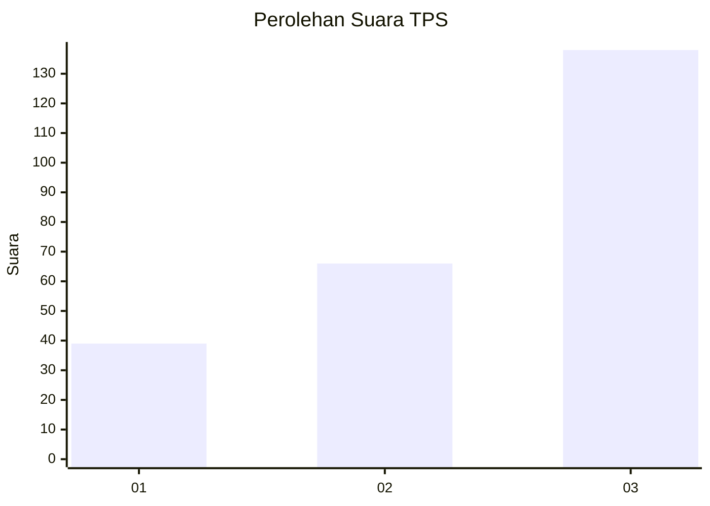
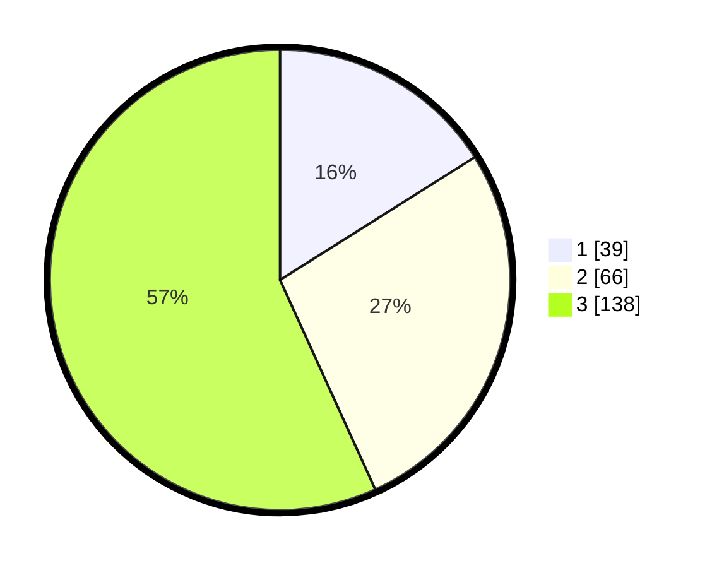

# Hasil

## Grafik

## Tabel

| No. | Nama Paslon    | Suara | Suara (raw) | Persentase |
|:--- |:-------------- | -----:| -----------:| ----------:|
| 1   | ANIES MUHAIMIN | 39    | [39][p-1]   | 16,05      |
| 2   | PRABOWO GIBRAN | 66    | [66][p-2]   | 27,16      |
| 3   | GANJAR MAHFUD  | 138   | [138][p-3]  | 56,79      |

[p-1]: https://github.com/gigit-pemilu/pemilu-2024/blob/main/pilpres/hitung-suara/sub/33-jawa-tengah/sub/08-magelang/sub/15-candimulyo/sub/2018-bateh/sub/008-tps/sub/paslon-1.txt
[p-2]: https://github.com/gigit-pemilu/pemilu-2024/blob/main/pilpres/hitung-suara/sub/33-jawa-tengah/sub/08-magelang/sub/15-candimulyo/sub/2018-bateh/sub/008-tps/sub/paslon-2.txt
[p-3]: https://github.com/gigit-pemilu/pemilu-2024/blob/main/pilpres/hitung-suara/sub/33-jawa-tengah/sub/08-magelang/sub/15-candimulyo/sub/2018-bateh/sub/008-tps/sub/paslon-3.txt

## Foto C Plano

https://sirekap-obj-formc.kpu.go.id/6f77/pemilu/ppwp/33/08/15/20/18/3308152018008-20240215-152823--105d548c-8383-487f-a770-23144b8612bc.jpg

https://sirekap-obj-formc.kpu.go.id/6f77/pemilu/ppwp/33/08/15/20/18/3308152018008-20240214-211255--4bcf6be9-91be-4433-a2e4-c3a0d7cac9f9.jpg

https://sirekap-obj-formc.kpu.go.id/6f77/pemilu/ppwp/33/08/15/20/18/3308152018008-20240214-211303--6fe6ab07-ef81-48f0-8dbc-240ef58c5492.jpg

## Metadata

| Key        | Value               |
| ---------- | ------------------- |
| Time Stamp | 2024-02-16 13:30:32 |

