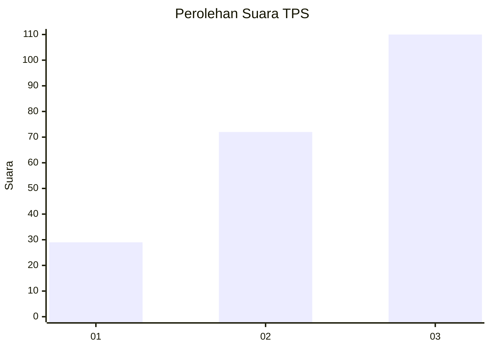
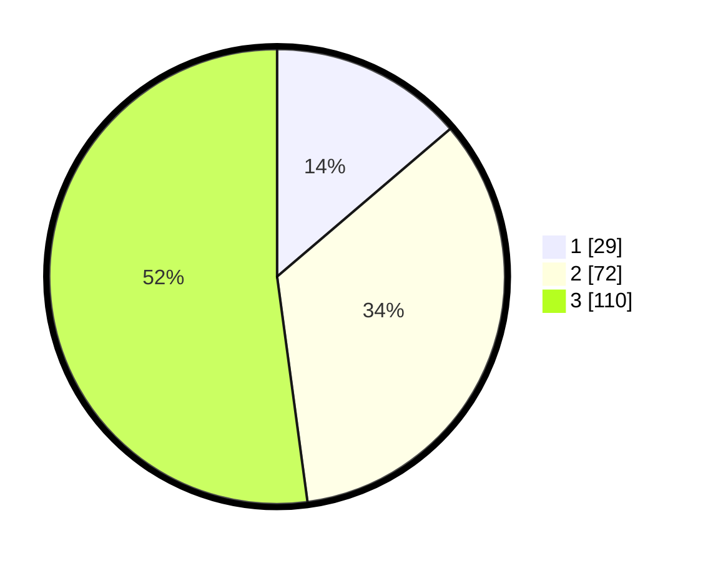

# Hasil

## Grafik

## Tabel

| No. | Nama Paslon    | Suara | Suara (raw) | Persentase |
|:--- |:-------------- | -----:| -----------:| ----------:|
| 1   | ANIES MUHAIMIN | 29    | [29][p-1]   | 13,74      |
| 2   | PRABOWO GIBRAN | 72    | [72][p-2]   | 34,12      |
| 3   | GANJAR MAHFUD  | 110   | [110][p-3]  | 52,13      |

[p-1]: https://github.com/gigit-pemilu/pemilu-2024-33-jawa-tengah/blob/main/pilpres/hitung-suara/sub/33-jawa-tengah/sub/08-magelang/sub/16-pakis/sub/2002-banyusidi/sub/008-tps/sub/paslon-1.txt
[p-2]: https://github.com/gigit-pemilu/pemilu-2024-33-jawa-tengah/blob/main/pilpres/hitung-suara/sub/33-jawa-tengah/sub/08-magelang/sub/16-pakis/sub/2002-banyusidi/sub/008-tps/sub/paslon-2.txt
[p-3]: https://github.com/gigit-pemilu/pemilu-2024-33-jawa-tengah/blob/main/pilpres/hitung-suara/sub/33-jawa-tengah/sub/08-magelang/sub/16-pakis/sub/2002-banyusidi/sub/008-tps/sub/paslon-3.txt

## Foto C Plano

https://sirekap-obj-formc.kpu.go.id/47fd/pemilu/ppwp/33/08/16/20/02/3308162002008-20240216-164215--ad4f9619-a4f7-445c-ad5e-df4cdc8f40d0.jpg

https://sirekap-obj-formc.kpu.go.id/47fd/pemilu/ppwp/33/08/16/20/02/3308162002008-20240214-220815--455cd526-e292-47ac-854c-4cc055f044aa.jpg

https://sirekap-obj-formc.kpu.go.id/47fd/pemilu/ppwp/33/08/16/20/02/3308162002008-20240214-220921--9debab99-8e14-4f79-8a7c-3514ceb63acb.jpg

## Metadata

| Key        | Value               |
| ---------- | ------------------- |
| Time Stamp | 2024-02-19 06:16:00 |

