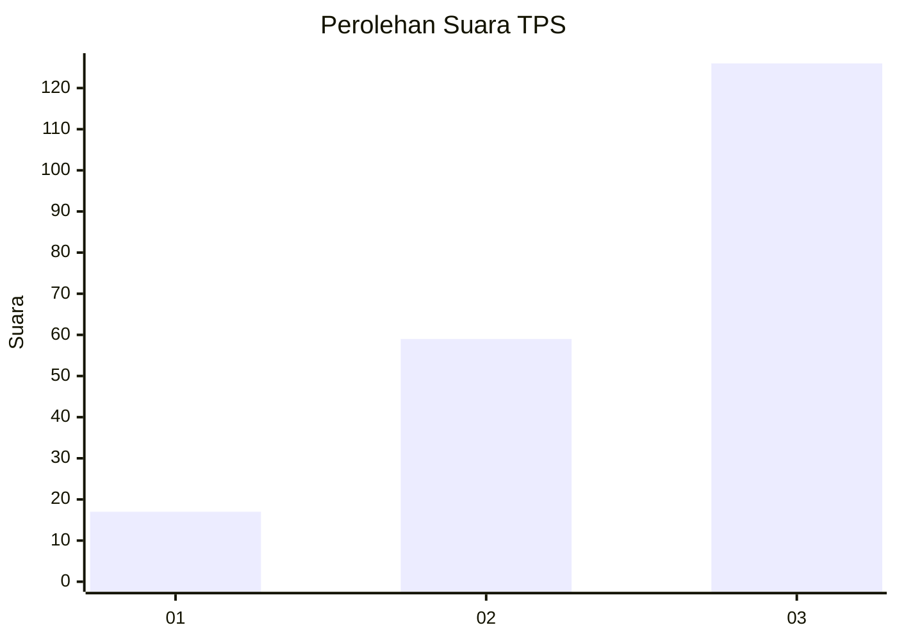
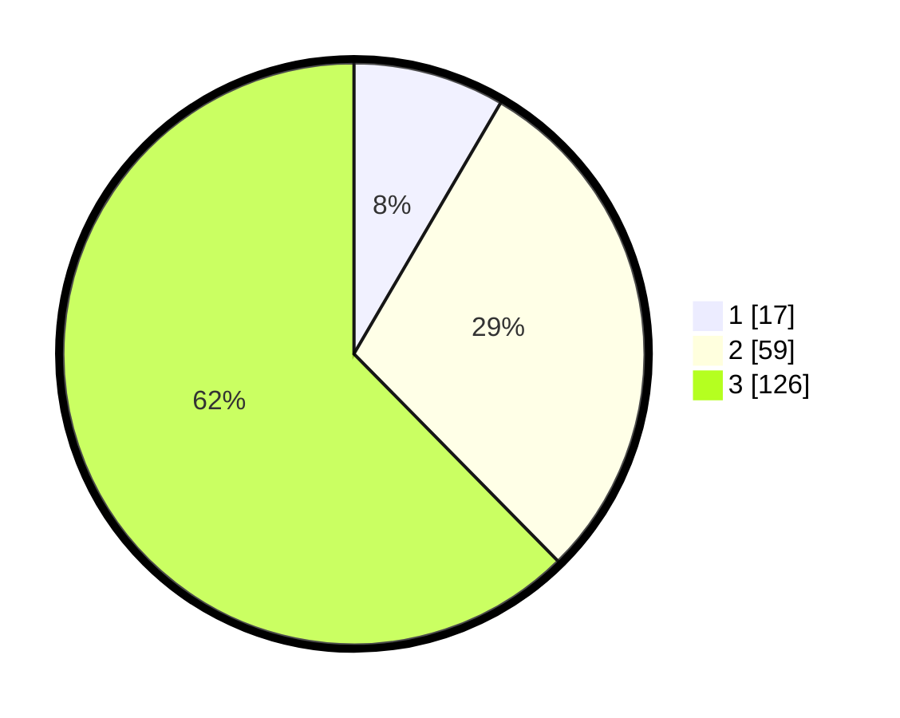

# Hasil

## Grafik

## Tabel

| No. | Nama Paslon    | Suara | Suara (raw) | Persentase |
|:--- |:-------------- | -----:| -----------:| ----------:|
| 1   | ANIES MUHAIMIN | 17    | [17][p-1]   | 8,42       |
| 2   | PRABOWO GIBRAN | 59    | [59][p-2]   | 29,21      |
| 3   | GANJAR MAHFUD  | 126   | [126][p-3]  | 62,38      |

[p-1]: https://github.com/gigit-pemilu/pemilu-2024-33-jawa-tengah/blob/main/pilpres/hitung-suara/sub/33-jawa-tengah/sub/08-magelang/sub/16-pakis/sub/2007-kragilan/sub/001-tps/sub/paslon-1.txt
[p-2]: https://github.com/gigit-pemilu/pemilu-2024-33-jawa-tengah/blob/main/pilpres/hitung-suara/sub/33-jawa-tengah/sub/08-magelang/sub/16-pakis/sub/2007-kragilan/sub/001-tps/sub/paslon-2.txt
[p-3]: https://github.com/gigit-pemilu/pemilu-2024-33-jawa-tengah/blob/main/pilpres/hitung-suara/sub/33-jawa-tengah/sub/08-magelang/sub/16-pakis/sub/2007-kragilan/sub/001-tps/sub/paslon-3.txt

## Foto C Plano

https://sirekap-obj-formc.kpu.go.id/5773/pemilu/ppwp/33/08/16/20/07/3308162007001-20240214-185855--29684496-a530-43af-ab47-697a4152c1f9.jpg

https://sirekap-obj-formc.kpu.go.id/5773/pemilu/ppwp/33/08/16/20/07/3308162007001-20240214-185746--e2453b96-19b0-4fdd-b1c1-ed640eb5f857.jpg

https://sirekap-obj-formc.kpu.go.id/5773/pemilu/ppwp/33/08/16/20/07/3308162007001-20240214-155515--46133d46-ceef-43df-bbb7-cf330cdce948.jpg

## Metadata

| Key        | Value               |
| ---------- | ------------------- |
| Time Stamp | 2024-02-19 06:16:00 |

