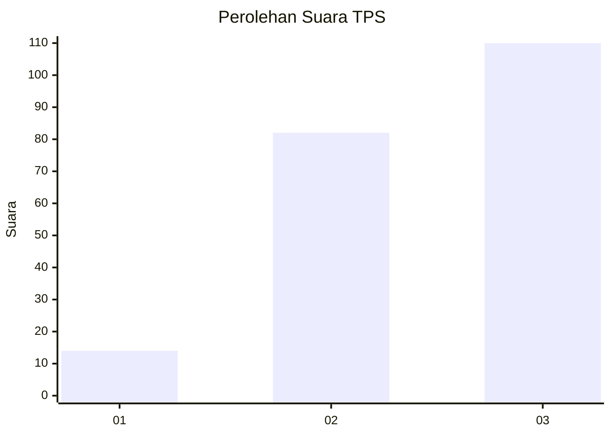
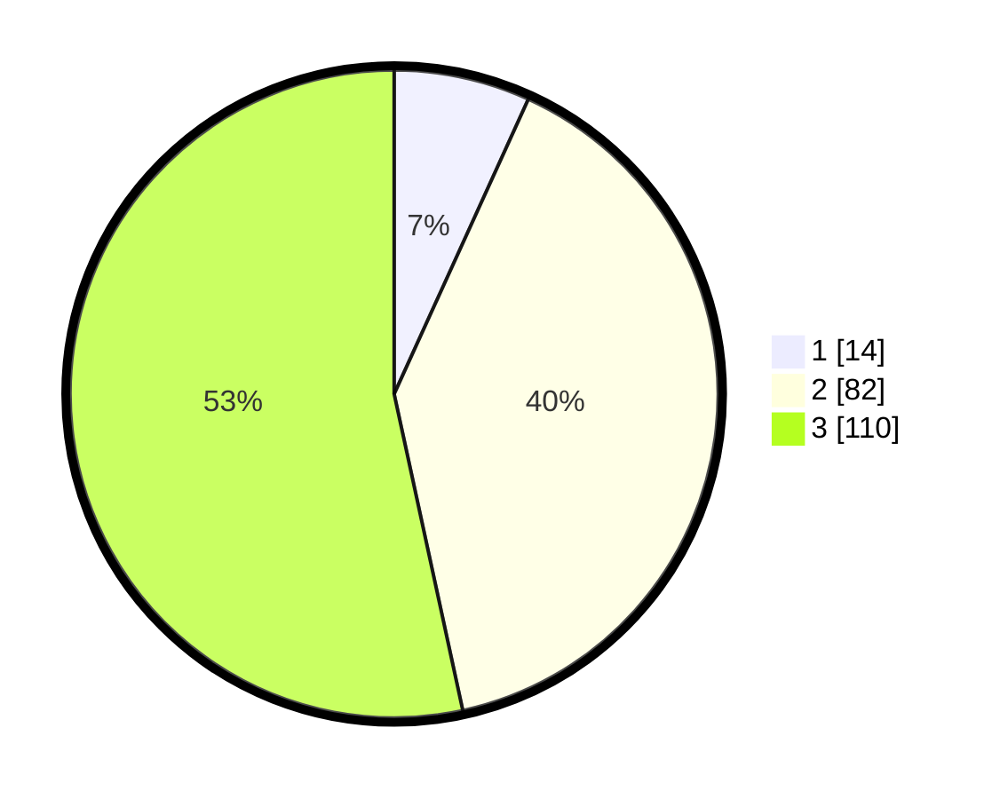

# Hasil

## Grafik

## Tabel

| No. | Nama Paslon    | Suara | Suara (raw) | Persentase |
|:--- |:-------------- | -----:| -----------:| ----------:|
| 1   | ANIES MUHAIMIN | 14    | [14][p-1]   | 6,80       |
| 2   | PRABOWO GIBRAN | 82    | [82][p-2]   | 39,81      |
| 3   | GANJAR MAHFUD  | 110   | [110][p-3]  | 53,40      |

[p-1]: https://github.com/gigit-pemilu/pemilu-2024-33-jawa-tengah/blob/main/pilpres/hitung-suara/sub/33-jawa-tengah/sub/08-magelang/sub/16-pakis/sub/2007-kragilan/sub/005-tps/sub/paslon-1.txt
[p-2]: https://github.com/gigit-pemilu/pemilu-2024-33-jawa-tengah/blob/main/pilpres/hitung-suara/sub/33-jawa-tengah/sub/08-magelang/sub/16-pakis/sub/2007-kragilan/sub/005-tps/sub/paslon-2.txt
[p-3]: https://github.com/gigit-pemilu/pemilu-2024-33-jawa-tengah/blob/main/pilpres/hitung-suara/sub/33-jawa-tengah/sub/08-magelang/sub/16-pakis/sub/2007-kragilan/sub/005-tps/sub/paslon-3.txt

## Foto C Plano

https://sirekap-obj-formc.kpu.go.id/4438/pemilu/ppwp/33/08/16/20/07/3308162007005-20240214-193007--3f612139-2a94-41a2-9490-5d002f711caa.jpg

https://sirekap-obj-formc.kpu.go.id/4438/pemilu/ppwp/33/08/16/20/07/3308162007005-20240214-193039--2430eecc-0c8d-40a8-bbf9-080be0404419.jpg

https://sirekap-obj-formc.kpu.go.id/4438/pemilu/ppwp/33/08/16/20/07/3308162007005-20240214-193047--5a8f2c1e-a11c-4077-b724-3eeeec29a7f6.jpg

## Metadata

| Key        | Value               |
| ---------- | ------------------- |
| Time Stamp | 2024-02-19 06:16:00 |

