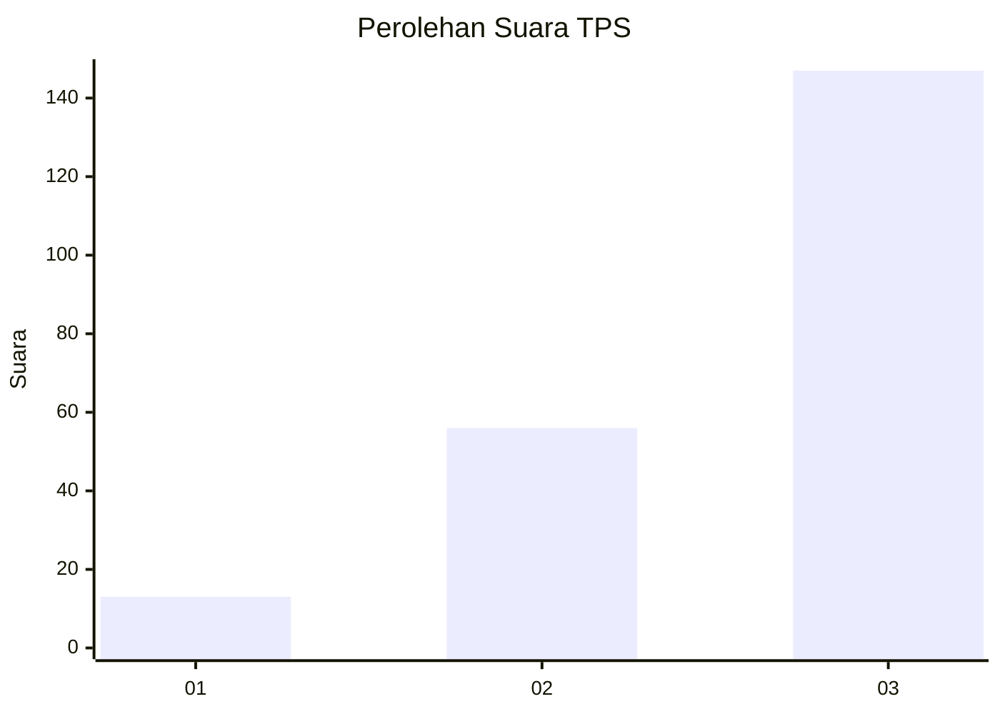
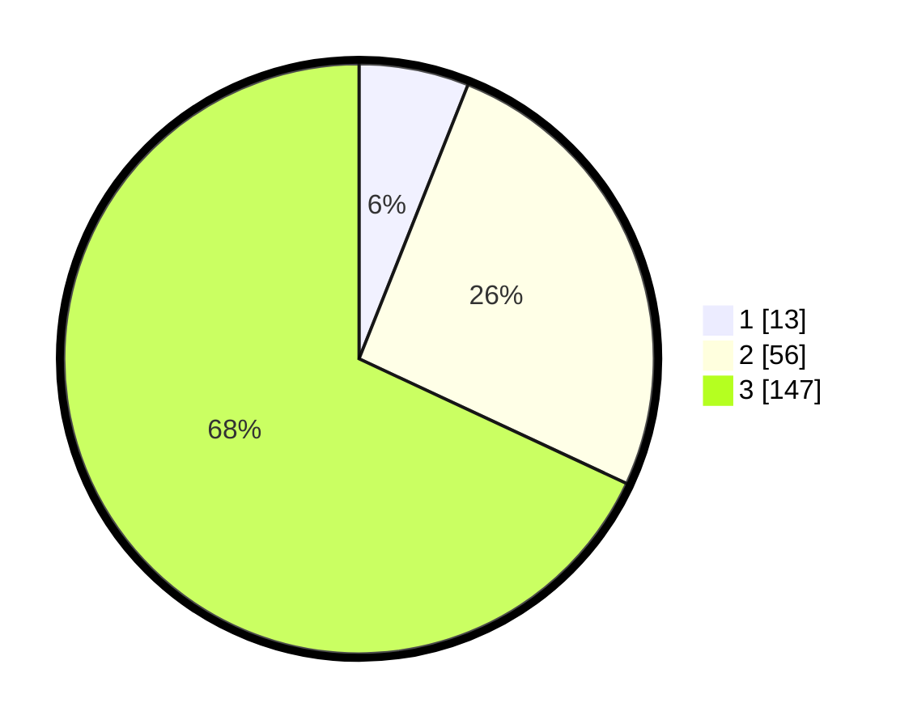

# Hasil

## Grafik

## Tabel

| No. | Nama Paslon    | Suara | Suara (raw) | Persentase |
|:--- |:-------------- | -----:| -----------:| ----------:|
| 1   | ANIES MUHAIMIN | 13    | [13][p-1]   | 6,02       |
| 2   | PRABOWO GIBRAN | 56    | [56][p-2]   | 25,93      |
| 3   | GANJAR MAHFUD  | 147   | [147][p-3]  | 68,06      |

[p-1]: https://github.com/gigit-pemilu/pemilu-2024/blob/main/pilpres/hitung-suara/sub/33-jawa-tengah/sub/08-magelang/sub/16-pakis/sub/2010-petung/sub/006-tps/sub/paslon-1.txt
[p-2]: https://github.com/gigit-pemilu/pemilu-2024/blob/main/pilpres/hitung-suara/sub/33-jawa-tengah/sub/08-magelang/sub/16-pakis/sub/2010-petung/sub/006-tps/sub/paslon-2.txt
[p-3]: https://github.com/gigit-pemilu/pemilu-2024/blob/main/pilpres/hitung-suara/sub/33-jawa-tengah/sub/08-magelang/sub/16-pakis/sub/2010-petung/sub/006-tps/sub/paslon-3.txt

## Foto C Plano

https://sirekap-obj-formc.kpu.go.id/2855/pemilu/ppwp/33/08/16/20/10/3308162010006-20240215-020306--160294f9-2160-445a-a3bc-d1e46b74e341.jpg

https://sirekap-obj-formc.kpu.go.id/2855/pemilu/ppwp/33/08/16/20/10/3308162010006-20240214-202517--ec0b9361-761f-4465-ab3a-45b28f3a6002.jpg

https://sirekap-obj-formc.kpu.go.id/2855/pemilu/ppwp/33/08/16/20/10/3308162010006-20240214-202746--9dceb9d0-f593-4d71-8f85-7b28e4212028.jpg

## Metadata

| Key        | Value               |
| ---------- | ------------------- |
| Time Stamp | 2024-02-19 06:16:00 |

