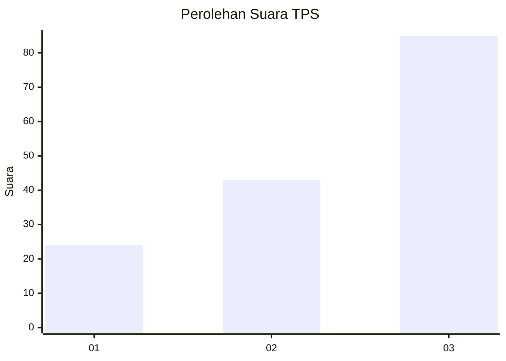
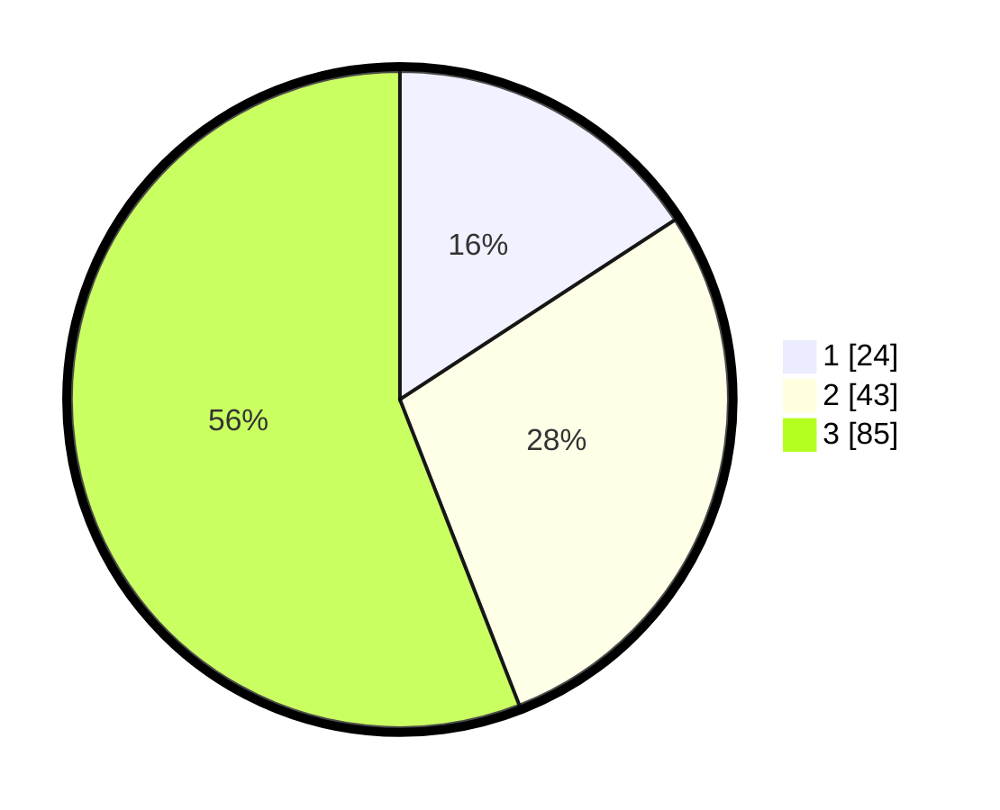

# Hasil

## Grafik

## Tabel

| No. | Nama Paslon    | Suara | Suara (raw) | Persentase |
|:--- |:-------------- | -----:| -----------:| ----------:|
| 1   | ANIES MUHAIMIN | 24    | [24][p-1]   | 15,79      |
| 2   | PRABOWO GIBRAN | 43    | [43][p-2]   | 28,29      |
| 3   | GANJAR MAHFUD  | 85    | [85][p-3]   | 55,92      |

[p-1]: https://github.com/gigit-pemilu/pemilu-2024-33-jawa-tengah/blob/main/pilpres/hitung-suara/sub/33-jawa-tengah/sub/08-magelang/sub/16-pakis/sub/2010-petung/sub/011-tps/sub/paslon-1.txt
[p-2]: https://github.com/gigit-pemilu/pemilu-2024-33-jawa-tengah/blob/main/pilpres/hitung-suara/sub/33-jawa-tengah/sub/08-magelang/sub/16-pakis/sub/2010-petung/sub/011-tps/sub/paslon-2.txt
[p-3]: https://github.com/gigit-pemilu/pemilu-2024-33-jawa-tengah/blob/main/pilpres/hitung-suara/sub/33-jawa-tengah/sub/08-magelang/sub/16-pakis/sub/2010-petung/sub/011-tps/sub/paslon-3.txt

## Foto C Plano

https://sirekap-obj-formc.kpu.go.id/2dae/pemilu/ppwp/33/08/16/20/10/3308162010011-20240214-220621--1b4aa5e6-4195-46ae-835f-9ac1d5c188a9.jpg

https://sirekap-obj-formc.kpu.go.id/2dae/pemilu/ppwp/33/08/16/20/10/3308162010011-20240214-220342--2932d469-fae8-4da6-9d24-e9948632cf9e.jpg

https://sirekap-obj-formc.kpu.go.id/2dae/pemilu/ppwp/33/08/16/20/10/3308162010011-20240214-220158--b5f5bb74-9a1f-4608-baa9-229f674d324a.jpg

## Metadata

| Key        | Value               |
| ---------- | ------------------- |
| Time Stamp | 2024-02-17 16:36:25 |

