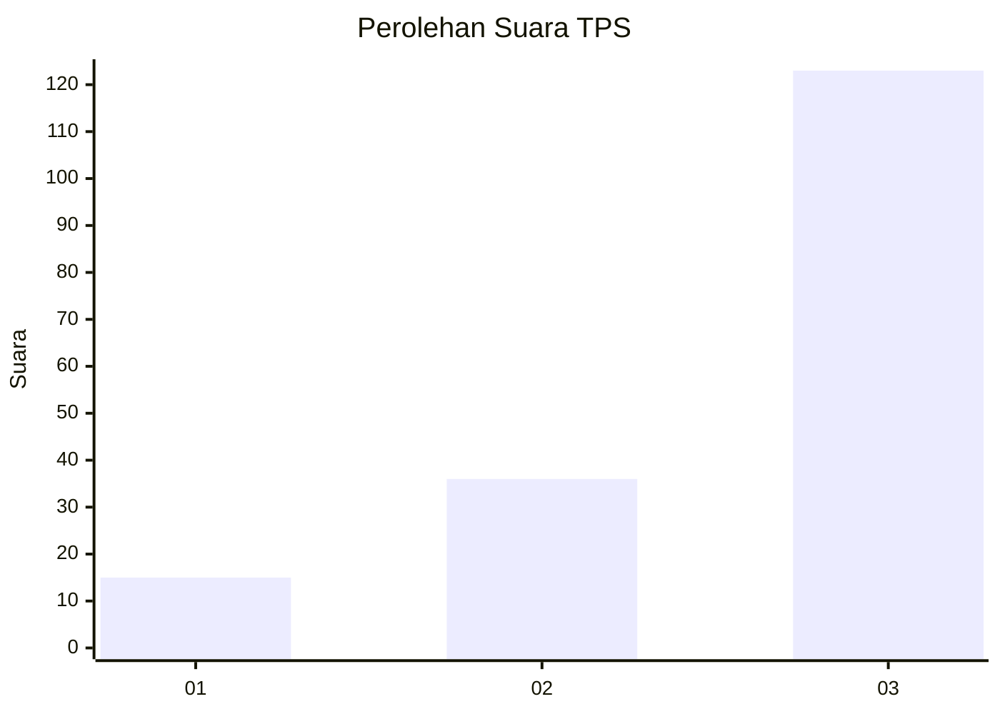
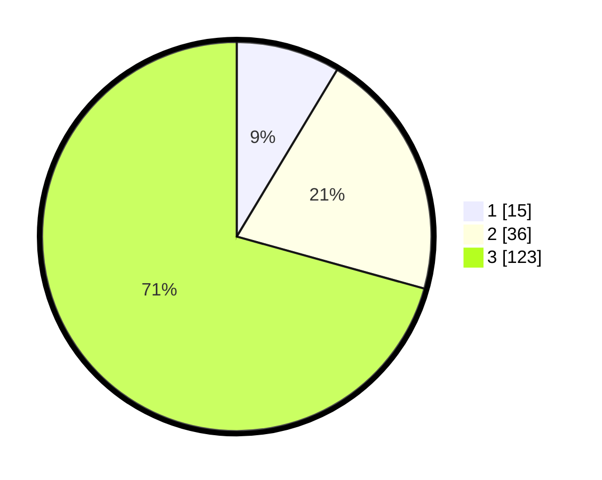

# Hasil

## Grafik

## Tabel

| No. | Nama Paslon    | Suara | Suara (raw) | Persentase |
|:--- |:-------------- | -----:| -----------:| ----------:|
| 1   | ANIES MUHAIMIN | 15    | [15][p-1]   | 8,62       |
| 2   | PRABOWO GIBRAN | 36    | [36][p-2]   | 20,69      |
| 3   | GANJAR MAHFUD  | 123   | [123][p-3]  | 70,69      |

[p-1]: https://github.com/gigit-pemilu/pemilu-2024/blob/main/pilpres/hitung-suara/sub/33-jawa-tengah/sub/08-magelang/sub/16-pakis/sub/2010-petung/sub/012-tps/sub/paslon-1.txt
[p-2]: https://github.com/gigit-pemilu/pemilu-2024/blob/main/pilpres/hitung-suara/sub/33-jawa-tengah/sub/08-magelang/sub/16-pakis/sub/2010-petung/sub/012-tps/sub/paslon-2.txt
[p-3]: https://github.com/gigit-pemilu/pemilu-2024/blob/main/pilpres/hitung-suara/sub/33-jawa-tengah/sub/08-magelang/sub/16-pakis/sub/2010-petung/sub/012-tps/sub/paslon-3.txt

## Foto C Plano

https://sirekap-obj-formc.kpu.go.id/904d/pemilu/ppwp/33/08/16/20/10/3308162010012-20240215-001003--7a3b0cf2-f104-4855-8f1a-c4811697c7bb.jpg

https://sirekap-obj-formc.kpu.go.id/904d/pemilu/ppwp/33/08/16/20/10/3308162010012-20240215-001226--29464300-c138-4473-a81a-e2050e73946e.jpg

https://sirekap-obj-formc.kpu.go.id/904d/pemilu/ppwp/33/08/16/20/10/3308162010012-20240215-001427--56cf4a07-8217-45db-bbfb-23935609e6a1.jpg

## Metadata

| Key        | Value               |
| ---------- | ------------------- |
| Time Stamp | 2024-02-19 06:16:00 |

