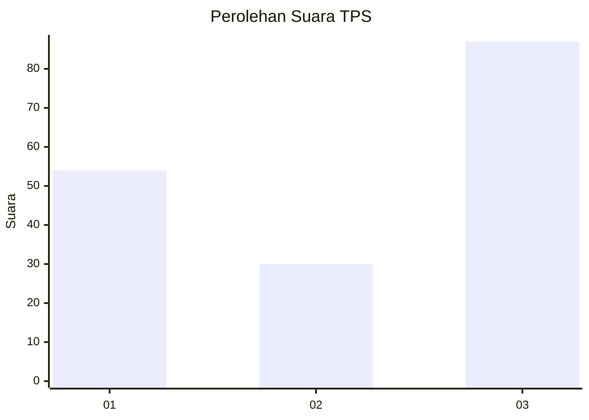
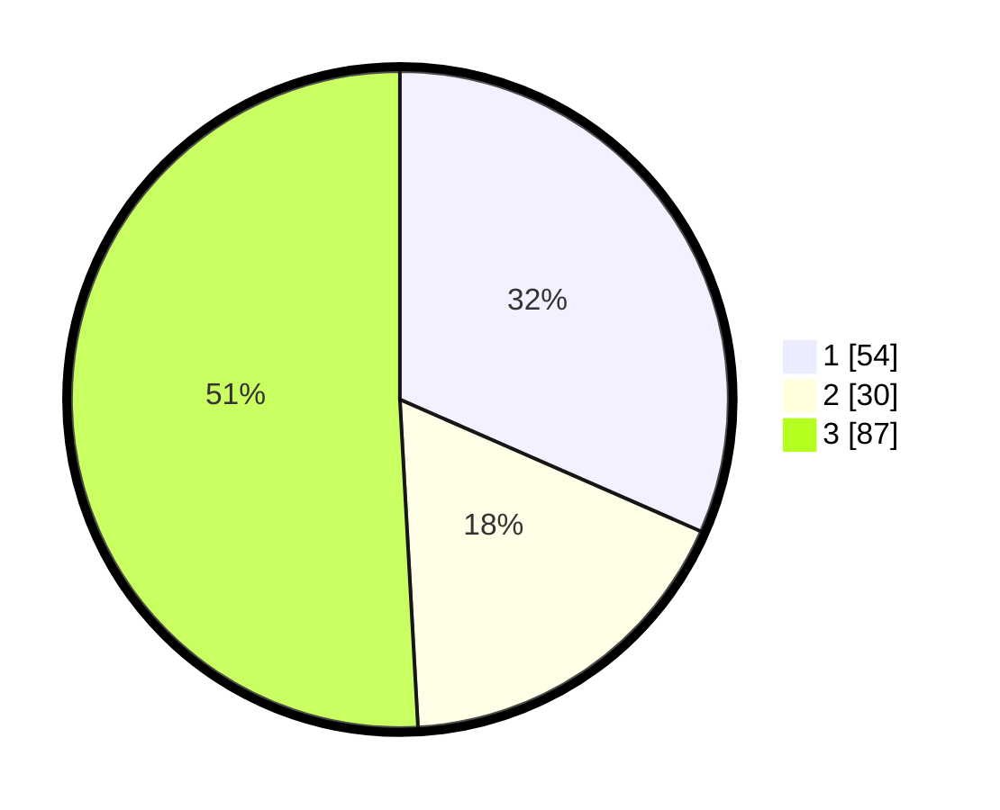

# Hasil

## Grafik

## Tabel

| No. | Nama Paslon    | Suara | Suara (raw) | Persentase |
|:--- |:-------------- | -----:| -----------:| ----------:|
| 1   | ANIES MUHAIMIN | 54    | [54][p-1]   | 31,58      |
| 2   | PRABOWO GIBRAN | 30    | [30][p-2]   | 17,54      |
| 3   | GANJAR MAHFUD  | 87    | [87][p-3]   | 50,88      |

[p-1]: https://github.com/gigit-pemilu/pemilu-2024-33-jawa-tengah/blob/main/pilpres/hitung-suara/sub/33-jawa-tengah/sub/08-magelang/sub/16-pakis/sub/2019-muneng/sub/004-tps/sub/paslon-1.txt
[p-2]: https://github.com/gigit-pemilu/pemilu-2024-33-jawa-tengah/blob/main/pilpres/hitung-suara/sub/33-jawa-tengah/sub/08-magelang/sub/16-pakis/sub/2019-muneng/sub/004-tps/sub/paslon-2.txt
[p-3]: https://github.com/gigit-pemilu/pemilu-2024-33-jawa-tengah/blob/main/pilpres/hitung-suara/sub/33-jawa-tengah/sub/08-magelang/sub/16-pakis/sub/2019-muneng/sub/004-tps/sub/paslon-3.txt

## Foto C Plano

https://sirekap-obj-formc.kpu.go.id/913d/pemilu/ppwp/33/08/16/20/19/3308162019004-20240216-142158--7c68d9f4-3df2-440d-9c02-22ba3c41f7cc.jpg

https://sirekap-obj-formc.kpu.go.id/913d/pemilu/ppwp/33/08/16/20/19/3308162019004-20240216-135302--99a08c3d-d5a1-42b9-99ba-64d0419fbf6a.jpg

https://sirekap-obj-formc.kpu.go.id/913d/pemilu/ppwp/33/08/16/20/19/3308162019004-20240216-140543--7421a265-01e1-4543-9ee3-526ceaca4bb2.jpg

## Metadata

| Key        | Value               |
| ---------- | ------------------- |
| Time Stamp | 2024-02-19 06:16:00 |

