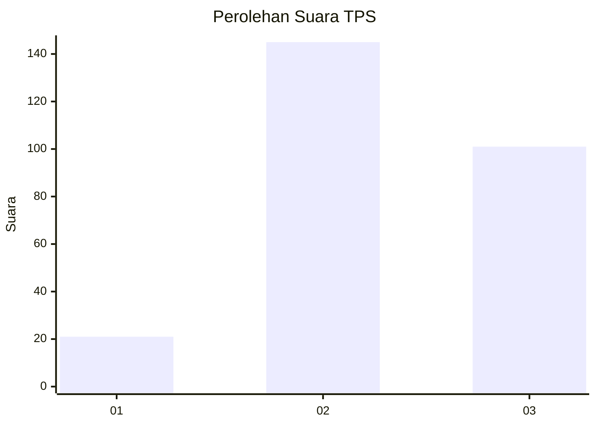
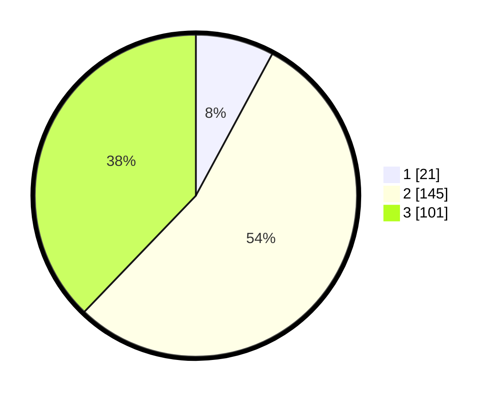

# Hasil

## Grafik

## Tabel

| No. | Nama Paslon    | Suara | Suara (raw) | Persentase |
|:--- |:-------------- | -----:| -----------:| ----------:|
| 1   | ANIES MUHAIMIN | 21    | [21][p-1]   | 7,87       |
| 2   | PRABOWO GIBRAN | 145   | [145][p-2]  | 54,31      |
| 3   | GANJAR MAHFUD  | 101   | [101][p-3]  | 37,83      |

[p-1]: https://github.com/gigit-pemilu/pemilu-2024/blob/main/pilpres/hitung-suara/sub/33-jawa-tengah/sub/08-magelang/sub/17-ngablak/sub/2001-ngablak/sub/002-tps/sub/paslon-1.txt
[p-2]: https://github.com/gigit-pemilu/pemilu-2024/blob/main/pilpres/hitung-suara/sub/33-jawa-tengah/sub/08-magelang/sub/17-ngablak/sub/2001-ngablak/sub/002-tps/sub/paslon-2.txt
[p-3]: https://github.com/gigit-pemilu/pemilu-2024/blob/main/pilpres/hitung-suara/sub/33-jawa-tengah/sub/08-magelang/sub/17-ngablak/sub/2001-ngablak/sub/002-tps/sub/paslon-3.txt

## Foto C Plano

https://sirekap-obj-formc.kpu.go.id/72e4/pemilu/ppwp/33/08/17/20/01/3308172001002-20240215-234258--0d4a2fc9-11d1-4773-9cb8-38509221589e.jpg

https://sirekap-obj-formc.kpu.go.id/72e4/pemilu/ppwp/33/08/17/20/01/3308172001002-20240215-234300--13b2a121-e5f4-4477-83b7-1cc1a03ae812.jpg

https://sirekap-obj-formc.kpu.go.id/72e4/pemilu/ppwp/33/08/17/20/01/3308172001002-20240215-234259--f0e607b5-18d7-4b4a-b993-fc38cf2b5398.jpg

## Metadata

| Key        | Value               |
| ---------- | ------------------- |
| Time Stamp | 2024-02-16 08:30:27 |

## DATA PEMILIH TETAP

Jumlah pemilih dalam DPT: **284**.
 * L: **143**.
 * P: **141**.

## DATA PENGGUNA HAK PILIH

Jumlah pengguna hak pilih dalam DPT: **267**.
 * L: **131**.
 * P: **136**.

Jumlah pengguna hak pilih dalam DPTb: **0**.
 * L: **0**.
 * P: **0**.

Jumlah pengguna hak pilih dalam DPK: **5**.
 * L: **3**.
 * P: **2**.

Jumlah pengguna hak pilih: **272**.
 * L: **134**.
 * P: **138**.

## JUMLAH SUARA SAH DAN TIDAK SAH

JUMLAH SELURUH SUARA SAH: **267**.

JUMLAH SUARA TIDAK SAH: **5**.

JUMLAH SELURUH SUARA SAH DAN SUARA TIDAK SAH: **272**.

