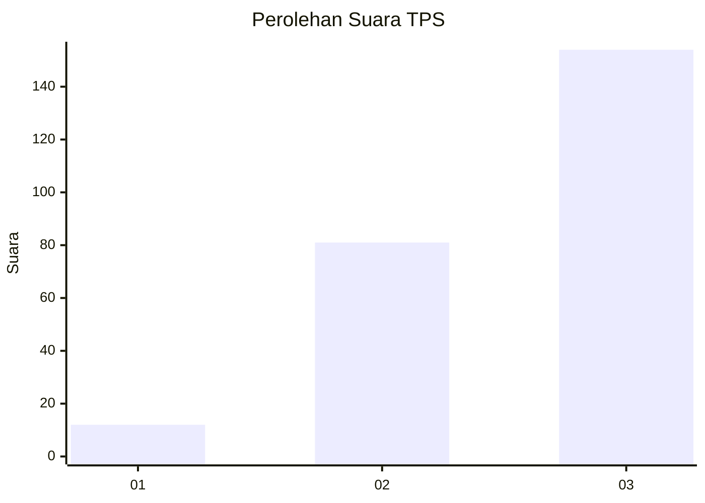
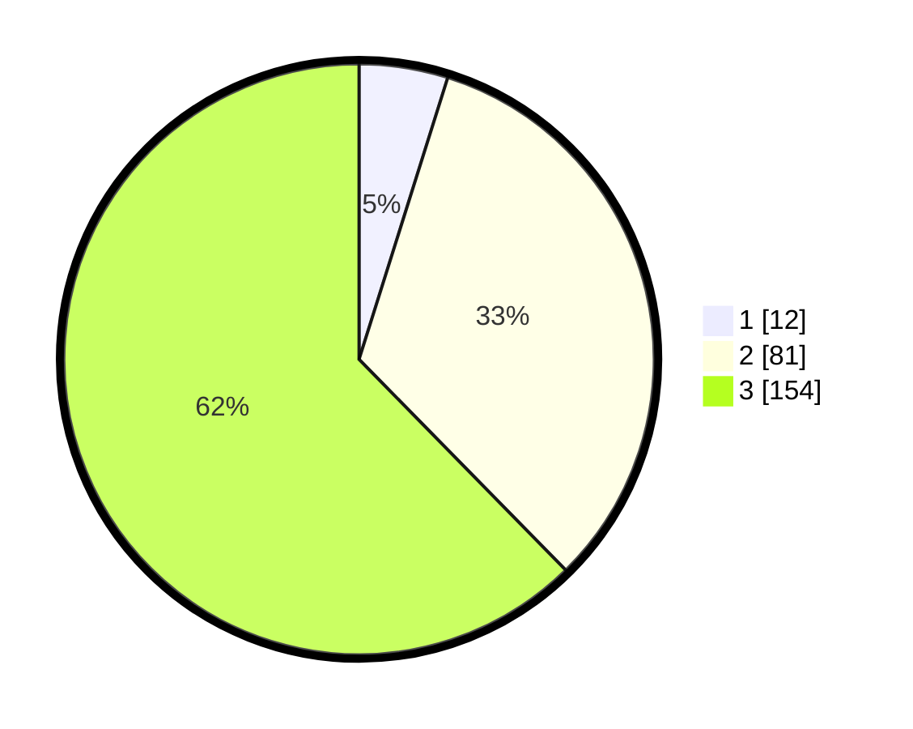

# Hasil

## Grafik

## Tabel

| No. | Nama Paslon    | Suara | Suara (raw) | Persentase |
|:--- |:-------------- | -----:| -----------:| ----------:|
| 1   | ANIES MUHAIMIN | 12    | [12][p-1]   | 4,86       |
| 2   | PRABOWO GIBRAN | 81    | [81][p-2]   | 32,79      |
| 3   | GANJAR MAHFUD  | 154   | [154][p-3]  | 62,35      |

[p-1]: https://github.com/gigit-pemilu/pemilu-2024/blob/main/pilpres/hitung-suara/sub/33-jawa-tengah/sub/08-magelang/sub/17-ngablak/sub/2010-jogoyasan/sub/003-tps/sub/paslon-1.txt
[p-2]: https://github.com/gigit-pemilu/pemilu-2024/blob/main/pilpres/hitung-suara/sub/33-jawa-tengah/sub/08-magelang/sub/17-ngablak/sub/2010-jogoyasan/sub/003-tps/sub/paslon-2.txt
[p-3]: https://github.com/gigit-pemilu/pemilu-2024/blob/main/pilpres/hitung-suara/sub/33-jawa-tengah/sub/08-magelang/sub/17-ngablak/sub/2010-jogoyasan/sub/003-tps/sub/paslon-3.txt

## Foto C Plano

https://sirekap-obj-formc.kpu.go.id/4184/pemilu/ppwp/33/08/17/20/10/3308172010003-20240215-011638--d95cb46b-d91b-4626-9f1d-4ed84bfb54b1.jpg

https://sirekap-obj-formc.kpu.go.id/4184/pemilu/ppwp/33/08/17/20/10/3308172010003-20240215-011736--34aa3c10-b25a-45a2-b4f1-357d841dbf2e.jpg

https://sirekap-obj-formc.kpu.go.id/4184/pemilu/ppwp/33/08/17/20/10/3308172010003-20240215-011437--76afc9e7-e6e1-4dfb-877e-39cea83919df.jpg

## Metadata

| Key        | Value               |
| ---------- | ------------------- |
| Time Stamp | 2024-02-16 10:00:28 |

