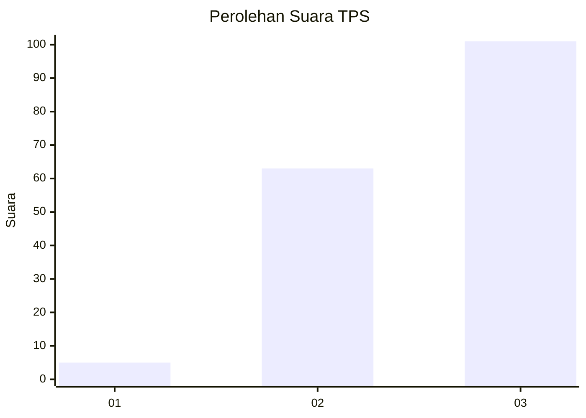
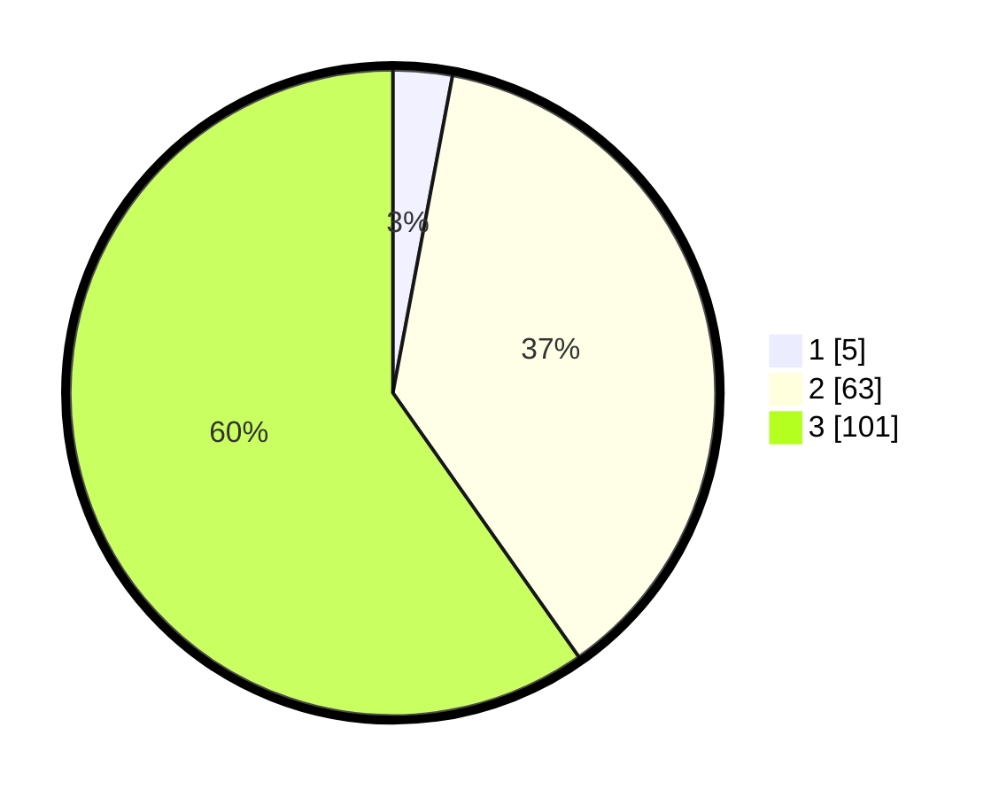

# Hasil

## Grafik

## Tabel

| No. | Nama Paslon    | Suara | Suara (raw) | Persentase |
|:--- |:-------------- | -----:| -----------:| ----------:|
| 1   | ANIES MUHAIMIN | 5     | [5][p-1]    | 2,96       |
| 2   | PRABOWO GIBRAN | 63    | [63][p-2]   | 37,28      |
| 3   | GANJAR MAHFUD  | 101   | [101][p-3]  | 59,76      |

[p-1]: https://github.com/gigit-pemilu/pemilu-2024-33-jawa-tengah/blob/main/pilpres/hitung-suara/sub/33-jawa-tengah/sub/08-magelang/sub/17-ngablak/sub/2013-kanigoro/sub/001-tps/sub/paslon-1.txt
[p-2]: https://github.com/gigit-pemilu/pemilu-2024-33-jawa-tengah/blob/main/pilpres/hitung-suara/sub/33-jawa-tengah/sub/08-magelang/sub/17-ngablak/sub/2013-kanigoro/sub/001-tps/sub/paslon-2.txt
[p-3]: https://github.com/gigit-pemilu/pemilu-2024-33-jawa-tengah/blob/main/pilpres/hitung-suara/sub/33-jawa-tengah/sub/08-magelang/sub/17-ngablak/sub/2013-kanigoro/sub/001-tps/sub/paslon-3.txt

## Foto C Plano

https://sirekap-obj-formc.kpu.go.id/eec0/pemilu/ppwp/33/08/17/20/13/3308172013001-20240217-160317--a7ceb5d8-588a-4996-8895-29675c777818.jpg

https://sirekap-obj-formc.kpu.go.id/eec0/pemilu/ppwp/33/08/17/20/13/3308172013001-20240217-160737--56d40051-e621-4fe3-b0fc-adb75632b9f6.jpg

https://sirekap-obj-formc.kpu.go.id/eec0/pemilu/ppwp/33/08/17/20/13/3308172013001-20240217-160556--ed9ce0ca-7be7-49c7-8e4a-419895e26905.jpg

## Metadata

| Key        | Value               |
| ---------- | ------------------- |
| Time Stamp | 2024-02-17 16:36:25 |

