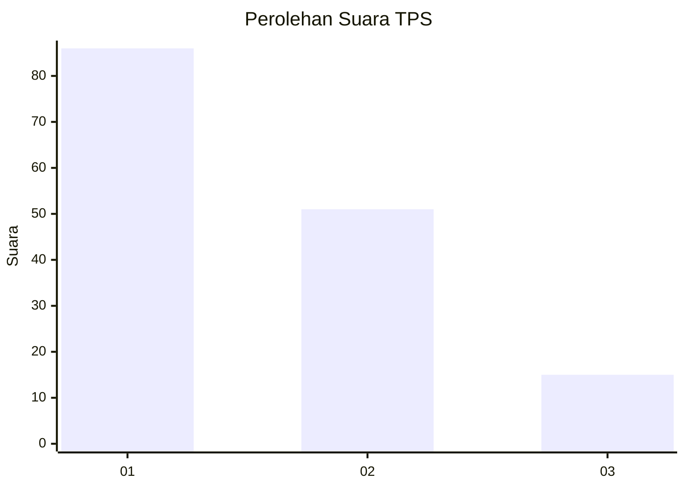
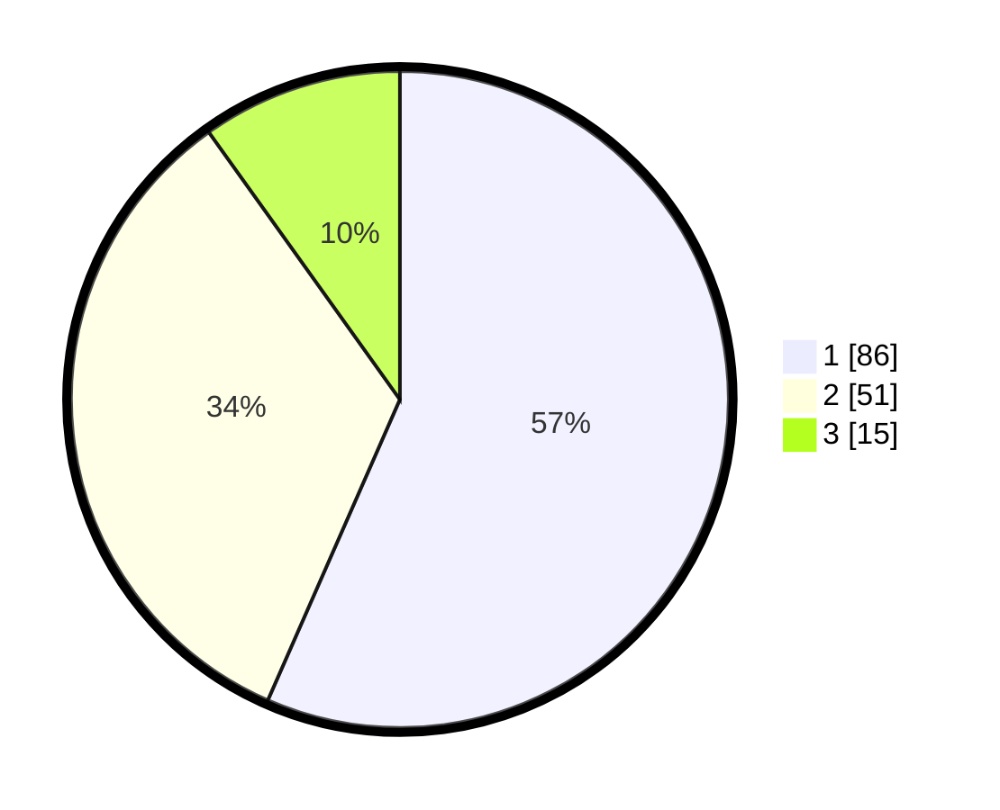

# Hasil

## Grafik

## Tabel

| No. | Nama Paslon    | Suara | Suara (raw) | Persentase |
|:--- |:-------------- | -----:| -----------:| ----------:|
| 1   | ANIES MUHAIMIN | 86    | [86][p-1]   | 56,58      |
| 2   | PRABOWO GIBRAN | 51    | [51][p-2]   | 33,55      |
| 3   | GANJAR MAHFUD  | 15    | [15][p-3]   | 9,87       |

[p-1]: https://github.com/gigit-pemilu/pemilu-2024/blob/main/pilpres/hitung-suara/sub/33-jawa-tengah/sub/08-magelang/sub/18-grabag/sub/2001-grabag/sub/012-tps/sub/paslon-1.txt
[p-2]: https://github.com/gigit-pemilu/pemilu-2024/blob/main/pilpres/hitung-suara/sub/33-jawa-tengah/sub/08-magelang/sub/18-grabag/sub/2001-grabag/sub/012-tps/sub/paslon-2.txt
[p-3]: https://github.com/gigit-pemilu/pemilu-2024/blob/main/pilpres/hitung-suara/sub/33-jawa-tengah/sub/08-magelang/sub/18-grabag/sub/2001-grabag/sub/012-tps/sub/paslon-3.txt

## Foto C Plano

https://sirekap-obj-formc.kpu.go.id/bf00/pemilu/ppwp/33/08/18/20/01/3308182001012-20240214-141735--5a27ea5c-24e7-48d9-83e5-1b7713757ac7.jpg

https://sirekap-obj-formc.kpu.go.id/bf00/pemilu/ppwp/33/08/18/20/01/3308182001012-20240214-141826--98352102-5fb4-4e15-876a-87be87f0b96b.jpg

https://sirekap-obj-formc.kpu.go.id/bf00/pemilu/ppwp/33/08/18/20/01/3308182001012-20240214-233048--3902c2b6-8dc0-4dd6-90b7-caa7187a8590.jpg

## Metadata

| Key        | Value               |
| ---------- | ------------------- |
| Time Stamp | 2024-02-15 19:30:26 |

