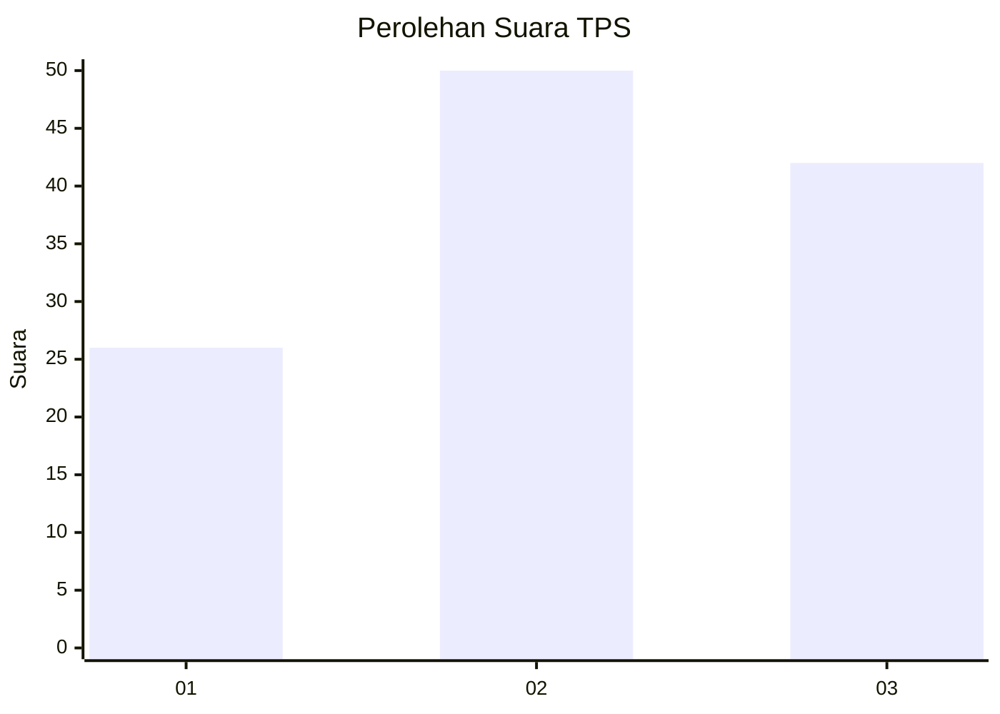
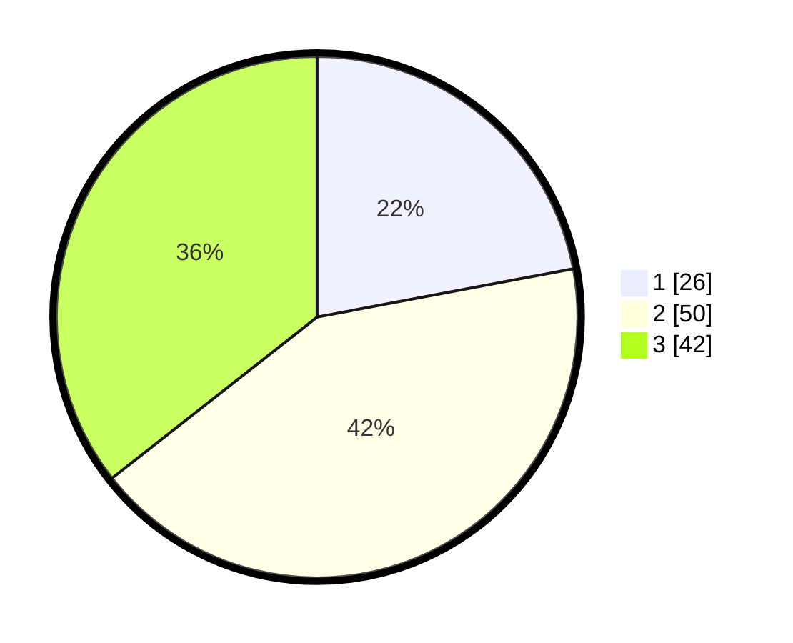

# Hasil

## Grafik

## Tabel

| No. | Nama Paslon    | Suara | Suara (raw) | Persentase |
|:--- |:-------------- | -----:| -----------:| ----------:|
| 1   | ANIES MUHAIMIN | 26    | [26][p-1]   | 22,03      |
| 2   | PRABOWO GIBRAN | 50    | [50][p-2]   | 42,37      |
| 3   | GANJAR MAHFUD  | 42    | [42][p-3]   | 35,59      |

[p-1]: https://github.com/gigit-pemilu/pemilu-2024/blob/main/pilpres/hitung-suara/sub/33-jawa-tengah/sub/08-magelang/sub/18-grabag/sub/2001-grabag/sub/015-tps/sub/paslon-1.txt
[p-2]: https://github.com/gigit-pemilu/pemilu-2024/blob/main/pilpres/hitung-suara/sub/33-jawa-tengah/sub/08-magelang/sub/18-grabag/sub/2001-grabag/sub/015-tps/sub/paslon-2.txt
[p-3]: https://github.com/gigit-pemilu/pemilu-2024/blob/main/pilpres/hitung-suara/sub/33-jawa-tengah/sub/08-magelang/sub/18-grabag/sub/2001-grabag/sub/015-tps/sub/paslon-3.txt

## Foto C Plano

https://sirekap-obj-formc.kpu.go.id/29f4/pemilu/ppwp/33/08/18/20/01/3308182001015-20240214-205802--addf4096-ee17-499f-aafe-36366d368c1e.jpg

https://sirekap-obj-formc.kpu.go.id/29f4/pemilu/ppwp/33/08/18/20/01/3308182001015-20240214-215707--27cd297d-13d1-4337-82a5-1a20b709c47f.jpg

https://sirekap-obj-formc.kpu.go.id/29f4/pemilu/ppwp/33/08/18/20/01/3308182001015-20240214-210206--1c7ec484-c436-4683-846a-e8164ba97d57.jpg

## Metadata

| Key        | Value               |
| ---------- | ------------------- |
| Time Stamp | 2024-02-15 18:30:25 |

