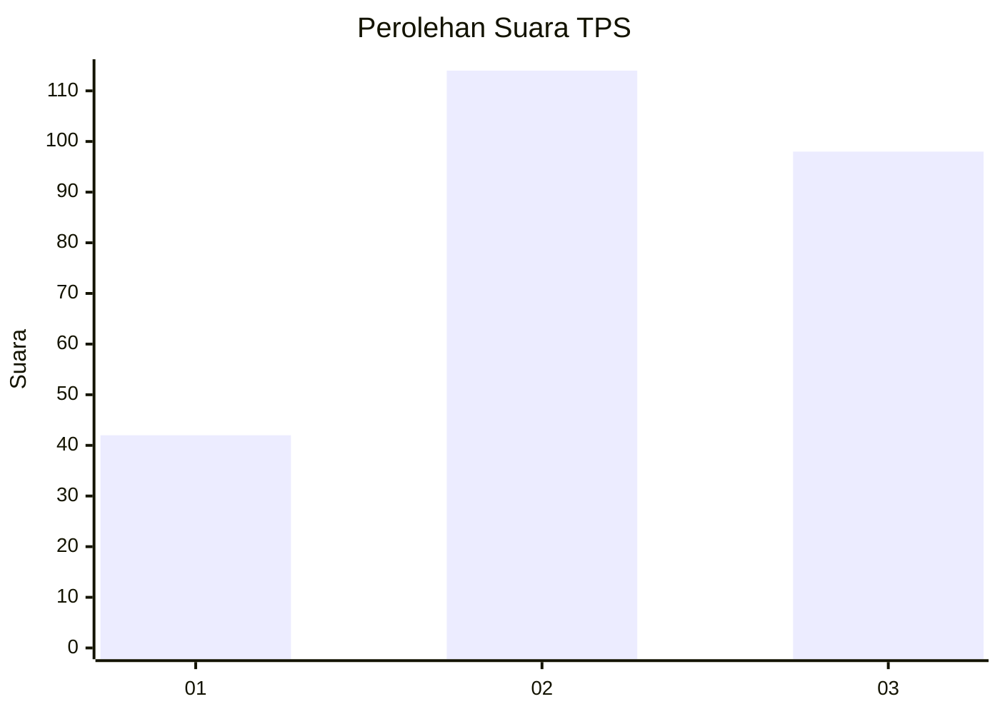
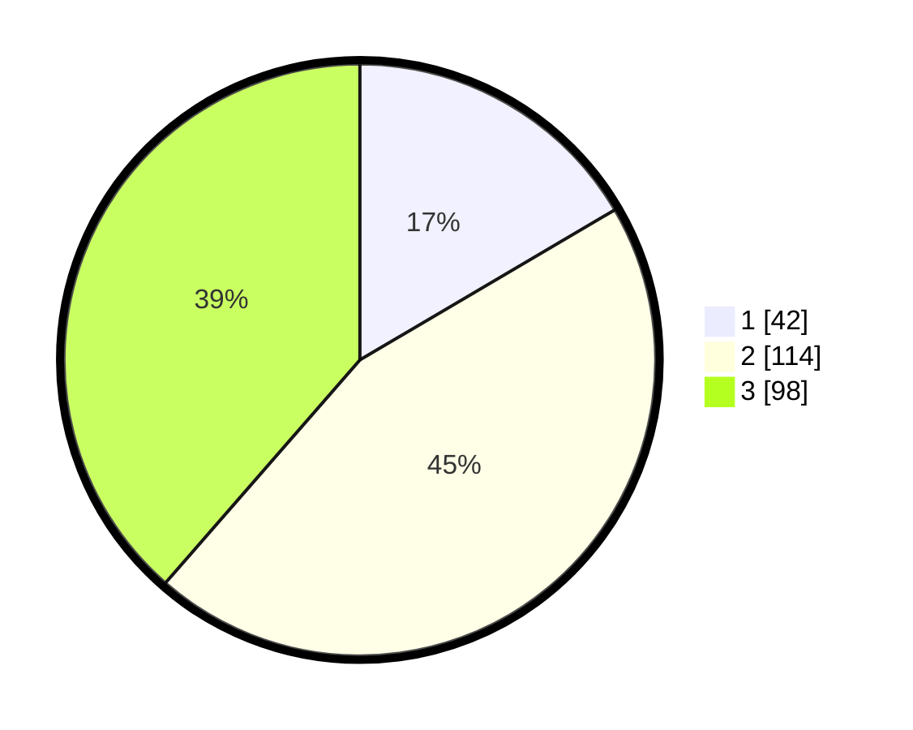

# Hasil

## Grafik

## Tabel

| No. | Nama Paslon    | Suara | Suara (raw) | Persentase |
|:--- |:-------------- | -----:| -----------:| ----------:|
| 1   | ANIES MUHAIMIN | 42    | [42][p-1]   | 16,54      |
| 2   | PRABOWO GIBRAN | 114   | [114][p-2]  | 44,88      |
| 3   | GANJAR MAHFUD  | 98    | [98][p-3]   | 38,58      |

[p-1]: https://github.com/gigit-pemilu/pemilu-2024/blob/main/pilpres/hitung-suara/sub/33-jawa-tengah/sub/08-magelang/sub/18-grabag/sub/2001-grabag/sub/020-tps/sub/paslon-1.txt
[p-2]: https://github.com/gigit-pemilu/pemilu-2024/blob/main/pilpres/hitung-suara/sub/33-jawa-tengah/sub/08-magelang/sub/18-grabag/sub/2001-grabag/sub/020-tps/sub/paslon-2.txt
[p-3]: https://github.com/gigit-pemilu/pemilu-2024/blob/main/pilpres/hitung-suara/sub/33-jawa-tengah/sub/08-magelang/sub/18-grabag/sub/2001-grabag/sub/020-tps/sub/paslon-3.txt

## Foto C Plano

https://sirekap-obj-formc.kpu.go.id/3ec3/pemilu/ppwp/33/08/18/20/01/3308182001020-20240214-190303--34cb81ca-85fb-4caf-babf-032dee736f4c.jpg

https://sirekap-obj-formc.kpu.go.id/3ec3/pemilu/ppwp/33/08/18/20/01/3308182001020-20240214-190311--274cc57d-b4fc-4132-9c1f-80f069030884.jpg

https://sirekap-obj-formc.kpu.go.id/3ec3/pemilu/ppwp/33/08/18/20/01/3308182001020-20240214-190317--66d479b4-22dd-43da-b09c-f6e5d1a84d9a.jpg

## Metadata

| Key        | Value               |
| ---------- | ------------------- |
| Time Stamp | 2024-02-15 23:29:50 |

