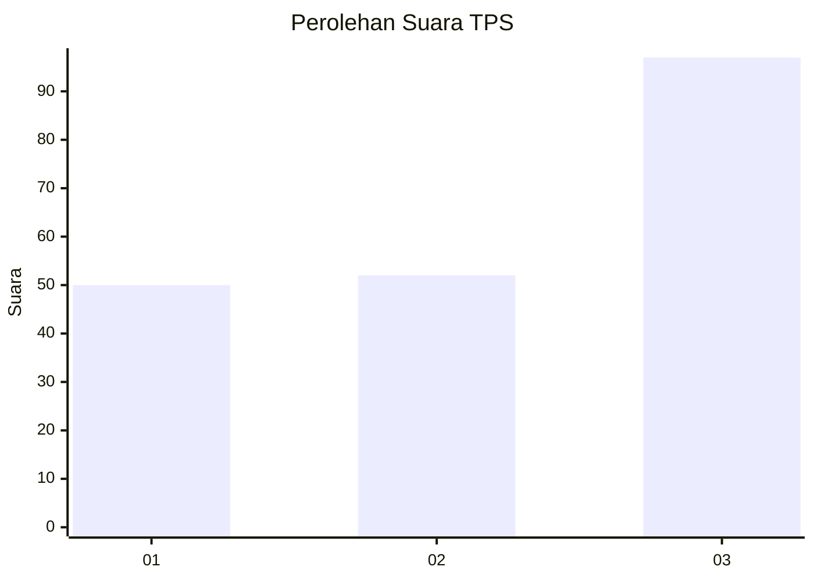
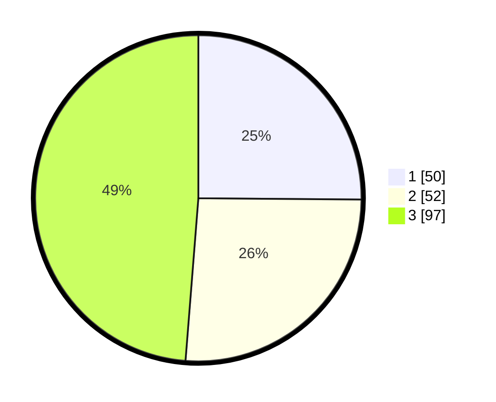

# Hasil

## Grafik

## Tabel

| No. | Nama Paslon    | Suara | Suara (raw) | Persentase |
|:--- |:-------------- | -----:| -----------:| ----------:|
| 1   | ANIES MUHAIMIN | 50    | [50][p-1]   | 25,13      |
| 2   | PRABOWO GIBRAN | 52    | [52][p-2]   | 26,13      |
| 3   | GANJAR MAHFUD  | 97    | [97][p-3]   | 48,74      |

[p-1]: https://github.com/gigit-pemilu/pemilu-2024-33-jawa-tengah/blob/main/pilpres/hitung-suara/sub/33-jawa-tengah/sub/08-magelang/sub/18-grabag/sub/2001-grabag/sub/022-tps/sub/paslon-1.txt
[p-2]: https://github.com/gigit-pemilu/pemilu-2024-33-jawa-tengah/blob/main/pilpres/hitung-suara/sub/33-jawa-tengah/sub/08-magelang/sub/18-grabag/sub/2001-grabag/sub/022-tps/sub/paslon-2.txt
[p-3]: https://github.com/gigit-pemilu/pemilu-2024-33-jawa-tengah/blob/main/pilpres/hitung-suara/sub/33-jawa-tengah/sub/08-magelang/sub/18-grabag/sub/2001-grabag/sub/022-tps/sub/paslon-3.txt

## Foto C Plano

https://sirekap-obj-formc.kpu.go.id/e19c/pemilu/ppwp/33/08/18/20/01/3308182001022-20240214-221715--a2ae1a60-2fee-4180-becb-15315aa465ba.jpg

https://sirekap-obj-formc.kpu.go.id/e19c/pemilu/ppwp/33/08/18/20/01/3308182001022-20240214-221902--1110d5bb-e8ba-4e11-819e-19d0769135c3.jpg

https://sirekap-obj-formc.kpu.go.id/e19c/pemilu/ppwp/33/08/18/20/01/3308182001022-20240214-222023--43258ef8-64de-4fd1-95a7-0d4e4a2ad5b2.jpg

## Metadata

| Key        | Value               |
| ---------- | ------------------- |
| Time Stamp | 2024-02-15 23:29:50 |

