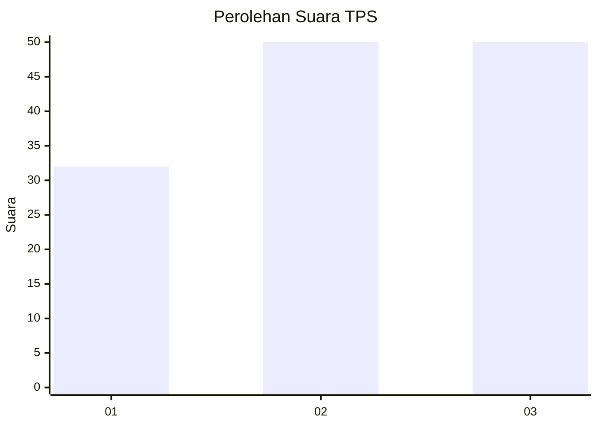
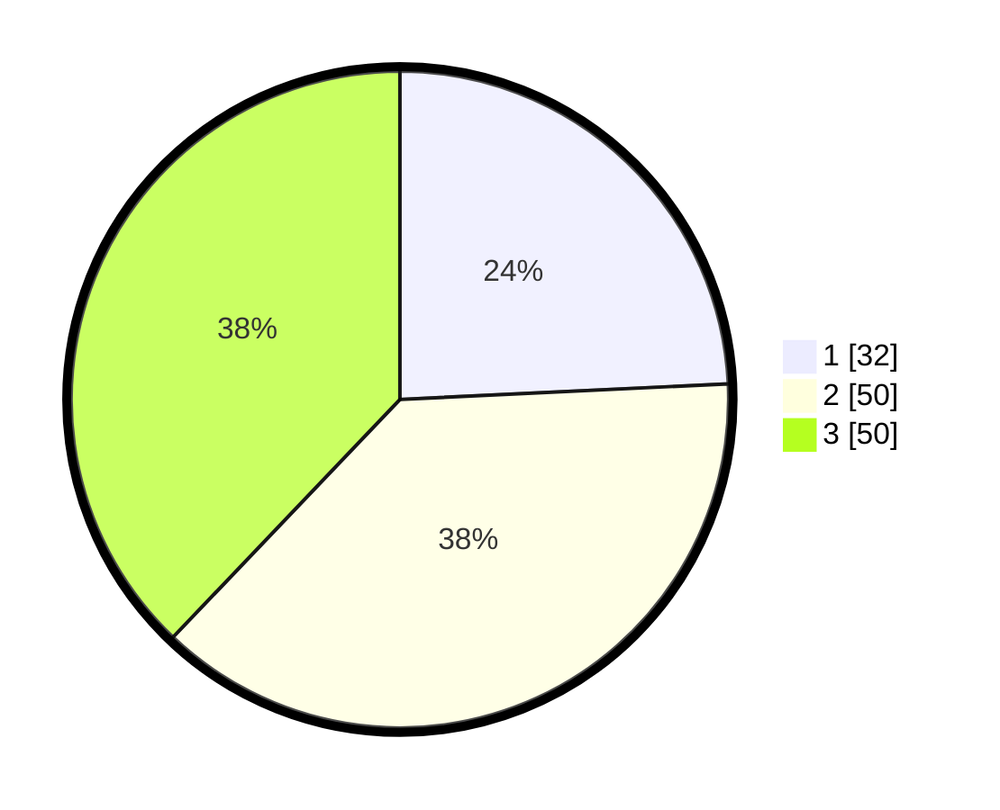

# Hasil

## Grafik

## Tabel

| No. | Nama Paslon    | Suara | Suara (raw) | Persentase |
|:--- |:-------------- | -----:| -----------:| ----------:|
| 1   | ANIES MUHAIMIN | 32    | [32][p-1]   | 24,24      |
| 2   | PRABOWO GIBRAN | 50    | [50][p-2]   | 37,88      |
| 3   | GANJAR MAHFUD  | 50    | [50][p-3]   | 37,88      |

[p-1]: https://github.com/gigit-pemilu/pemilu-2024/blob/main/pilpres/hitung-suara/sub/33-jawa-tengah/sub/08-magelang/sub/18-grabag/sub/2003-banyusari/sub/012-tps/sub/paslon-1.txt
[p-2]: https://github.com/gigit-pemilu/pemilu-2024/blob/main/pilpres/hitung-suara/sub/33-jawa-tengah/sub/08-magelang/sub/18-grabag/sub/2003-banyusari/sub/012-tps/sub/paslon-2.txt
[p-3]: https://github.com/gigit-pemilu/pemilu-2024/blob/main/pilpres/hitung-suara/sub/33-jawa-tengah/sub/08-magelang/sub/18-grabag/sub/2003-banyusari/sub/012-tps/sub/paslon-3.txt

## Foto C Plano

https://sirekap-obj-formc.kpu.go.id/2ed3/pemilu/ppwp/33/08/18/20/03/3308182003012-20240214-141537--333d6b76-863c-49ec-ad87-5ba1fb2f7bdb.jpg

https://sirekap-obj-formc.kpu.go.id/2ed3/pemilu/ppwp/33/08/18/20/03/3308182003012-20240214-141612--ef77094a-161c-4e4b-9a5c-56d42a0248d8.jpg

https://sirekap-obj-formc.kpu.go.id/2ed3/pemilu/ppwp/33/08/18/20/03/3308182003012-20240214-141153--2ef1702a-ed45-4975-a660-a88e7aa489ec.jpg

## Metadata

| Key        | Value               |
| ---------- | ------------------- |
| Time Stamp | 2024-02-15 22:00:27 |

