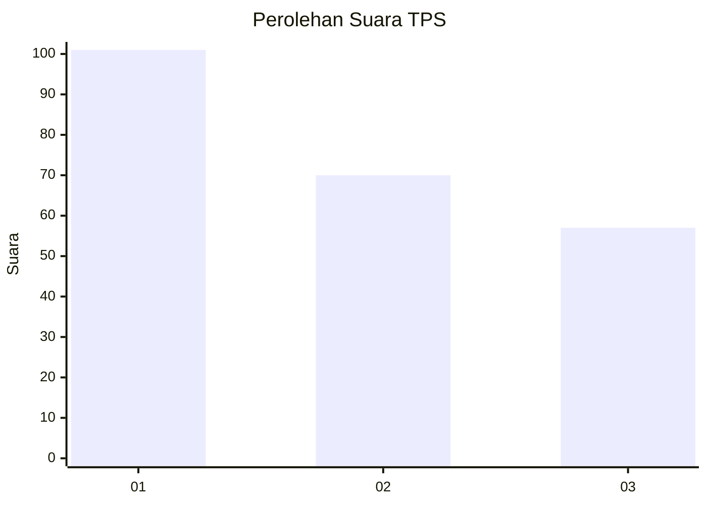
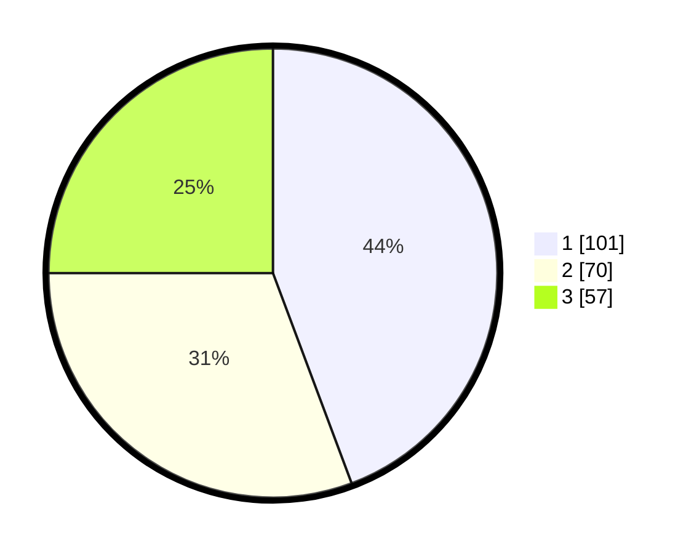

# Hasil

## Grafik

## Tabel

| No. | Nama Paslon    | Suara | Suara (raw) | Persentase |
|:--- |:-------------- | -----:| -----------:| ----------:|
| 1   | ANIES MUHAIMIN | 101   | [101][p-1]  | 44,30      |
| 2   | PRABOWO GIBRAN | 70    | [70][p-2]   | 30,70      |
| 3   | GANJAR MAHFUD  | 57    | [57][p-3]   | 25,00      |

[p-1]: https://github.com/gigit-pemilu/pemilu-2024/blob/main/pilpres/hitung-suara/sub/33-jawa-tengah/sub/08-magelang/sub/18-grabag/sub/2004-kartoharjo/sub/001-tps/sub/paslon-1.txt
[p-2]: https://github.com/gigit-pemilu/pemilu-2024/blob/main/pilpres/hitung-suara/sub/33-jawa-tengah/sub/08-magelang/sub/18-grabag/sub/2004-kartoharjo/sub/001-tps/sub/paslon-2.txt
[p-3]: https://github.com/gigit-pemilu/pemilu-2024/blob/main/pilpres/hitung-suara/sub/33-jawa-tengah/sub/08-magelang/sub/18-grabag/sub/2004-kartoharjo/sub/001-tps/sub/paslon-3.txt

## Foto C Plano

https://sirekap-obj-formc.kpu.go.id/f8c8/pemilu/ppwp/33/08/18/20/04/3308182004001-20240216-152135--a9d60fc2-11d3-488e-b0d9-9810f64a81b9.jpg

https://sirekap-obj-formc.kpu.go.id/f8c8/pemilu/ppwp/33/08/18/20/04/3308182004001-20240216-155727--5199c451-2de9-4f5f-8d0a-1dfefcac9adc.jpg

https://sirekap-obj-formc.kpu.go.id/f8c8/pemilu/ppwp/33/08/18/20/04/3308182004001-20240216-150944--e4c09c5b-1eea-4998-82a2-c06e7c6a9eee.jpg

## Metadata

| Key        | Value               |
| ---------- | ------------------- |
| Time Stamp | 2024-02-17 16:52:47 |

