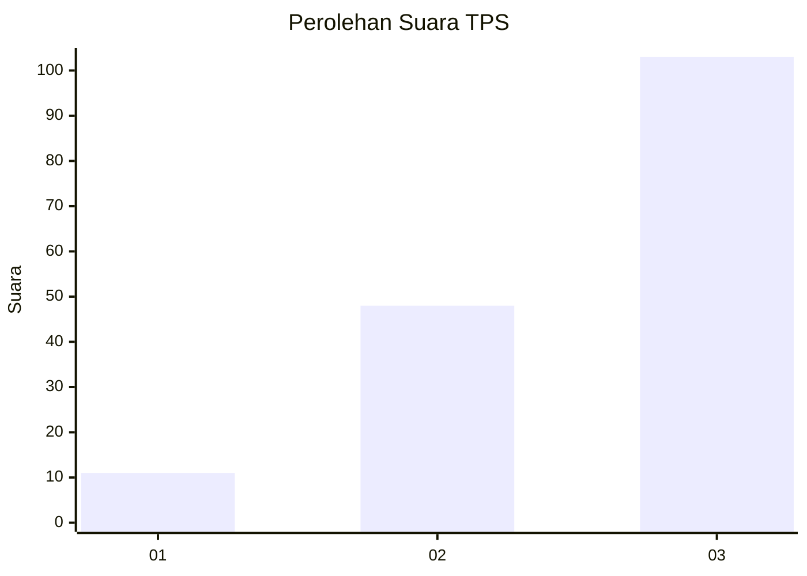
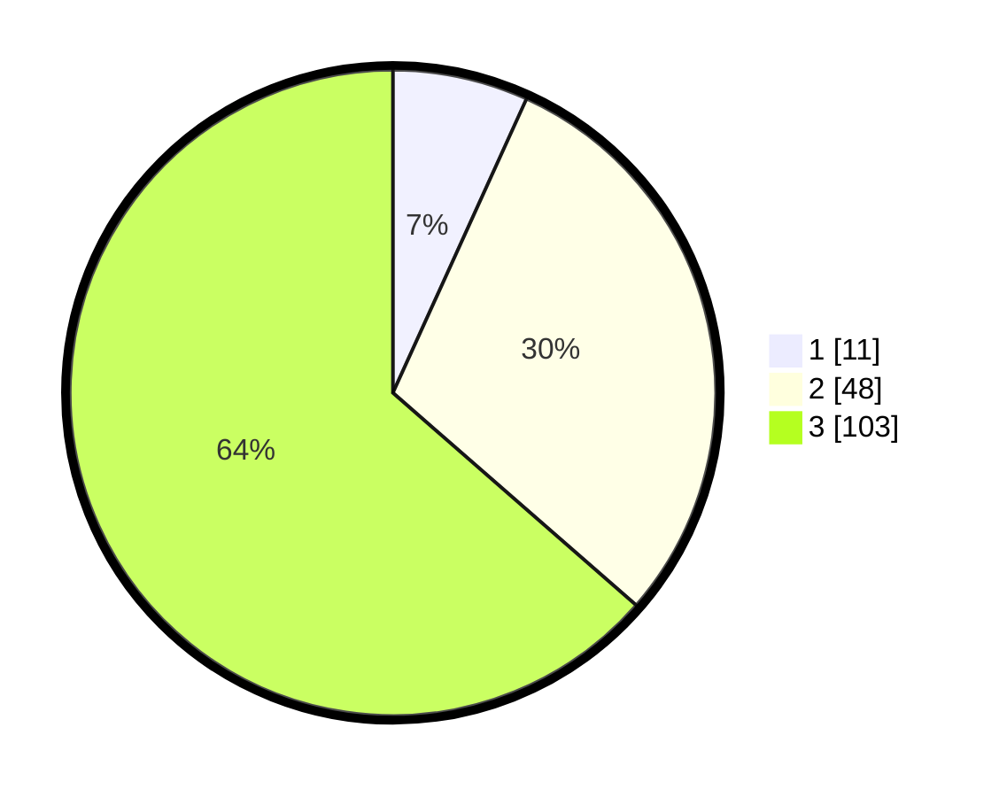

# Hasil

## Grafik

## Tabel

| No. | Nama Paslon    | Suara | Suara (raw) | Persentase |
|:--- |:-------------- | -----:| -----------:| ----------:|
| 1   | ANIES MUHAIMIN | 11    | [11][p-1]   | 6,79       |
| 2   | PRABOWO GIBRAN | 48    | [48][p-2]   | 29,63      |
| 3   | GANJAR MAHFUD  | 103   | [103][p-3]  | 63,58      |

[p-1]: https://github.com/gigit-pemilu/pemilu-2024-33-jawa-tengah/blob/main/pilpres/hitung-suara/sub/33-jawa-tengah/sub/08-magelang/sub/18-grabag/sub/2006-citrosono/sub/017-tps/sub/paslon-1.txt
[p-2]: https://github.com/gigit-pemilu/pemilu-2024-33-jawa-tengah/blob/main/pilpres/hitung-suara/sub/33-jawa-tengah/sub/08-magelang/sub/18-grabag/sub/2006-citrosono/sub/017-tps/sub/paslon-2.txt
[p-3]: https://github.com/gigit-pemilu/pemilu-2024-33-jawa-tengah/blob/main/pilpres/hitung-suara/sub/33-jawa-tengah/sub/08-magelang/sub/18-grabag/sub/2006-citrosono/sub/017-tps/sub/paslon-3.txt

## Foto C Plano

https://sirekap-obj-formc.kpu.go.id/776c/pemilu/ppwp/33/08/18/20/06/3308182006017-20240215-201604--51924c7f-d936-4692-95c0-29c6ee153868.jpg

https://sirekap-obj-formc.kpu.go.id/776c/pemilu/ppwp/33/08/18/20/06/3308182006017-20240215-001559--7ebf3fe3-5b08-4560-9c51-8aaa8df49a59.jpg

https://sirekap-obj-formc.kpu.go.id/776c/pemilu/ppwp/33/08/18/20/06/3308182006017-20240215-201347--1ea4e028-5ddb-4a8b-b1d8-6f4527f00ed8.jpg

## Metadata

| Key        | Value               |
| ---------- | ------------------- |
| Time Stamp | 2024-02-16 00:00:26 |

