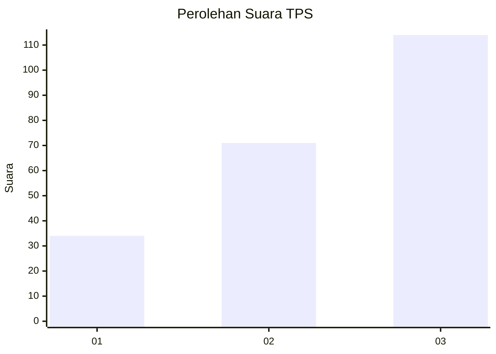
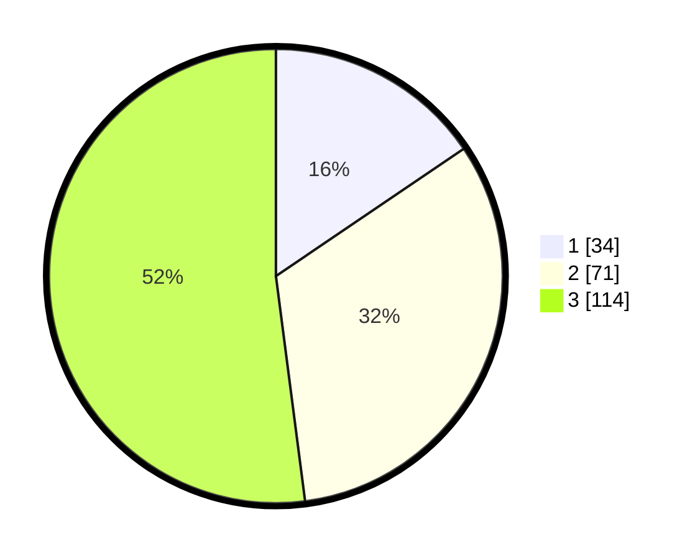

# Hasil

## Grafik

## Tabel

| No. | Nama Paslon    | Suara | Suara (raw) | Persentase |
|:--- |:-------------- | -----:| -----------:| ----------:|
| 1   | ANIES MUHAIMIN | 34    | [34][p-1]   | 15,53      |
| 2   | PRABOWO GIBRAN | 71    | [71][p-2]   | 32,42      |
| 3   | GANJAR MAHFUD  | 114   | [114][p-3]  | 52,05      |

[p-1]: https://github.com/gigit-pemilu/pemilu-2024/blob/main/pilpres/hitung-suara/sub/33-jawa-tengah/sub/08-magelang/sub/18-grabag/sub/2008-ngasinan/sub/006-tps/sub/paslon-1.txt
[p-2]: https://github.com/gigit-pemilu/pemilu-2024/blob/main/pilpres/hitung-suara/sub/33-jawa-tengah/sub/08-magelang/sub/18-grabag/sub/2008-ngasinan/sub/006-tps/sub/paslon-2.txt
[p-3]: https://github.com/gigit-pemilu/pemilu-2024/blob/main/pilpres/hitung-suara/sub/33-jawa-tengah/sub/08-magelang/sub/18-grabag/sub/2008-ngasinan/sub/006-tps/sub/paslon-3.txt

## Foto C Plano

https://sirekap-obj-formc.kpu.go.id/abd9/pemilu/ppwp/33/08/18/20/08/3308182008006-20240214-214414--9cdf931e-13d7-4ce5-84ad-f07bb1162347.jpg

https://sirekap-obj-formc.kpu.go.id/abd9/pemilu/ppwp/33/08/18/20/08/3308182008006-20240214-213637--86dc3239-a7bf-4297-9f0a-cfc33d336e0c.jpg

https://sirekap-obj-formc.kpu.go.id/abd9/pemilu/ppwp/33/08/18/20/08/3308182008006-20240215-230139--b92567f2-992a-4fea-9470-f2ef2a5fd175.jpg

## Metadata

| Key        | Value               |
| ---------- | ------------------- |
| Time Stamp | 2024-02-15 23:29:50 |

