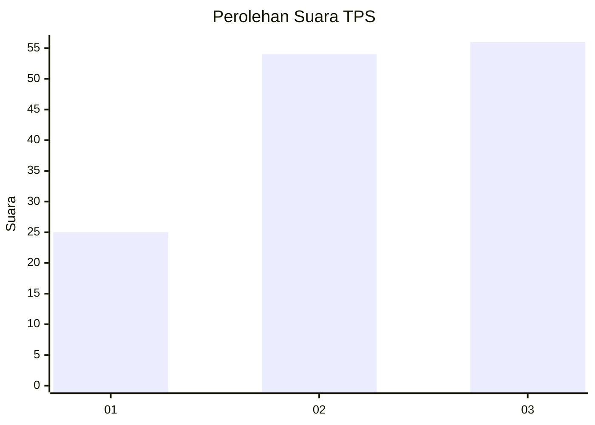
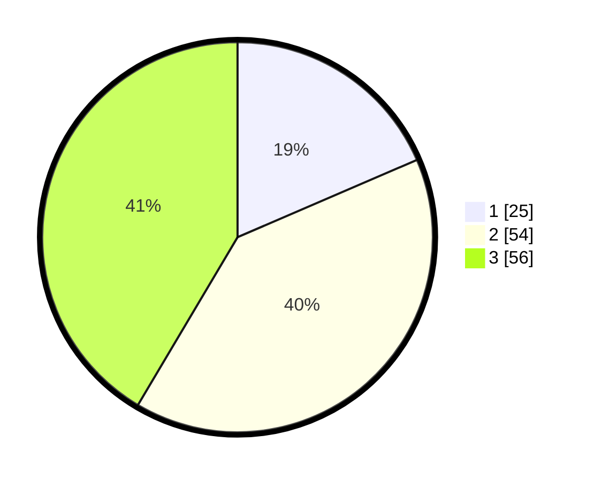

# Hasil

## Grafik

## Tabel

| No. | Nama Paslon    | Suara | Suara (raw) | Persentase |
|:--- |:-------------- | -----:| -----------:| ----------:|
| 1   | ANIES MUHAIMIN | 25    | [25][p-1]   | 18,52      |
| 2   | PRABOWO GIBRAN | 54    | [54][p-2]   | 40,00      |
| 3   | GANJAR MAHFUD  | 56    | [56][p-3]   | 41,48      |

[p-1]: https://github.com/gigit-pemilu/pemilu-2024/blob/main/pilpres/hitung-suara/sub/33-jawa-tengah/sub/08-magelang/sub/18-grabag/sub/2012-kalikuto/sub/011-tps/sub/paslon-1.txt
[p-2]: https://github.com/gigit-pemilu/pemilu-2024/blob/main/pilpres/hitung-suara/sub/33-jawa-tengah/sub/08-magelang/sub/18-grabag/sub/2012-kalikuto/sub/011-tps/sub/paslon-2.txt
[p-3]: https://github.com/gigit-pemilu/pemilu-2024/blob/main/pilpres/hitung-suara/sub/33-jawa-tengah/sub/08-magelang/sub/18-grabag/sub/2012-kalikuto/sub/011-tps/sub/paslon-3.txt

## Foto C Plano

https://sirekap-obj-formc.kpu.go.id/8842/pemilu/ppwp/33/08/18/20/12/3308182012011-20240214-231308--d99021af-233a-4da0-ab06-2d301408fe64.jpg

https://sirekap-obj-formc.kpu.go.id/8842/pemilu/ppwp/33/08/18/20/12/3308182012011-20240214-221701--668c5505-6aeb-4a7a-b32b-91d6e00dd6b3.jpg

https://sirekap-obj-formc.kpu.go.id/8842/pemilu/ppwp/33/08/18/20/12/3308182012011-20240214-221846--f73a2d89-d959-454e-a1a0-3951105455d3.jpg

## Metadata

| Key        | Value               |
| ---------- | ------------------- |
| Time Stamp | 2024-02-16 11:00:29 |

