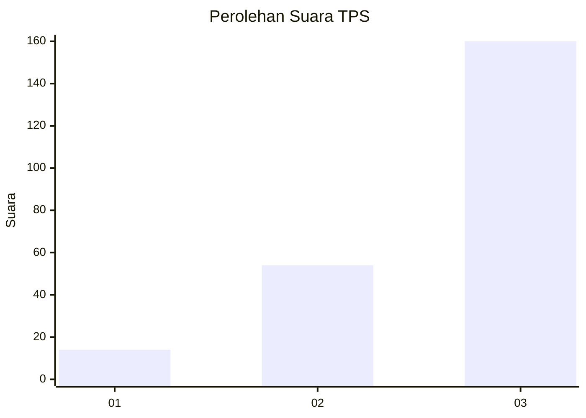
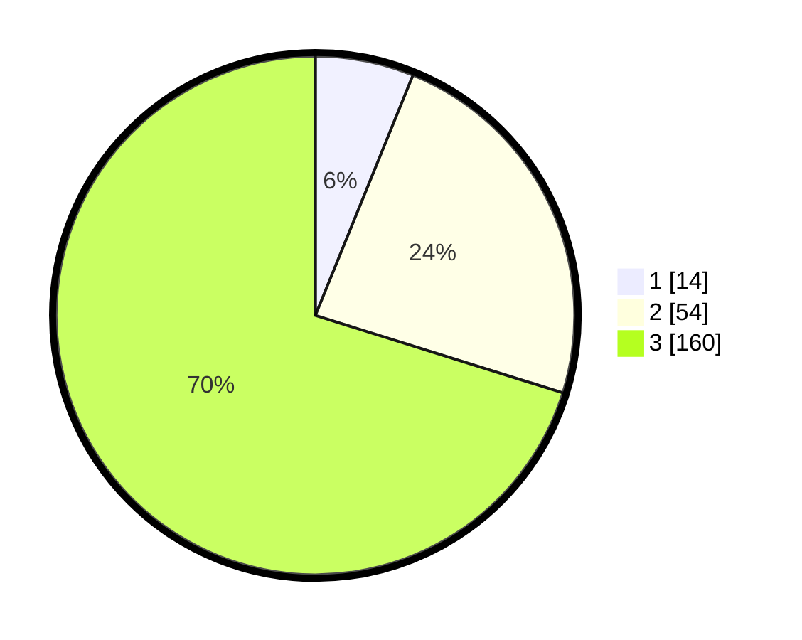

# Hasil

## Grafik

## Tabel

| No. | Nama Paslon    | Suara | Suara (raw) | Persentase |
|:--- |:-------------- | -----:| -----------:| ----------:|
| 1   | ANIES MUHAIMIN | 14    | [14][p-1]   | 6,14       |
| 2   | PRABOWO GIBRAN | 54    | [54][p-2]   | 23,68      |
| 3   | GANJAR MAHFUD  | 160   | [160][p-3]  | 70,18      |

[p-1]: https://github.com/gigit-pemilu/pemilu-2024-33-jawa-tengah/blob/main/pilpres/hitung-suara/sub/33-jawa-tengah/sub/08-magelang/sub/18-grabag/sub/2019-ketawang/sub/002-tps/sub/paslon-1.txt
[p-2]: https://github.com/gigit-pemilu/pemilu-2024-33-jawa-tengah/blob/main/pilpres/hitung-suara/sub/33-jawa-tengah/sub/08-magelang/sub/18-grabag/sub/2019-ketawang/sub/002-tps/sub/paslon-2.txt
[p-3]: https://github.com/gigit-pemilu/pemilu-2024-33-jawa-tengah/blob/main/pilpres/hitung-suara/sub/33-jawa-tengah/sub/08-magelang/sub/18-grabag/sub/2019-ketawang/sub/002-tps/sub/paslon-3.txt

## Foto C Plano

https://sirekap-obj-formc.kpu.go.id/f761/pemilu/ppwp/33/08/18/20/19/3308182019002-20240215-032021--aa0bff8e-d071-40ee-a4ca-33df0f6f7edb.jpg

https://sirekap-obj-formc.kpu.go.id/f761/pemilu/ppwp/33/08/18/20/19/3308182019002-20240214-205300--fd0f4e1f-7dc3-4054-98e7-545f6d7c7613.jpg

https://sirekap-obj-formc.kpu.go.id/f761/pemilu/ppwp/33/08/18/20/19/3308182019002-20240214-200446--2494a4cd-1aa7-4b09-97da-fe3e0cf0d4c1.jpg

## Metadata

| Key        | Value               |
| ---------- | ------------------- |
| Time Stamp | 2024-02-15 12:00:28 |

