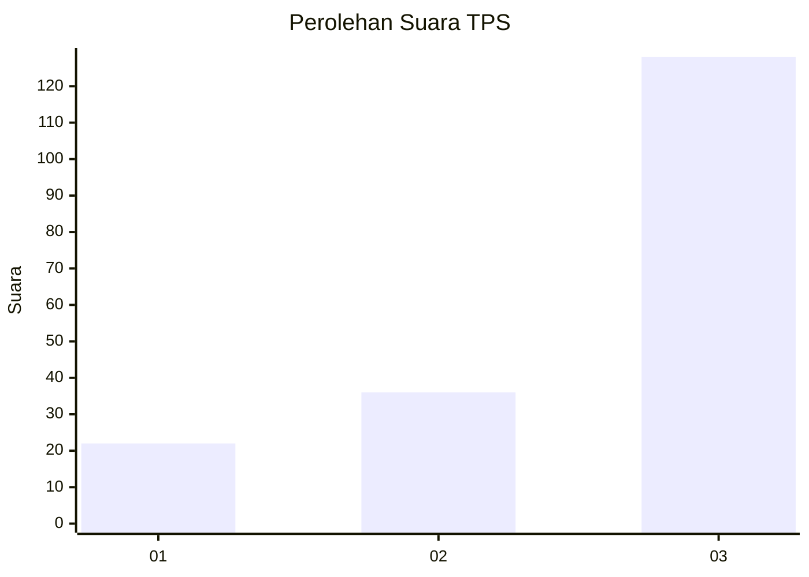
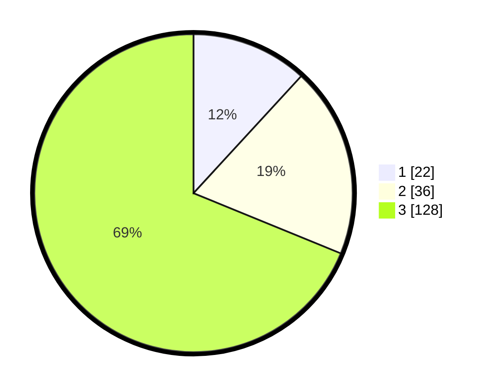

# Hasil

## Grafik

## Tabel

| No. | Nama Paslon    | Suara | Suara (raw) | Persentase |
|:--- |:-------------- | -----:| -----------:| ----------:|
| 1   | ANIES MUHAIMIN | 22    | [22][p-1]   | 11,83      |
| 2   | PRABOWO GIBRAN | 36    | [36][p-2]   | 19,35      |
| 3   | GANJAR MAHFUD  | 128   | [128][p-3]  | 68,82      |

[p-1]: https://github.com/gigit-pemilu/pemilu-2024-33-jawa-tengah/blob/main/pilpres/hitung-suara/sub/33-jawa-tengah/sub/08-magelang/sub/18-grabag/sub/2020-salam/sub/001-tps/sub/paslon-1.txt
[p-2]: https://github.com/gigit-pemilu/pemilu-2024-33-jawa-tengah/blob/main/pilpres/hitung-suara/sub/33-jawa-tengah/sub/08-magelang/sub/18-grabag/sub/2020-salam/sub/001-tps/sub/paslon-2.txt
[p-3]: https://github.com/gigit-pemilu/pemilu-2024-33-jawa-tengah/blob/main/pilpres/hitung-suara/sub/33-jawa-tengah/sub/08-magelang/sub/18-grabag/sub/2020-salam/sub/001-tps/sub/paslon-3.txt

## Foto C Plano

https://sirekap-obj-formc.kpu.go.id/49ff/pemilu/ppwp/33/08/18/20/20/3308182020001-20240214-223523--41054de5-6696-4f94-8d9c-4ad7390c0874.jpg

https://sirekap-obj-formc.kpu.go.id/49ff/pemilu/ppwp/33/08/18/20/20/3308182020001-20240214-225853--66716abe-bfc2-4f51-82af-1f3ee26153aa.jpg

https://sirekap-obj-formc.kpu.go.id/49ff/pemilu/ppwp/33/08/18/20/20/3308182020001-20240214-225856--068973db-5594-4142-9248-77c0e5acff13.jpg

## Metadata

| Key        | Value               |
| ---------- | ------------------- |
| Time Stamp | 2024-02-16 11:00:29 |

