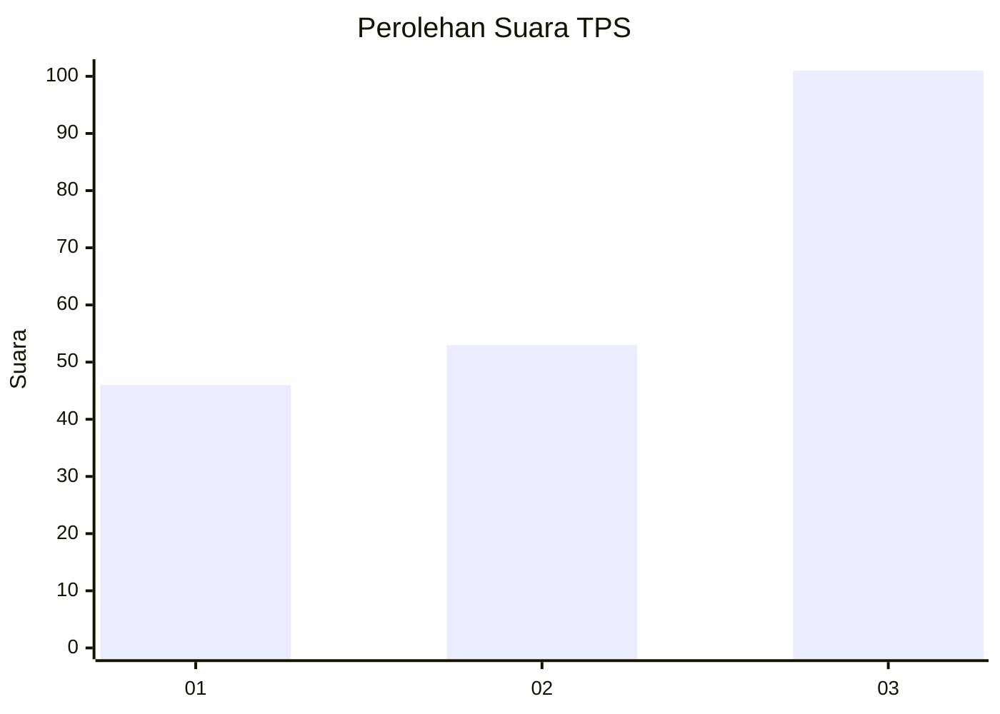
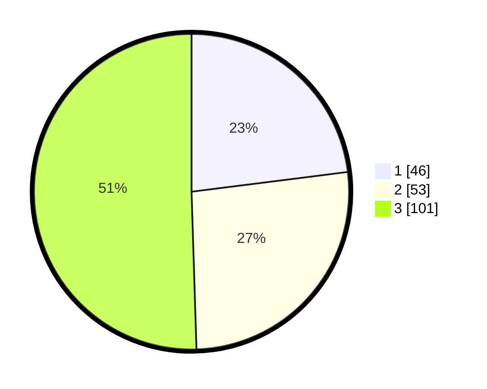

# Hasil

## Grafik

## Tabel

| No. | Nama Paslon    | Suara | Suara (raw) | Persentase |
|:--- |:-------------- | -----:| -----------:| ----------:|
| 1   | ANIES MUHAIMIN | 46    | [46][p-1]   | 23,00      |
| 2   | PRABOWO GIBRAN | 53    | [53][p-2]   | 26,50      |
| 3   | GANJAR MAHFUD  | 101   | [101][p-3]  | 50,50      |

[p-1]: https://github.com/gigit-pemilu/pemilu-2024/blob/main/pilpres/hitung-suara/sub/33-jawa-tengah/sub/08-magelang/sub/18-grabag/sub/2020-salam/sub/005-tps/sub/paslon-1.txt
[p-2]: https://github.com/gigit-pemilu/pemilu-2024/blob/main/pilpres/hitung-suara/sub/33-jawa-tengah/sub/08-magelang/sub/18-grabag/sub/2020-salam/sub/005-tps/sub/paslon-2.txt
[p-3]: https://github.com/gigit-pemilu/pemilu-2024/blob/main/pilpres/hitung-suara/sub/33-jawa-tengah/sub/08-magelang/sub/18-grabag/sub/2020-salam/sub/005-tps/sub/paslon-3.txt

## Foto C Plano

https://sirekap-obj-formc.kpu.go.id/2c13/pemilu/ppwp/33/08/18/20/20/3308182020005-20240216-174428--606042fe-b35c-49c9-8c8e-eed3ff4a0024.jpg

https://sirekap-obj-formc.kpu.go.id/2c13/pemilu/ppwp/33/08/18/20/20/3308182020005-20240214-220546--65cc0750-32ea-4d3b-86da-4377dc70ad16.jpg

https://sirekap-obj-formc.kpu.go.id/2c13/pemilu/ppwp/33/08/18/20/20/3308182020005-20240214-220724--6f519654-83ce-4778-b9da-ecde99688a61.jpg

## Metadata

| Key        | Value               |
| ---------- | ------------------- |
| Time Stamp | 2024-02-16 21:01:00 |

