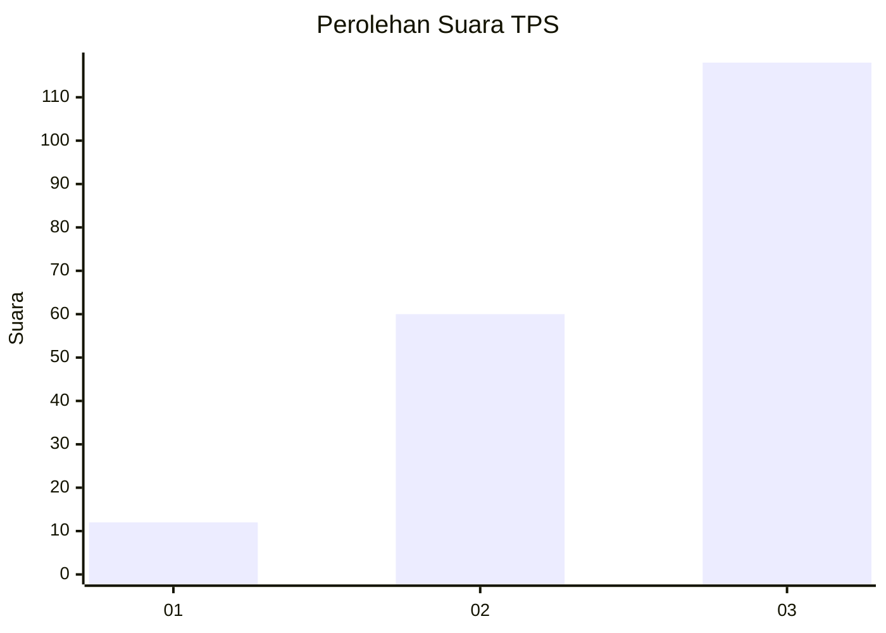
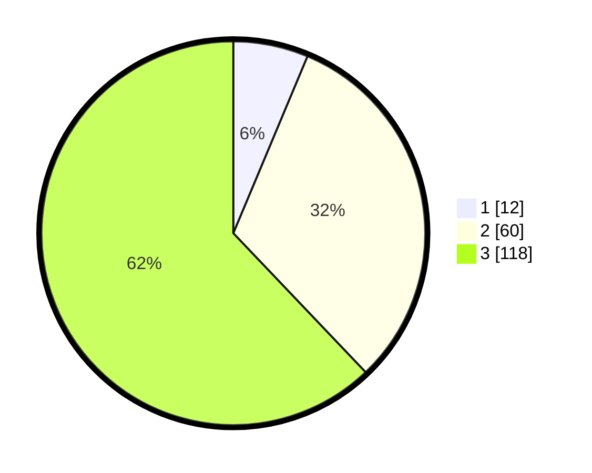

# Hasil

## Grafik

## Tabel

| No. | Nama Paslon    | Suara | Suara (raw) | Persentase |
|:--- |:-------------- | -----:| -----------:| ----------:|
| 1   | ANIES MUHAIMIN | 12    | [12][p-1]   | 6,32       |
| 2   | PRABOWO GIBRAN | 60    | [60][p-2]   | 31,58      |
| 3   | GANJAR MAHFUD  | 118   | [118][p-3]  | 62,11      |

[p-1]: https://github.com/gigit-pemilu/pemilu-2024-33-jawa-tengah/blob/main/pilpres/hitung-suara/sub/33-jawa-tengah/sub/08-magelang/sub/18-grabag/sub/2022-losari/sub/005-tps/sub/paslon-1.txt
[p-2]: https://github.com/gigit-pemilu/pemilu-2024-33-jawa-tengah/blob/main/pilpres/hitung-suara/sub/33-jawa-tengah/sub/08-magelang/sub/18-grabag/sub/2022-losari/sub/005-tps/sub/paslon-2.txt
[p-3]: https://github.com/gigit-pemilu/pemilu-2024-33-jawa-tengah/blob/main/pilpres/hitung-suara/sub/33-jawa-tengah/sub/08-magelang/sub/18-grabag/sub/2022-losari/sub/005-tps/sub/paslon-3.txt

## Foto C Plano

https://sirekap-obj-formc.kpu.go.id/aafd/pemilu/ppwp/33/08/18/20/22/3308182022005-20240214-220810--11599a4f-36df-4a96-9c04-2ec991f880eb.jpg

https://sirekap-obj-formc.kpu.go.id/aafd/pemilu/ppwp/33/08/18/20/22/3308182022005-20240214-141451--0fd1c58c-e061-4dc2-bc59-7b80356f7151.jpg

https://sirekap-obj-formc.kpu.go.id/aafd/pemilu/ppwp/33/08/18/20/22/3308182022005-20240214-141200--ede5441f-9b9f-4df0-add0-da6cda000437.jpg

## Metadata

| Key        | Value               |
| ---------- | ------------------- |
| Time Stamp | 2024-02-15 15:00:29 |

