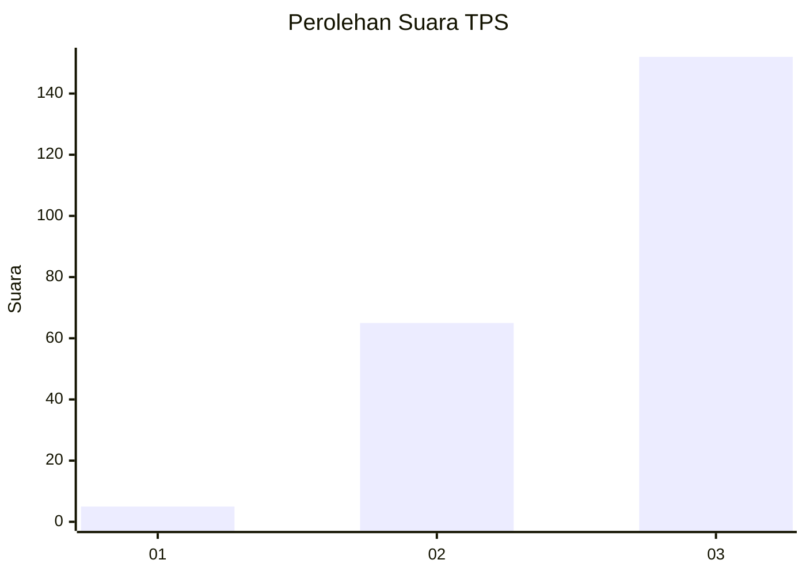
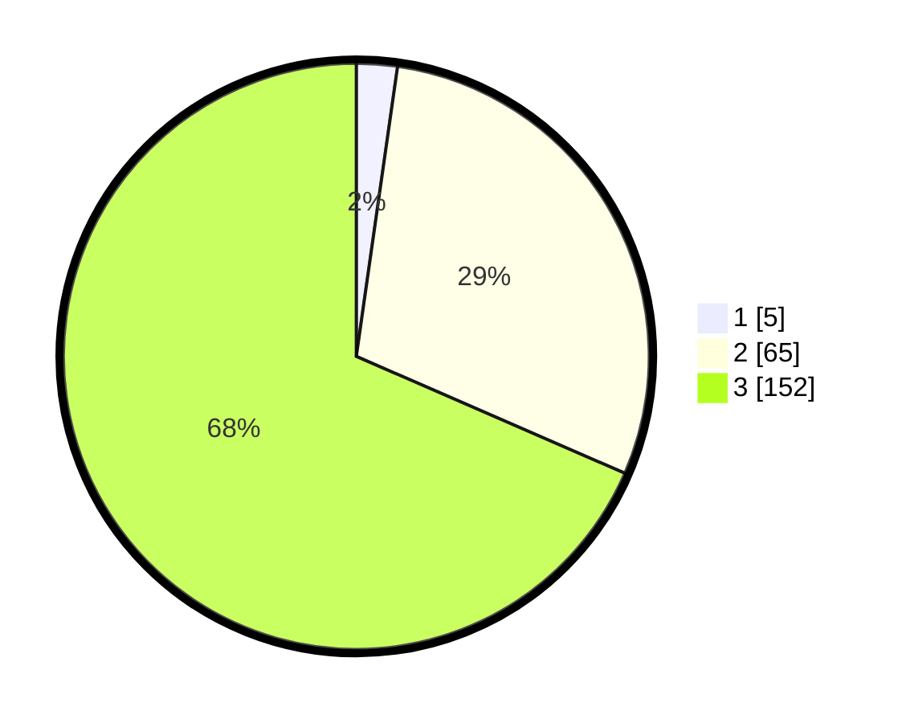

# Hasil

## Grafik

## Tabel

| No. | Nama Paslon    | Suara | Suara (raw) | Persentase |
|:--- |:-------------- | -----:| -----------:| ----------:|
| 1   | ANIES MUHAIMIN | 5     | [5][p-1]    | 2,25       |
| 2   | PRABOWO GIBRAN | 65    | [65][p-2]   | 29,28      |
| 3   | GANJAR MAHFUD  | 152   | [152][p-3]  | 68,47      |

[p-1]: https://github.com/gigit-pemilu/pemilu-2024-33-jawa-tengah/blob/main/pilpres/hitung-suara/sub/33-jawa-tengah/sub/08-magelang/sub/18-grabag/sub/2023-ngrancah/sub/002-tps/sub/paslon-1.txt
[p-2]: https://github.com/gigit-pemilu/pemilu-2024-33-jawa-tengah/blob/main/pilpres/hitung-suara/sub/33-jawa-tengah/sub/08-magelang/sub/18-grabag/sub/2023-ngrancah/sub/002-tps/sub/paslon-2.txt
[p-3]: https://github.com/gigit-pemilu/pemilu-2024-33-jawa-tengah/blob/main/pilpres/hitung-suara/sub/33-jawa-tengah/sub/08-magelang/sub/18-grabag/sub/2023-ngrancah/sub/002-tps/sub/paslon-3.txt

## Foto C Plano

https://sirekap-obj-formc.kpu.go.id/153c/pemilu/ppwp/33/08/18/20/23/3308182023002-20240215-131126--8a36a1f9-2a35-438f-97c5-bcfa11f9b8da.jpg

https://sirekap-obj-formc.kpu.go.id/153c/pemilu/ppwp/33/08/18/20/23/3308182023002-20240216-083943--ddad3bb9-a532-402f-b923-598d21098251.jpg

https://sirekap-obj-formc.kpu.go.id/153c/pemilu/ppwp/33/08/18/20/23/3308182023002-20240214-193647--d3dc9cb7-c309-47da-af06-de3efec6c021.jpg

## Metadata

| Key        | Value               |
| ---------- | ------------------- |
| Time Stamp | 2024-02-16 10:30:29 |

