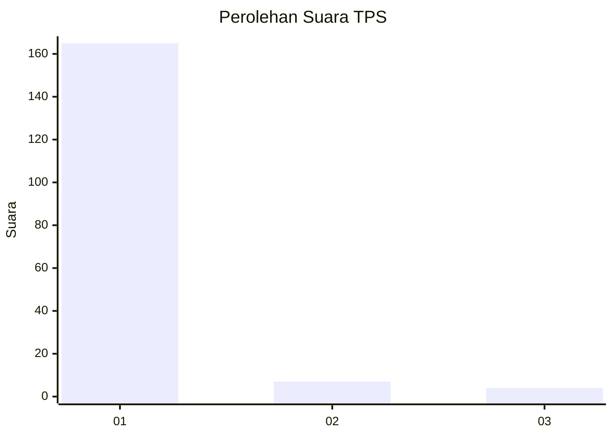
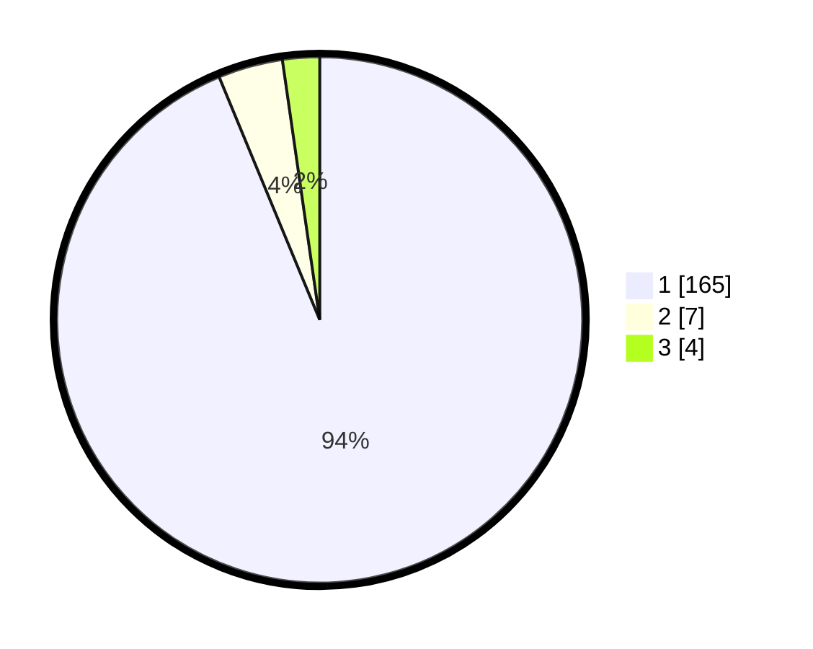

# Hasil

## Grafik

## Tabel

| No. | Nama Paslon    | Suara | Suara (raw) | Persentase |
|:--- |:-------------- | -----:| -----------:| ----------:|
| 1   | ANIES MUHAIMIN | 165   | [165][p-1]  | 93,75      |
| 2   | PRABOWO GIBRAN | 7     | [7][p-2]    | 3,98       |
| 3   | GANJAR MAHFUD  | 4     | [4][p-3]    | 2,27       |

[p-1]: https://github.com/gigit-pemilu/pemilu-2024-33-jawa-tengah/blob/main/pilpres/hitung-suara/sub/33-jawa-tengah/sub/08-magelang/sub/19-tegalrejo/sub/2001-tegalrejo/sub/901-tps/sub/paslon-1.txt
[p-2]: https://github.com/gigit-pemilu/pemilu-2024-33-jawa-tengah/blob/main/pilpres/hitung-suara/sub/33-jawa-tengah/sub/08-magelang/sub/19-tegalrejo/sub/2001-tegalrejo/sub/901-tps/sub/paslon-2.txt
[p-3]: https://github.com/gigit-pemilu/pemilu-2024-33-jawa-tengah/blob/main/pilpres/hitung-suara/sub/33-jawa-tengah/sub/08-magelang/sub/19-tegalrejo/sub/2001-tegalrejo/sub/901-tps/sub/paslon-3.txt

## Foto C Plano

https://sirekap-obj-formc.kpu.go.id/a887/pemilu/ppwp/33/08/19/20/01/3308192001901-20240214-203043--c3e04b3e-847a-4e2f-8e3f-2b440b4eb243.jpg

https://sirekap-obj-formc.kpu.go.id/a887/pemilu/ppwp/33/08/19/20/01/3308192001901-20240215-003329--957756c6-1e20-4193-83a2-8e5a202caaaa.jpg

https://sirekap-obj-formc.kpu.go.id/a887/pemilu/ppwp/33/08/19/20/01/3308192001901-20240214-212927--d4b3a17c-93f0-4a47-b65e-33da6aeef858.jpg

## Metadata

| Key        | Value               |
| ---------- | ------------------- |
| Time Stamp | 2024-02-15 22:00:27 |

