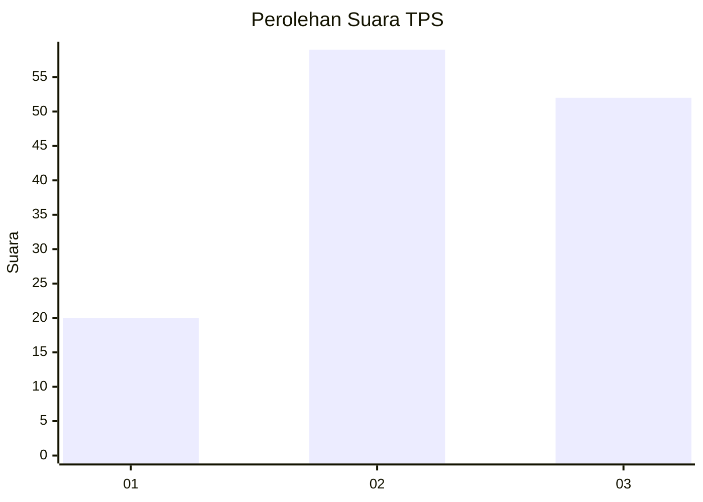
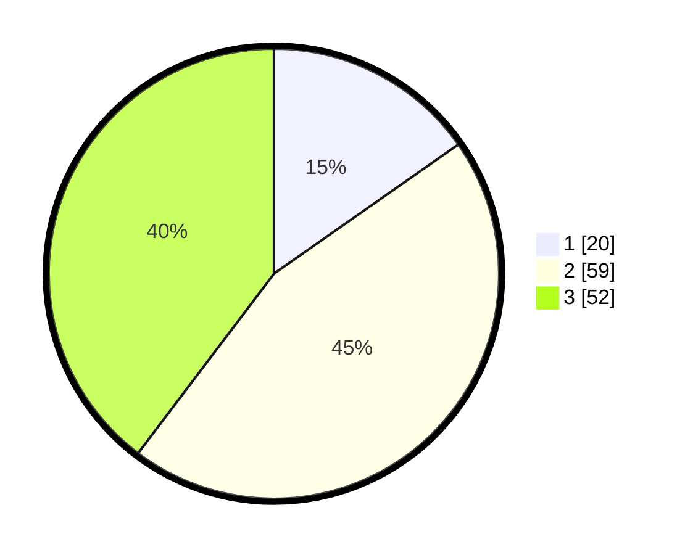

# Hasil

## Grafik

## Tabel

| No. | Nama Paslon    | Suara | Suara (raw) | Persentase |
|:--- |:-------------- | -----:| -----------:| ----------:|
| 1   | ANIES MUHAIMIN | 20    | [20][p-1]   | 15,27      |
| 2   | PRABOWO GIBRAN | 59    | [59][p-2]   | 45,04      |
| 3   | GANJAR MAHFUD  | 52    | [52][p-3]   | 39,69      |

[p-1]: https://github.com/gigit-pemilu/pemilu-2024-33-jawa-tengah/blob/main/pilpres/hitung-suara/sub/33-jawa-tengah/sub/08-magelang/sub/19-tegalrejo/sub/2013-dawung/sub/004-tps/sub/paslon-1.txt
[p-2]: https://github.com/gigit-pemilu/pemilu-2024-33-jawa-tengah/blob/main/pilpres/hitung-suara/sub/33-jawa-tengah/sub/08-magelang/sub/19-tegalrejo/sub/2013-dawung/sub/004-tps/sub/paslon-2.txt
[p-3]: https://github.com/gigit-pemilu/pemilu-2024-33-jawa-tengah/blob/main/pilpres/hitung-suara/sub/33-jawa-tengah/sub/08-magelang/sub/19-tegalrejo/sub/2013-dawung/sub/004-tps/sub/paslon-3.txt

## Foto C Plano

https://sirekap-obj-formc.kpu.go.id/de2b/pemilu/ppwp/33/08/19/20/13/3308192013004-20240214-141840--65cde3f5-3a27-499d-8d6a-d1d15ed2b39f.jpg

https://sirekap-obj-formc.kpu.go.id/de2b/pemilu/ppwp/33/08/19/20/13/3308192013004-20240214-141742--4a8c7eea-b074-4284-8f4e-2bde58a747a9.jpg

https://sirekap-obj-formc.kpu.go.id/de2b/pemilu/ppwp/33/08/19/20/13/3308192013004-20240214-141915--37bd1921-ead7-47cd-9ce7-64b2963a3f65.jpg

## Metadata

| Key        | Value               |
| ---------- | ------------------- |
| Time Stamp | 2024-02-15 22:00:27 |

