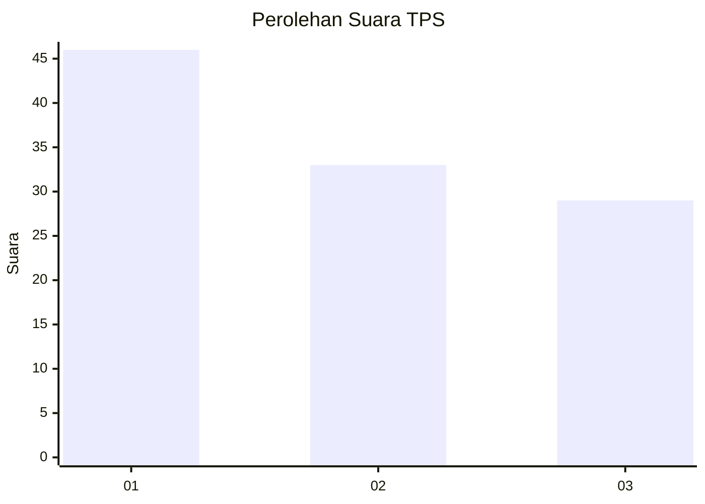
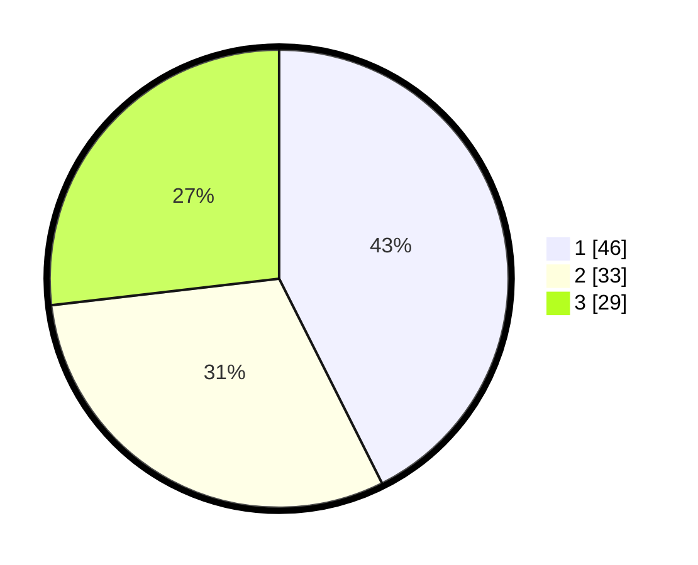

# Hasil

## Grafik

## Tabel

| No. | Nama Paslon    | Suara | Suara (raw) | Persentase |
|:--- |:-------------- | -----:| -----------:| ----------:|
| 1   | ANIES MUHAIMIN | 46    | [46][p-1]   | 42,59      |
| 2   | PRABOWO GIBRAN | 33    | [33][p-2]   | 30,56      |
| 3   | GANJAR MAHFUD  | 29    | [29][p-3]   | 26,85      |

[p-1]: https://github.com/gigit-pemilu/pemilu-2024/blob/main/pilpres/hitung-suara/sub/33-jawa-tengah/sub/08-magelang/sub/19-tegalrejo/sub/2021-mangunrejo/sub/007-tps/sub/paslon-1.txt
[p-2]: https://github.com/gigit-pemilu/pemilu-2024/blob/main/pilpres/hitung-suara/sub/33-jawa-tengah/sub/08-magelang/sub/19-tegalrejo/sub/2021-mangunrejo/sub/007-tps/sub/paslon-2.txt
[p-3]: https://github.com/gigit-pemilu/pemilu-2024/blob/main/pilpres/hitung-suara/sub/33-jawa-tengah/sub/08-magelang/sub/19-tegalrejo/sub/2021-mangunrejo/sub/007-tps/sub/paslon-3.txt

## Foto C Plano

https://sirekap-obj-formc.kpu.go.id/9631/pemilu/ppwp/33/08/19/20/21/3308192021007-20240214-212919--06e2d566-c2bd-455d-be58-bf4dfd03b0af.jpg

https://sirekap-obj-formc.kpu.go.id/9631/pemilu/ppwp/33/08/19/20/21/3308192021007-20240214-213058--2741315a-1880-41c5-8822-91baef1aa107.jpg

https://sirekap-obj-formc.kpu.go.id/9631/pemilu/ppwp/33/08/19/20/21/3308192021007-20240214-213149--2a159ded-cc18-4b8c-989a-ff0f57d89986.jpg

## Metadata

| Key        | Value               |
| ---------- | ------------------- |
| Time Stamp | 2024-02-15 22:40:13 |

