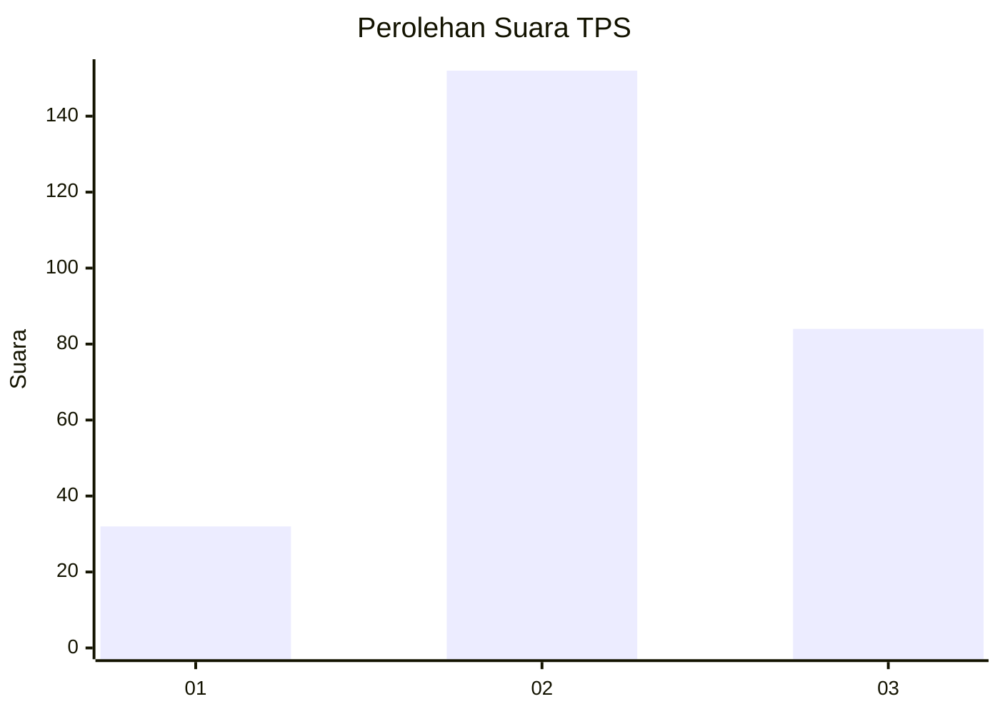
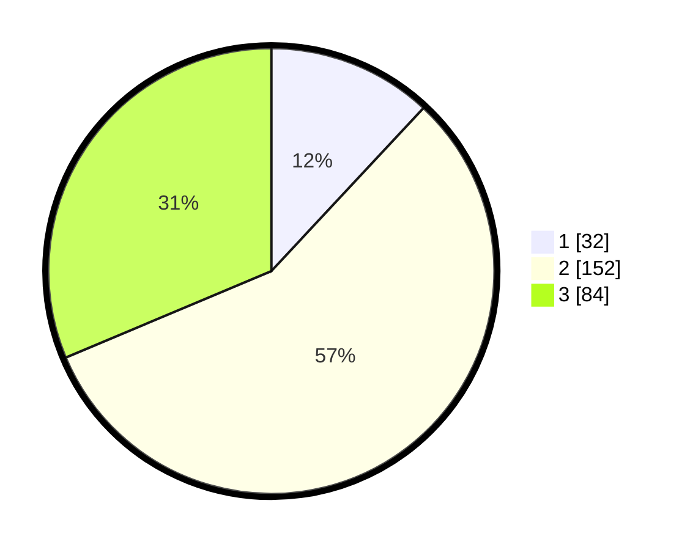

# Hasil

## Grafik

## Tabel

| No. | Nama Paslon    | Suara | Suara (raw) | Persentase |
|:--- |:-------------- | -----:| -----------:| ----------:|
| 1   | ANIES MUHAIMIN | 32    | [32][p-1]   | 11,94      |
| 2   | PRABOWO GIBRAN | 152   | [152][p-2]  | 56,72      |
| 3   | GANJAR MAHFUD  | 84    | [84][p-3]   | 31,34      |

[p-1]: https://github.com/gigit-pemilu/pemilu-2024/blob/main/pilpres/hitung-suara/sub/33-jawa-tengah/sub/08-magelang/sub/20-secang/sub/2008-candiretno/sub/011-tps/sub/paslon-1.txt
[p-2]: https://github.com/gigit-pemilu/pemilu-2024/blob/main/pilpres/hitung-suara/sub/33-jawa-tengah/sub/08-magelang/sub/20-secang/sub/2008-candiretno/sub/011-tps/sub/paslon-2.txt
[p-3]: https://github.com/gigit-pemilu/pemilu-2024/blob/main/pilpres/hitung-suara/sub/33-jawa-tengah/sub/08-magelang/sub/20-secang/sub/2008-candiretno/sub/011-tps/sub/paslon-3.txt

## Foto C Plano

https://sirekap-obj-formc.kpu.go.id/9a52/pemilu/ppwp/33/08/20/20/08/3308202008011-20240215-214607--94964eb1-6271-47be-94ea-45b9706d37cb.jpg

https://sirekap-obj-formc.kpu.go.id/9a52/pemilu/ppwp/33/08/20/20/08/3308202008011-20240215-083548--9fe5069e-91a3-4679-a91b-337ad05b61fe.jpg

https://sirekap-obj-formc.kpu.go.id/9a52/pemilu/ppwp/33/08/20/20/08/3308202008011-20240215-083728--08e1de7e-92a6-45e3-b6ef-3d037ffc7ec5.jpg

## Metadata

| Key        | Value               |
| ---------- | ------------------- |
| Time Stamp | 2024-02-15 22:00:27 |

