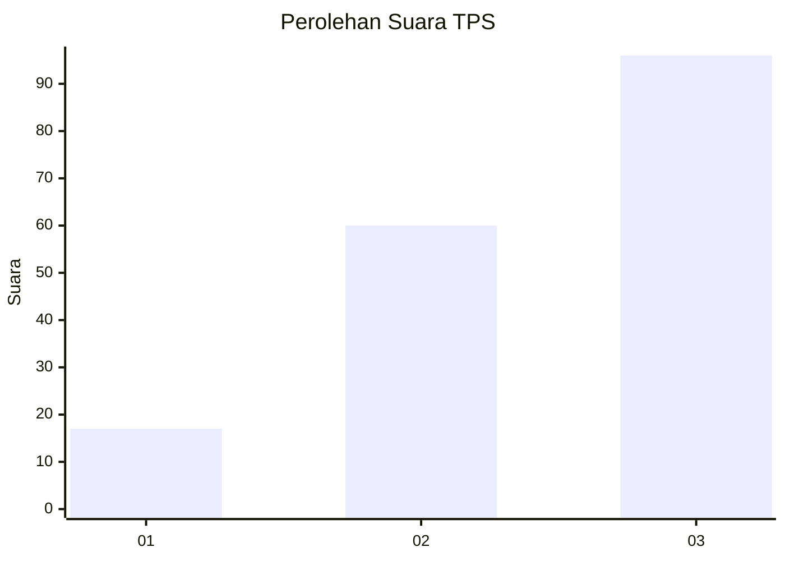
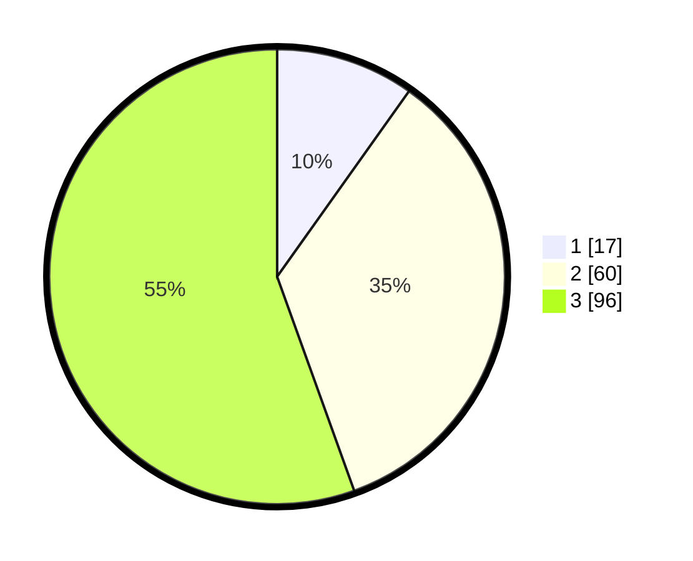

# Hasil

## Grafik

## Tabel

| No. | Nama Paslon    | Suara | Suara (raw) | Persentase |
|:--- |:-------------- | -----:| -----------:| ----------:|
| 1   | ANIES MUHAIMIN | 17    | [17][p-1]   | 9,83       |
| 2   | PRABOWO GIBRAN | 60    | [60][p-2]   | 34,68      |
| 3   | GANJAR MAHFUD  | 96    | [96][p-3]   | 55,49      |

[p-1]: https://github.com/gigit-pemilu/pemilu-2024/blob/main/pilpres/hitung-suara/sub/33-jawa-tengah/sub/08-magelang/sub/20-secang/sub/2008-candiretno/sub/013-tps/sub/paslon-1.txt
[p-2]: https://github.com/gigit-pemilu/pemilu-2024/blob/main/pilpres/hitung-suara/sub/33-jawa-tengah/sub/08-magelang/sub/20-secang/sub/2008-candiretno/sub/013-tps/sub/paslon-2.txt
[p-3]: https://github.com/gigit-pemilu/pemilu-2024/blob/main/pilpres/hitung-suara/sub/33-jawa-tengah/sub/08-magelang/sub/20-secang/sub/2008-candiretno/sub/013-tps/sub/paslon-3.txt

## Foto C Plano

https://sirekap-obj-formc.kpu.go.id/986c/pemilu/ppwp/33/08/20/20/08/3308202008013-20240216-204411--c4c6d043-17ac-4fe5-b3c5-284142ad3fb4.jpg

https://sirekap-obj-formc.kpu.go.id/986c/pemilu/ppwp/33/08/20/20/08/3308202008013-20240216-204226--b17e4452-5819-4bd2-9623-5429a2050be2.jpg

https://sirekap-obj-formc.kpu.go.id/986c/pemilu/ppwp/33/08/20/20/08/3308202008013-20240216-204312--151fc8fe-ffc6-4740-8858-ce3c1aa113f8.jpg

## Metadata

| Key        | Value               |
| ---------- | ------------------- |
| Time Stamp | 2024-02-17 16:52:47 |

