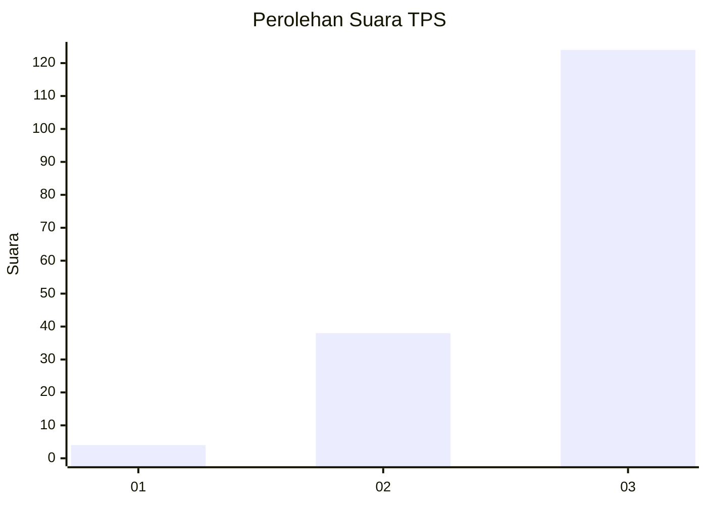
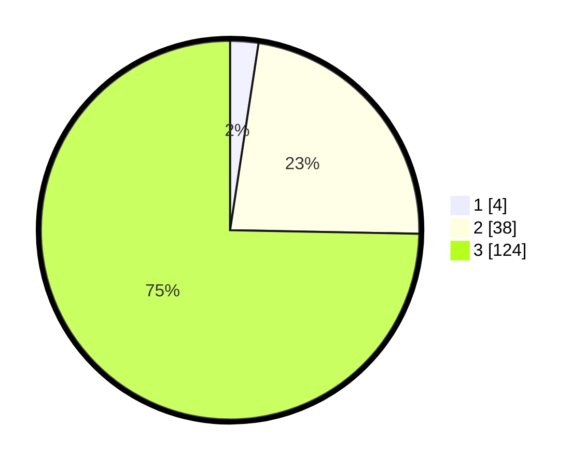

# Hasil

## Grafik

## Tabel

| No. | Nama Paslon    | Suara | Suara (raw) | Persentase |
|:--- |:-------------- | -----:| -----------:| ----------:|
| 1   | ANIES MUHAIMIN | 4     | [4][p-1]    | 2,41       |
| 2   | PRABOWO GIBRAN | 38    | [38][p-2]   | 22,89      |
| 3   | GANJAR MAHFUD  | 124   | [124][p-3]  | 74,70      |

[p-1]: https://github.com/gigit-pemilu/pemilu-2024-33-jawa-tengah/blob/main/pilpres/hitung-suara/sub/33-jawa-tengah/sub/08-magelang/sub/20-secang/sub/2008-candiretno/sub/014-tps/sub/paslon-1.txt
[p-2]: https://github.com/gigit-pemilu/pemilu-2024-33-jawa-tengah/blob/main/pilpres/hitung-suara/sub/33-jawa-tengah/sub/08-magelang/sub/20-secang/sub/2008-candiretno/sub/014-tps/sub/paslon-2.txt
[p-3]: https://github.com/gigit-pemilu/pemilu-2024-33-jawa-tengah/blob/main/pilpres/hitung-suara/sub/33-jawa-tengah/sub/08-magelang/sub/20-secang/sub/2008-candiretno/sub/014-tps/sub/paslon-3.txt

## Foto C Plano

https://sirekap-obj-formc.kpu.go.id/e985/pemilu/ppwp/33/08/20/20/08/3308202008014-20240214-141653--ea00ef7f-1eec-4c04-8d26-e44f3dca1827.jpg

https://sirekap-obj-formc.kpu.go.id/e985/pemilu/ppwp/33/08/20/20/08/3308202008014-20240215-142033--88a7a0c9-c270-4bb7-89a8-07f30dd8ca08.jpg

https://sirekap-obj-formc.kpu.go.id/e985/pemilu/ppwp/33/08/20/20/08/3308202008014-20240215-142045--52bb948a-e93f-4fca-8a82-516c5af82c07.jpg

## Metadata

| Key        | Value               |
| ---------- | ------------------- |
| Time Stamp | 2024-02-15 21:30:27 |

