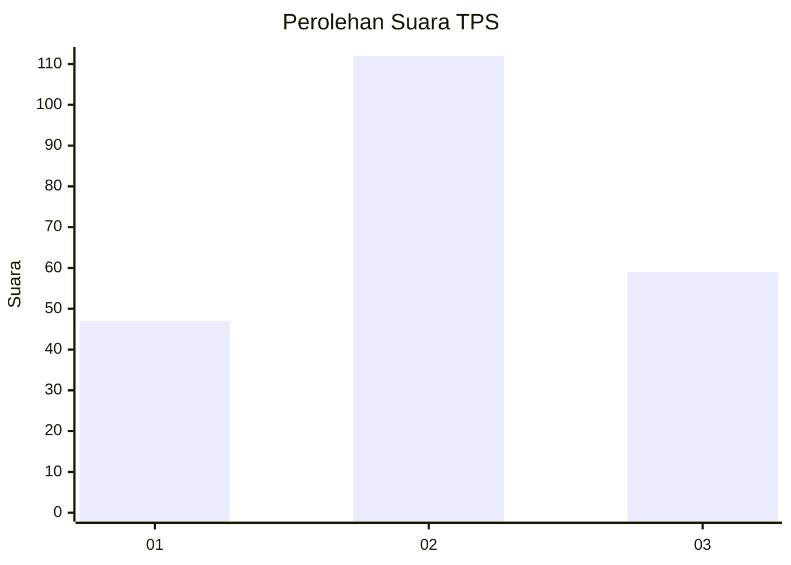
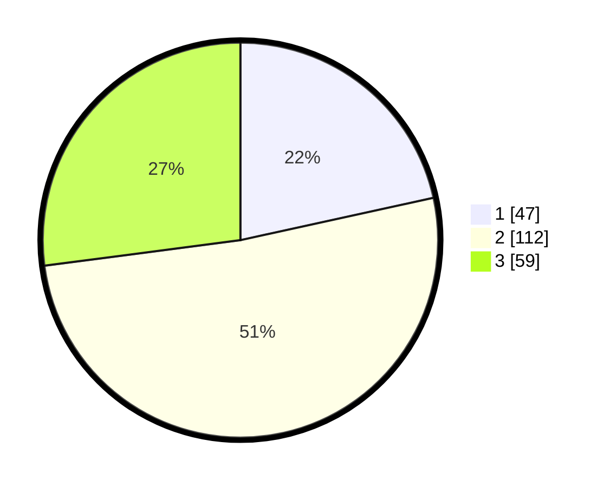

# Hasil

## Grafik

## Tabel

| No. | Nama Paslon    | Suara | Suara (raw) | Persentase |
|:--- |:-------------- | -----:| -----------:| ----------:|
| 1   | ANIES MUHAIMIN | 47    | [47][p-1]   | 21,56      |
| 2   | PRABOWO GIBRAN | 112   | [112][p-2]  | 51,38      |
| 3   | GANJAR MAHFUD  | 59    | [59][p-3]   | 27,06      |

[p-1]: https://github.com/gigit-pemilu/pemilu-2024/blob/main/pilpres/hitung-suara/sub/33-jawa-tengah/sub/08-magelang/sub/20-secang/sub/2013-ngadirojo/sub/004-tps/sub/paslon-1.txt
[p-2]: https://github.com/gigit-pemilu/pemilu-2024/blob/main/pilpres/hitung-suara/sub/33-jawa-tengah/sub/08-magelang/sub/20-secang/sub/2013-ngadirojo/sub/004-tps/sub/paslon-2.txt
[p-3]: https://github.com/gigit-pemilu/pemilu-2024/blob/main/pilpres/hitung-suara/sub/33-jawa-tengah/sub/08-magelang/sub/20-secang/sub/2013-ngadirojo/sub/004-tps/sub/paslon-3.txt

## Foto C Plano

https://sirekap-obj-formc.kpu.go.id/77fe/pemilu/ppwp/33/08/20/20/13/3308202013004-20240214-203819--3f31479e-0c73-468f-a0b9-7fe24a7ba207.jpg

https://sirekap-obj-formc.kpu.go.id/77fe/pemilu/ppwp/33/08/20/20/13/3308202013004-20240214-203930--8650d15a-3a7c-489f-9fab-3b6bb7ce9114.jpg

https://sirekap-obj-formc.kpu.go.id/77fe/pemilu/ppwp/33/08/20/20/13/3308202013004-20240214-203647--7fd3f22e-8ac0-4efb-a160-d970cd93a6cf.jpg

## Metadata

| Key        | Value               |
| ---------- | ------------------- |
| Time Stamp | 2024-02-14 21:46:01 |

