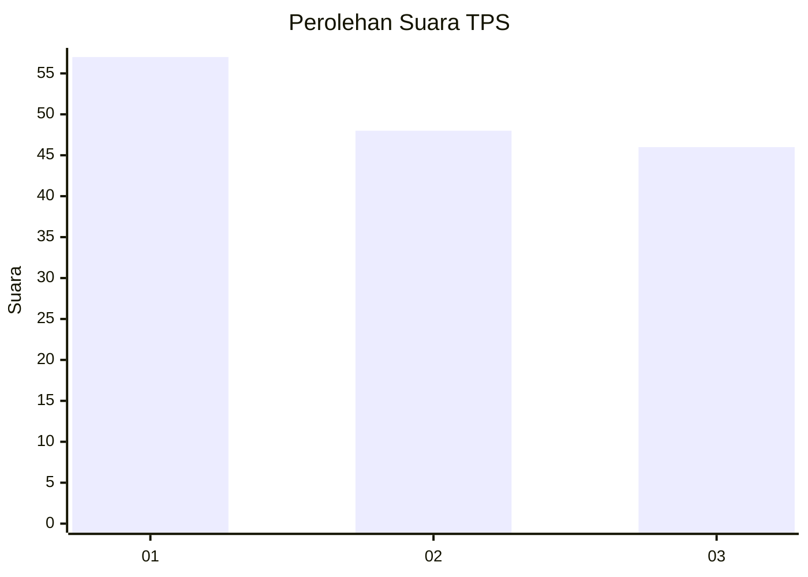
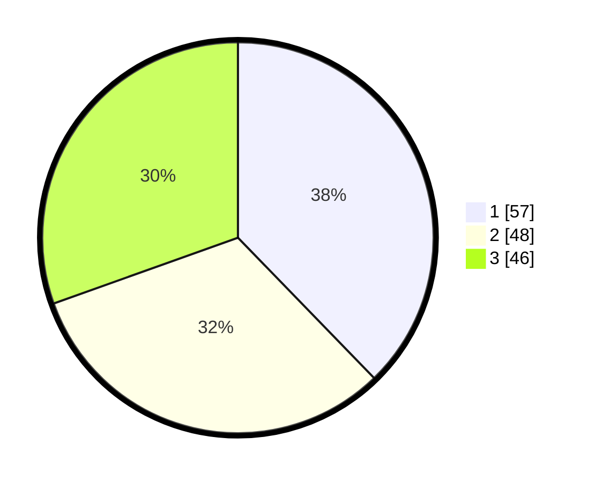

# Hasil

## Grafik

## Tabel

| No. | Nama Paslon    | Suara | Suara (raw) | Persentase |
|:--- |:-------------- | -----:| -----------:| ----------:|
| 1   | ANIES MUHAIMIN | 57    | [57][p-1]   | 37,75      |
| 2   | PRABOWO GIBRAN | 48    | [48][p-2]   | 31,79      |
| 3   | GANJAR MAHFUD  | 46    | [46][p-3]   | 30,46      |

[p-1]: https://github.com/gigit-pemilu/pemilu-2024-33-jawa-tengah/blob/main/pilpres/hitung-suara/sub/33-jawa-tengah/sub/08-magelang/sub/20-secang/sub/2018-donomulyo/sub/004-tps/sub/paslon-1.txt
[p-2]: https://github.com/gigit-pemilu/pemilu-2024-33-jawa-tengah/blob/main/pilpres/hitung-suara/sub/33-jawa-tengah/sub/08-magelang/sub/20-secang/sub/2018-donomulyo/sub/004-tps/sub/paslon-2.txt
[p-3]: https://github.com/gigit-pemilu/pemilu-2024-33-jawa-tengah/blob/main/pilpres/hitung-suara/sub/33-jawa-tengah/sub/08-magelang/sub/20-secang/sub/2018-donomulyo/sub/004-tps/sub/paslon-3.txt

## Foto C Plano

https://sirekap-obj-formc.kpu.go.id/4f1e/pemilu/ppwp/33/08/20/20/18/3308202018004-20240215-173627--2c09c8bb-4b28-4769-bd3a-074fbc340d08.jpg

https://sirekap-obj-formc.kpu.go.id/4f1e/pemilu/ppwp/33/08/20/20/18/3308202018004-20240214-223905--3902953c-c87b-4cbb-ba71-517ff8705998.jpg

https://sirekap-obj-formc.kpu.go.id/4f1e/pemilu/ppwp/33/08/20/20/18/3308202018004-20240215-005849--37ce0caa-bd69-4453-98e4-fc3aef786d3a.jpg

## Metadata

| Key        | Value               |
| ---------- | ------------------- |
| Time Stamp | 2024-02-19 06:16:00 |

