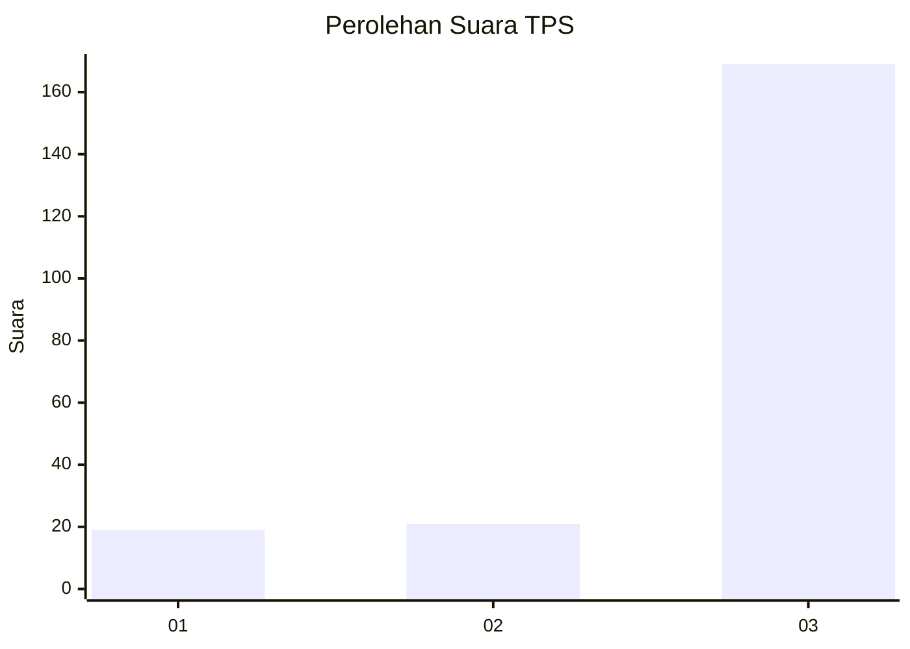
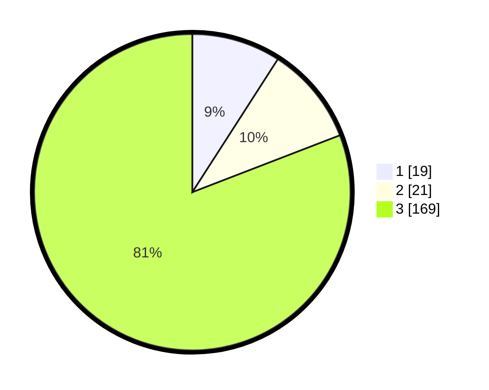

# Hasil

## Grafik

## Tabel

| No. | Nama Paslon    | Suara | Suara (raw) | Persentase |
|:--- |:-------------- | -----:| -----------:| ----------:|
| 1   | ANIES MUHAIMIN | 19    | [19][p-1]   | 9,09       |
| 2   | PRABOWO GIBRAN | 21    | [21][p-2]   | 10,05      |
| 3   | GANJAR MAHFUD  | 169   | [169][p-3]  | 80,86      |

[p-1]: https://github.com/gigit-pemilu/pemilu-2024-33-jawa-tengah/blob/main/pilpres/hitung-suara/sub/33-jawa-tengah/sub/08-magelang/sub/20-secang/sub/2019-girikulon/sub/003-tps/sub/paslon-1.txt
[p-2]: https://github.com/gigit-pemilu/pemilu-2024-33-jawa-tengah/blob/main/pilpres/hitung-suara/sub/33-jawa-tengah/sub/08-magelang/sub/20-secang/sub/2019-girikulon/sub/003-tps/sub/paslon-2.txt
[p-3]: https://github.com/gigit-pemilu/pemilu-2024-33-jawa-tengah/blob/main/pilpres/hitung-suara/sub/33-jawa-tengah/sub/08-magelang/sub/20-secang/sub/2019-girikulon/sub/003-tps/sub/paslon-3.txt

## Foto C Plano

https://sirekap-obj-formc.kpu.go.id/de14/pemilu/ppwp/33/08/20/20/19/3308202019003-20240215-135815--69ffdaed-b056-4f6f-818d-03aa53e72153.jpg

https://sirekap-obj-formc.kpu.go.id/de14/pemilu/ppwp/33/08/20/20/19/3308202019003-20240215-135853--480332f4-9eab-4b16-8f45-cb41889dc04f.jpg

https://sirekap-obj-formc.kpu.go.id/de14/pemilu/ppwp/33/08/20/20/19/3308202019003-20240215-135943--b514f210-20d6-414b-a929-435802c1fc65.jpg

## Metadata

| Key        | Value               |
| ---------- | ------------------- |
| Time Stamp | 2024-02-19 06:16:00 |

