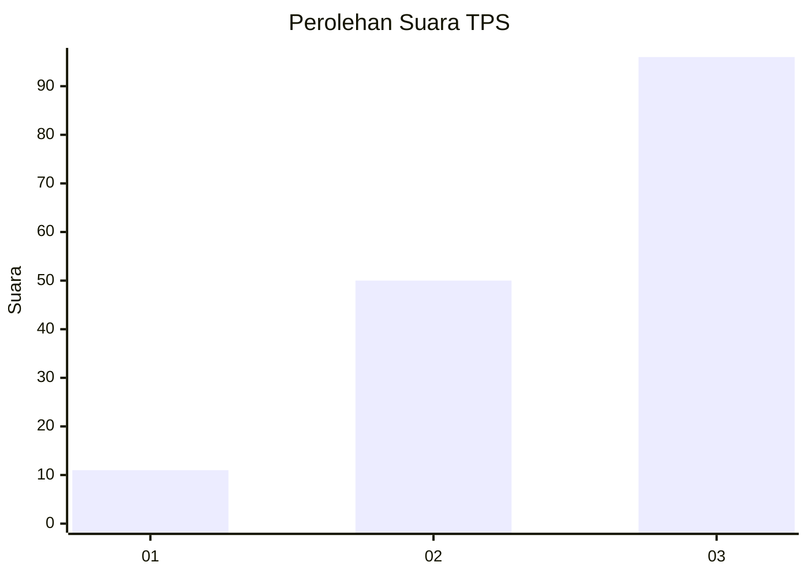
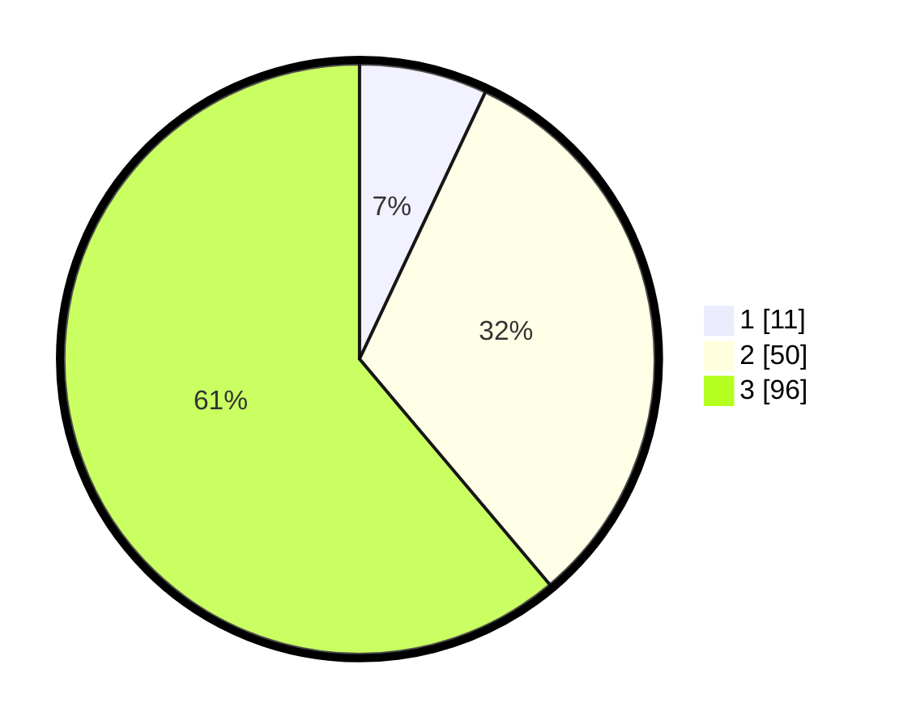

# Hasil

## Grafik

## Tabel

| No. | Nama Paslon    | Suara | Suara (raw) | Persentase |
|:--- |:-------------- | -----:| -----------:| ----------:|
| 1   | ANIES MUHAIMIN | 11    | [11][p-1]   | 7,01       |
| 2   | PRABOWO GIBRAN | 50    | [50][p-2]   | 31,85      |
| 3   | GANJAR MAHFUD  | 96    | [96][p-3]   | 61,15      |

[p-1]: https://github.com/gigit-pemilu/pemilu-2024/blob/main/pilpres/hitung-suara/sub/33-jawa-tengah/sub/08-magelang/sub/21-windusari/sub/2010-genito/sub/015-tps/sub/paslon-1.txt
[p-2]: https://github.com/gigit-pemilu/pemilu-2024/blob/main/pilpres/hitung-suara/sub/33-jawa-tengah/sub/08-magelang/sub/21-windusari/sub/2010-genito/sub/015-tps/sub/paslon-2.txt
[p-3]: https://github.com/gigit-pemilu/pemilu-2024/blob/main/pilpres/hitung-suara/sub/33-jawa-tengah/sub/08-magelang/sub/21-windusari/sub/2010-genito/sub/015-tps/sub/paslon-3.txt

## Foto C Plano

https://sirekap-obj-formc.kpu.go.id/6b51/pemilu/ppwp/33/08/21/20/10/3308212010015-20240214-201644--5f87219e-6fa6-4754-9ff2-4a9bffc73596.jpg

https://sirekap-obj-formc.kpu.go.id/6b51/pemilu/ppwp/33/08/21/20/10/3308212010015-20240214-202419--2fd85d0d-6706-4f44-9ea3-11809986da65.jpg

https://sirekap-obj-formc.kpu.go.id/6b51/pemilu/ppwp/33/08/21/20/10/3308212010015-20240214-202259--4610054f-a8a4-47bb-bed5-6175f49720de.jpg

## Metadata

| Key        | Value               |
| ---------- | ------------------- |
| Time Stamp | 2024-02-15 20:30:46 |

