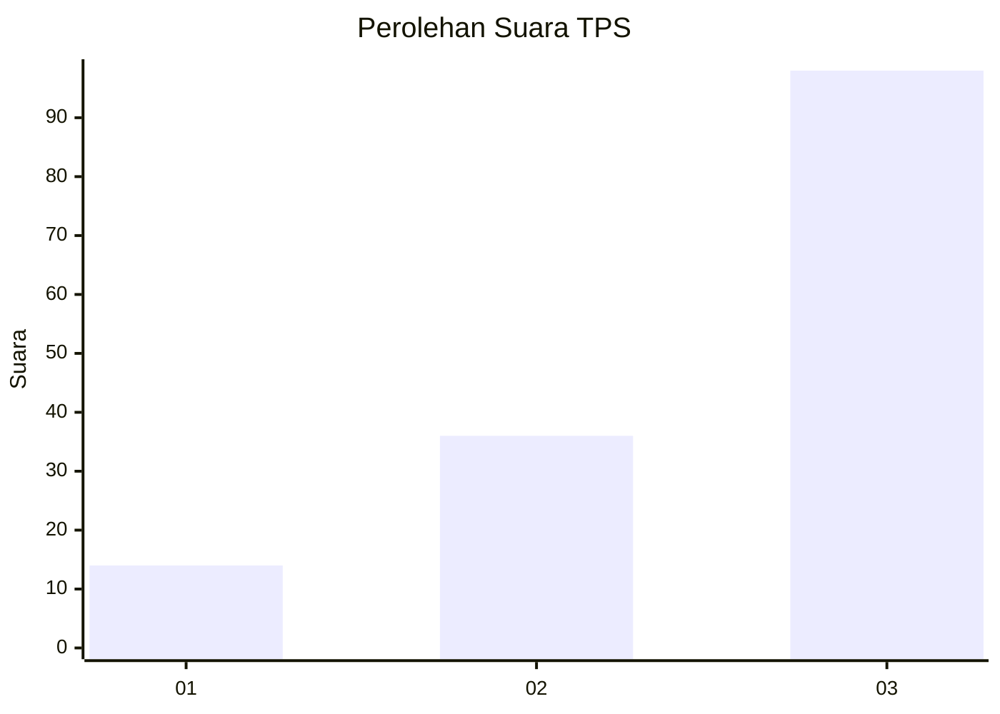
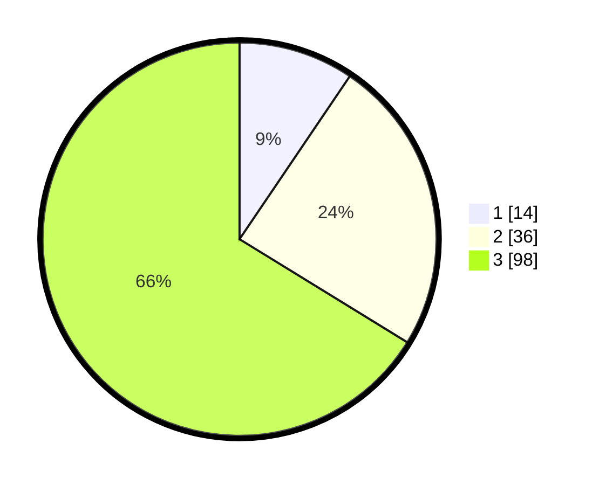

# Hasil

## Grafik

## Tabel

| No. | Nama Paslon    | Suara | Suara (raw) | Persentase |
|:--- |:-------------- | -----:| -----------:| ----------:|
| 1   | ANIES MUHAIMIN | 14    | [14][p-1]   | 9,46       |
| 2   | PRABOWO GIBRAN | 36    | [36][p-2]   | 24,32      |
| 3   | GANJAR MAHFUD  | 98    | [98][p-3]   | 66,22      |

[p-1]: https://github.com/gigit-pemilu/pemilu-2024/blob/main/pilpres/hitung-suara/sub/33-jawa-tengah/sub/09-boyolali/sub/01-selo/sub/2001-tlogolele/sub/001-tps/sub/paslon-1.txt
[p-2]: https://github.com/gigit-pemilu/pemilu-2024/blob/main/pilpres/hitung-suara/sub/33-jawa-tengah/sub/09-boyolali/sub/01-selo/sub/2001-tlogolele/sub/001-tps/sub/paslon-2.txt
[p-3]: https://github.com/gigit-pemilu/pemilu-2024/blob/main/pilpres/hitung-suara/sub/33-jawa-tengah/sub/09-boyolali/sub/01-selo/sub/2001-tlogolele/sub/001-tps/sub/paslon-3.txt

## Foto C Plano

https://sirekap-obj-formc.kpu.go.id/ba8c/pemilu/ppwp/33/09/01/20/01/3309012001001-20240216-094801--28314efd-af3e-46e6-ae0d-5026a09a5d70.jpg

https://sirekap-obj-formc.kpu.go.id/ba8c/pemilu/ppwp/33/09/01/20/01/3309012001001-20240215-185105--16b97ebf-5aa6-4540-b883-d275c490964b.jpg

https://sirekap-obj-formc.kpu.go.id/ba8c/pemilu/ppwp/33/09/01/20/01/3309012001001-20240215-185427--b5660f31-97fb-4df9-9ff9-dea72fbfab57.jpg

## Metadata

| Key        | Value               |
| ---------- | ------------------- |
| Time Stamp | 2024-02-16 10:00:28 |

## DATA PEMILIH TETAP

Jumlah pemilih dalam DPT: **170**.
 * L: **85**.
 * P: **85**.

## DATA PENGGUNA HAK PILIH

Jumlah pengguna hak pilih dalam DPT: **152**.
 * L: **73**.
 * P: **79**.

Jumlah pengguna hak pilih dalam DPTb: **3**.
 * L: **2**.
 * P: **1**.

Jumlah pengguna hak pilih dalam DPK: **0**.
 * L: **0**.
 * P: **0**.

Jumlah pengguna hak pilih: **155**.
 * L: **75**.
 * P: **80**.

## JUMLAH SUARA SAH DAN TIDAK SAH

JUMLAH SELURUH SUARA SAH: **148**.

JUMLAH SUARA TIDAK SAH: **7**.

JUMLAH SELURUH SUARA SAH DAN SUARA TIDAK SAH: **155**.

