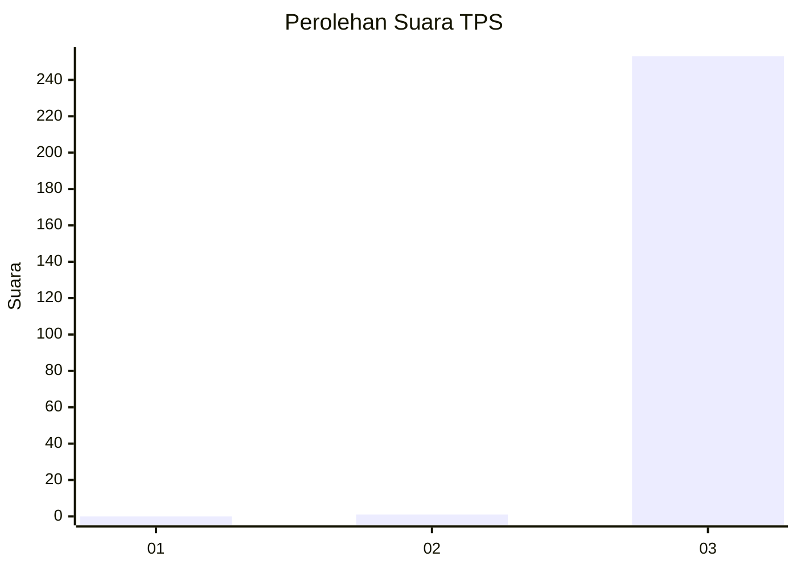
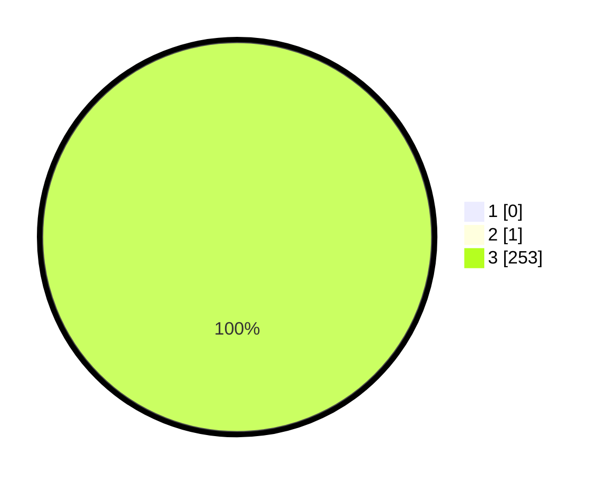

# Hasil

## Grafik

## Tabel

| No. | Nama Paslon    | Suara | Suara (raw) | Persentase |
|:--- |:-------------- | -----:| -----------:| ----------:|
| 1   | ANIES MUHAIMIN | 0     | [0][p-1]    | 0,00       |
| 2   | PRABOWO GIBRAN | 1     | [1][p-2]    | 0,39       |
| 3   | GANJAR MAHFUD  | 253   | [253][p-3]  | 99,61      |

[p-1]: https://github.com/gigit-pemilu/pemilu-2024/blob/main/pilpres/hitung-suara/sub/33-jawa-tengah/sub/09-boyolali/sub/01-selo/sub/2001-tlogolele/sub/003-tps/sub/paslon-1.txt
[p-2]: https://github.com/gigit-pemilu/pemilu-2024/blob/main/pilpres/hitung-suara/sub/33-jawa-tengah/sub/09-boyolali/sub/01-selo/sub/2001-tlogolele/sub/003-tps/sub/paslon-2.txt
[p-3]: https://github.com/gigit-pemilu/pemilu-2024/blob/main/pilpres/hitung-suara/sub/33-jawa-tengah/sub/09-boyolali/sub/01-selo/sub/2001-tlogolele/sub/003-tps/sub/paslon-3.txt

## Foto C Plano

https://sirekap-obj-formc.kpu.go.id/41f2/pemilu/ppwp/33/09/01/20/01/3309012001003-20240214-225207--cf709e86-6de9-471f-a6fc-d57f4a60b370.jpg

https://sirekap-obj-formc.kpu.go.id/41f2/pemilu/ppwp/33/09/01/20/01/3309012001003-20240214-225251--f30294e8-18f2-4d0c-8fde-e894fee5dd3e.jpg

https://sirekap-obj-formc.kpu.go.id/41f2/pemilu/ppwp/33/09/01/20/01/3309012001003-20240214-225348--ceb81a5f-252b-446c-bd68-c5d58687eade.jpg

## Metadata

| Key        | Value               |
| ---------- | ------------------- |
| Time Stamp | 2024-02-15 07:00:44 |

## DATA PEMILIH TETAP

Jumlah pemilih dalam DPT: **267**.
 * L: **142**.
 * P: **125**.

## DATA PENGGUNA HAK PILIH

Jumlah pengguna hak pilih dalam DPT: **255**.
 * L: **135**.
 * P: **120**.

Jumlah pengguna hak pilih dalam DPTb: **1**.
 * L: **1**.
 * P: **0**.

Jumlah pengguna hak pilih dalam DPK: **0**.
 * L: **0**.
 * P: **0**.

Jumlah pengguna hak pilih: **256**.
 * L: **136**.
 * P: **120**.

## JUMLAH SUARA SAH DAN TIDAK SAH

JUMLAH SELURUH SUARA SAH: **254**.

JUMLAH SUARA TIDAK SAH: **2**.

JUMLAH SELURUH SUARA SAH DAN SUARA TIDAK SAH: **256**.

