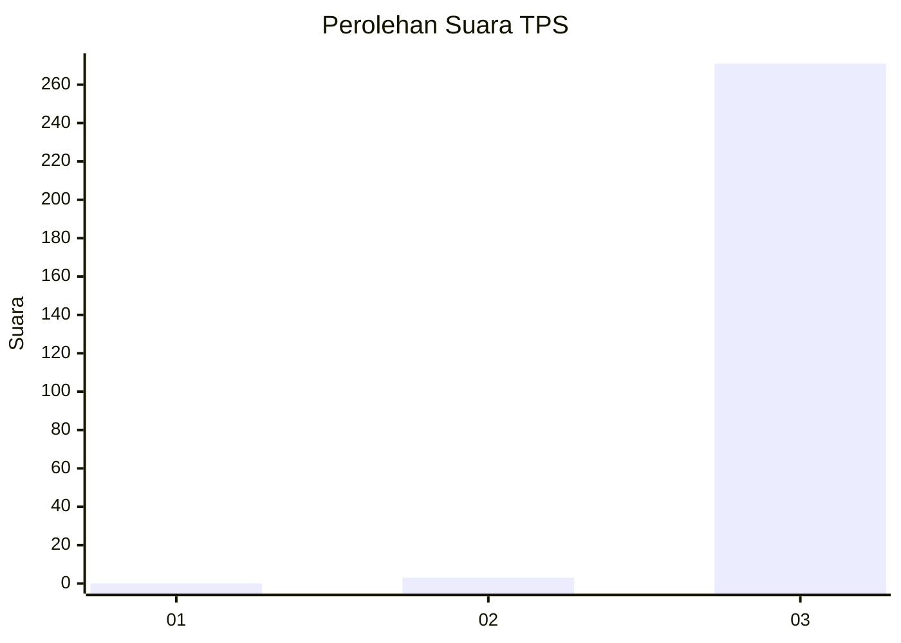
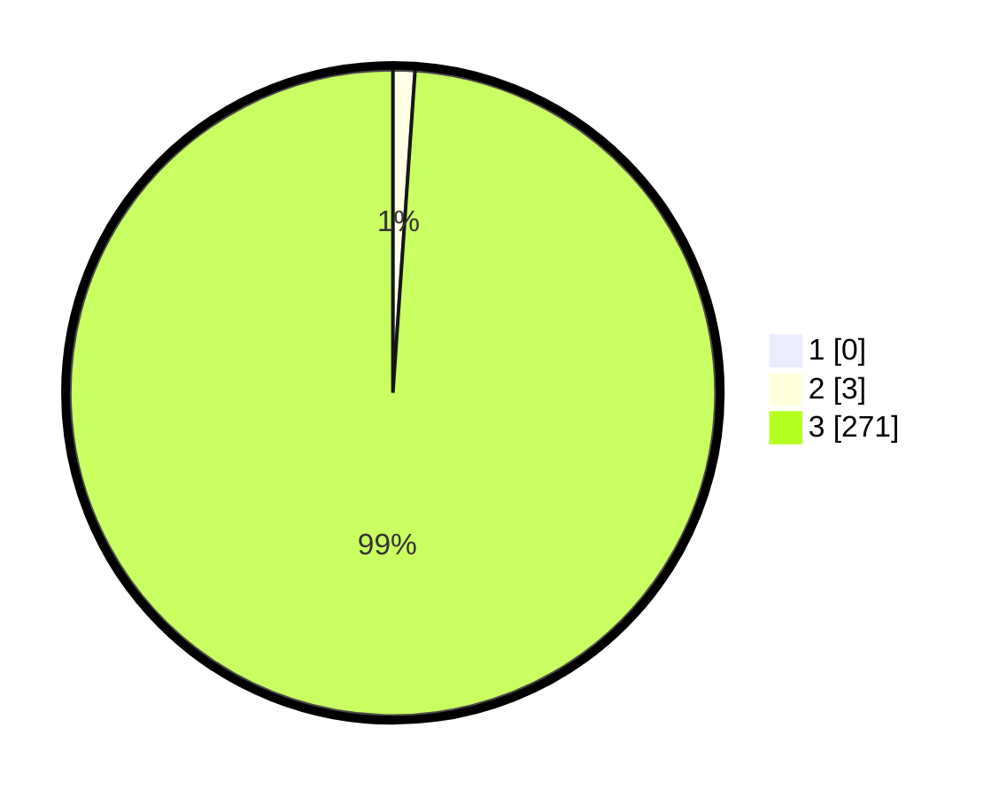

# Hasil

## Grafik

## Tabel

| No. | Nama Paslon    | Suara | Suara (raw) | Persentase |
|:--- |:-------------- | -----:| -----------:| ----------:|
| 1   | ANIES MUHAIMIN | 0     | [0][p-1]    | 0,00       |
| 2   | PRABOWO GIBRAN | 3     | [3][p-2]    | 1,09       |
| 3   | GANJAR MAHFUD  | 271   | [271][p-3]  | 98,91      |

[p-1]: https://github.com/gigit-pemilu/pemilu-2024/blob/main/pilpres/hitung-suara/sub/33-jawa-tengah/sub/09-boyolali/sub/01-selo/sub/2001-tlogolele/sub/004-tps/sub/paslon-1.txt
[p-2]: https://github.com/gigit-pemilu/pemilu-2024/blob/main/pilpres/hitung-suara/sub/33-jawa-tengah/sub/09-boyolali/sub/01-selo/sub/2001-tlogolele/sub/004-tps/sub/paslon-2.txt
[p-3]: https://github.com/gigit-pemilu/pemilu-2024/blob/main/pilpres/hitung-suara/sub/33-jawa-tengah/sub/09-boyolali/sub/01-selo/sub/2001-tlogolele/sub/004-tps/sub/paslon-3.txt

## Foto C Plano

https://sirekap-obj-formc.kpu.go.id/5638/pemilu/ppwp/33/09/01/20/01/3309012001004-20240214-215331--7a53ca41-3bf8-44e7-aea3-a944c309fe66.jpg

https://sirekap-obj-formc.kpu.go.id/5638/pemilu/ppwp/33/09/01/20/01/3309012001004-20240214-215515--6add0fcb-baa3-4fce-ae92-d22918b24449.jpg

https://sirekap-obj-formc.kpu.go.id/5638/pemilu/ppwp/33/09/01/20/01/3309012001004-20240214-220114--4add62b6-5001-45a3-b314-b83f58d705c0.jpg

## Metadata

| Key        | Value               |
| ---------- | ------------------- |
| Time Stamp | 2024-02-17 13:37:34 |

