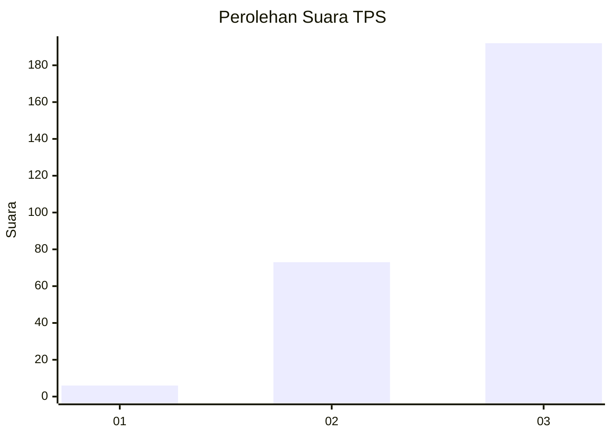
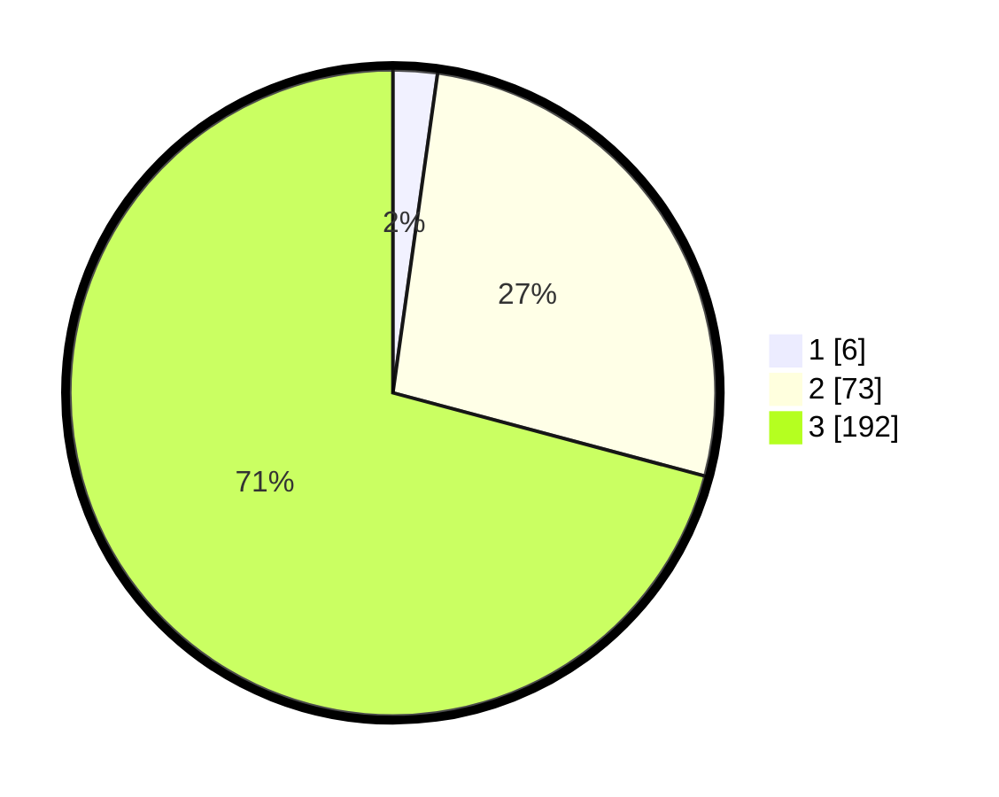

# Hasil

## Grafik

## Tabel

| No. | Nama Paslon    | Suara | Suara (raw) | Persentase |
|:--- |:-------------- | -----:| -----------:| ----------:|
| 1   | ANIES MUHAIMIN | 6     | [6][p-1]    | 2,21       |
| 2   | PRABOWO GIBRAN | 73    | [73][p-2]   | 26,94      |
| 3   | GANJAR MAHFUD  | 192   | [192][p-3]  | 70,85      |

[p-1]: https://github.com/gigit-pemilu/pemilu-2024/blob/main/pilpres/hitung-suara/sub/33-jawa-tengah/sub/09-boyolali/sub/01-selo/sub/2008-tarubatang/sub/001-tps/sub/paslon-1.txt
[p-2]: https://github.com/gigit-pemilu/pemilu-2024/blob/main/pilpres/hitung-suara/sub/33-jawa-tengah/sub/09-boyolali/sub/01-selo/sub/2008-tarubatang/sub/001-tps/sub/paslon-2.txt
[p-3]: https://github.com/gigit-pemilu/pemilu-2024/blob/main/pilpres/hitung-suara/sub/33-jawa-tengah/sub/09-boyolali/sub/01-selo/sub/2008-tarubatang/sub/001-tps/sub/paslon-3.txt

## Foto C Plano

https://sirekap-obj-formc.kpu.go.id/a397/pemilu/ppwp/33/09/01/20/08/3309012008001-20240218-194727--7119396a-3d86-4da1-bfa4-6ceaf95b2b44.jpg

https://sirekap-obj-formc.kpu.go.id/a397/pemilu/ppwp/33/09/01/20/08/3309012008001-20240215-000147--cd84d8e6-b3fd-45f5-9447-480ce37d2489.jpg

https://sirekap-obj-formc.kpu.go.id/a397/pemilu/ppwp/33/09/01/20/08/3309012008001-20240215-000239--ff82c773-d0e6-4f5d-99be-aa59a05469f5.jpg

## Metadata

| Key        | Value               |
| ---------- | ------------------- |
| Time Stamp | 2024-02-19 06:16:00 |

