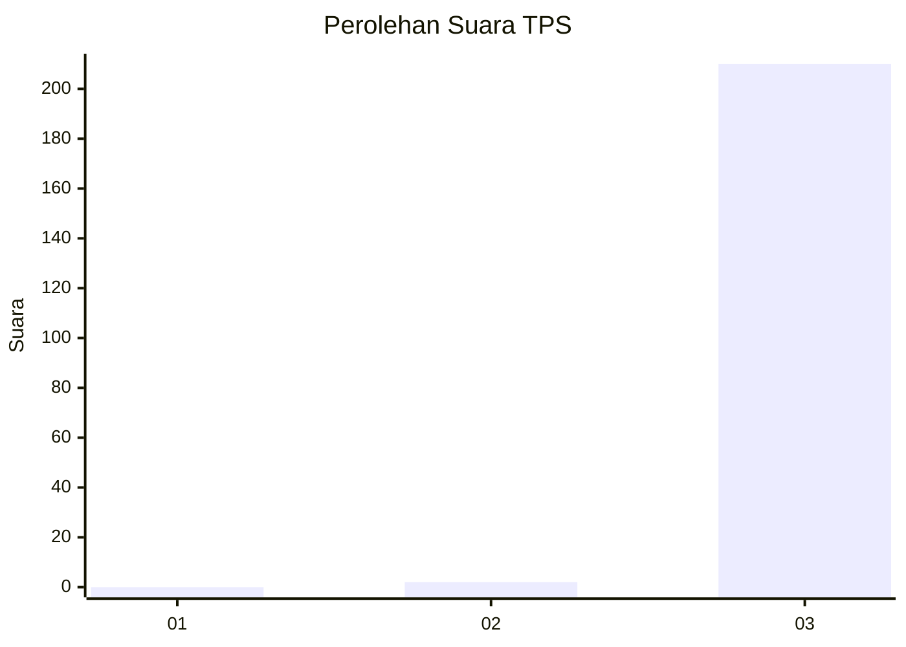
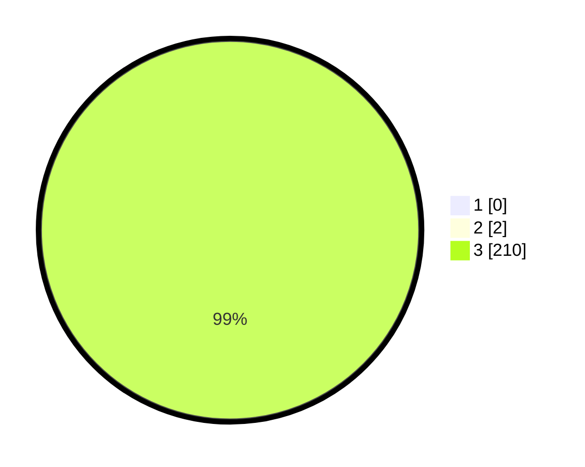

# Hasil

## Grafik

## Tabel

| No. | Nama Paslon    | Suara | Suara (raw) | Persentase |
|:--- |:-------------- | -----:| -----------:| ----------:|
| 1   | ANIES MUHAIMIN | 0     | [0][p-1]    | 0,00       |
| 2   | PRABOWO GIBRAN | 2     | [2][p-2]    | 0,94       |
| 3   | GANJAR MAHFUD  | 210   | [210][p-3]  | 99,06      |

[p-1]: https://github.com/gigit-pemilu/pemilu-2024-33-jawa-tengah/blob/main/pilpres/hitung-suara/sub/33-jawa-tengah/sub/09-boyolali/sub/01-selo/sub/2009-senden/sub/003-tps/sub/paslon-1.txt
[p-2]: https://github.com/gigit-pemilu/pemilu-2024-33-jawa-tengah/blob/main/pilpres/hitung-suara/sub/33-jawa-tengah/sub/09-boyolali/sub/01-selo/sub/2009-senden/sub/003-tps/sub/paslon-2.txt
[p-3]: https://github.com/gigit-pemilu/pemilu-2024-33-jawa-tengah/blob/main/pilpres/hitung-suara/sub/33-jawa-tengah/sub/09-boyolali/sub/01-selo/sub/2009-senden/sub/003-tps/sub/paslon-3.txt

## Foto C Plano

https://sirekap-obj-formc.kpu.go.id/8509/pemilu/ppwp/33/09/01/20/09/3309012009003-20240215-013630--28933560-e7e2-4673-84a0-8250cfb27656.jpg

https://sirekap-obj-formc.kpu.go.id/8509/pemilu/ppwp/33/09/01/20/09/3309012009003-20240215-013541--afdbc5b5-4a6f-4108-abcb-1046491f86a9.jpg

https://sirekap-obj-formc.kpu.go.id/8509/pemilu/ppwp/33/09/01/20/09/3309012009003-20240215-013758--af3728a5-d659-4006-8889-7d85badfdf28.jpg

## Metadata

| Key        | Value               |
| ---------- | ------------------- |
| Time Stamp | 2024-02-15 22:30:27 |

