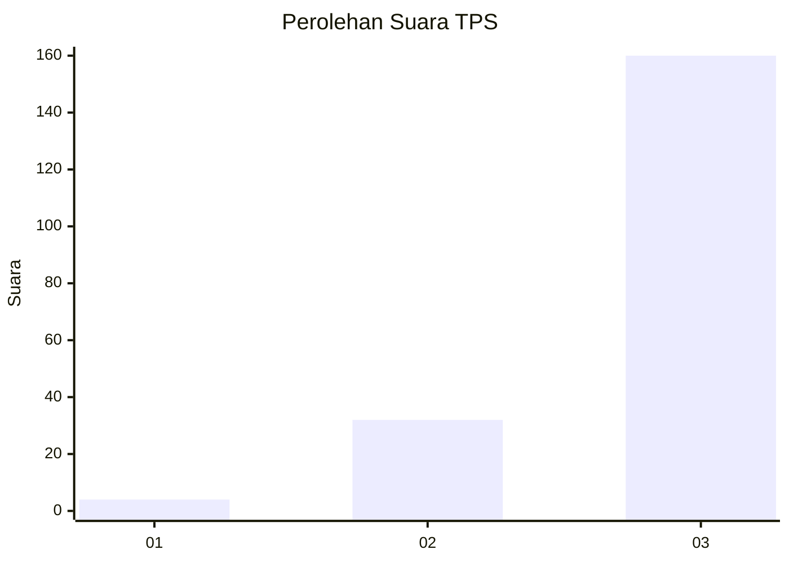
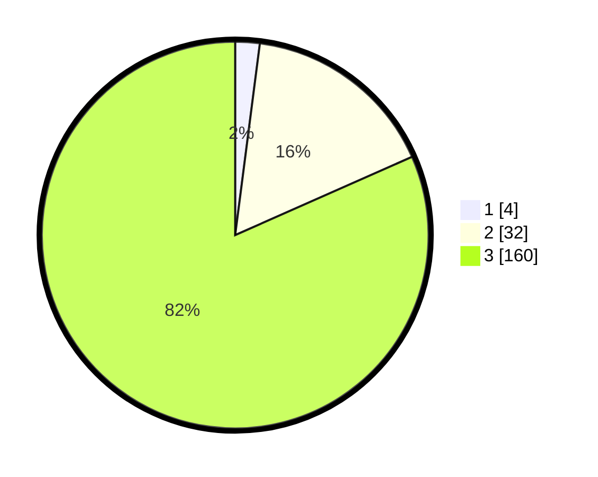

# Hasil

## Grafik

## Tabel

| No. | Nama Paslon    | Suara | Suara (raw) | Persentase |
|:--- |:-------------- | -----:| -----------:| ----------:|
| 1   | ANIES MUHAIMIN | 4     | [4][p-1]    | 2,04       |
| 2   | PRABOWO GIBRAN | 32    | [32][p-2]   | 16,33      |
| 3   | GANJAR MAHFUD  | 160   | [160][p-3]  | 81,63      |

[p-1]: https://github.com/gigit-pemilu/pemilu-2024-33-jawa-tengah/blob/main/pilpres/hitung-suara/sub/33-jawa-tengah/sub/09-boyolali/sub/01-selo/sub/2009-senden/sub/004-tps/sub/paslon-1.txt
[p-2]: https://github.com/gigit-pemilu/pemilu-2024-33-jawa-tengah/blob/main/pilpres/hitung-suara/sub/33-jawa-tengah/sub/09-boyolali/sub/01-selo/sub/2009-senden/sub/004-tps/sub/paslon-2.txt
[p-3]: https://github.com/gigit-pemilu/pemilu-2024-33-jawa-tengah/blob/main/pilpres/hitung-suara/sub/33-jawa-tengah/sub/09-boyolali/sub/01-selo/sub/2009-senden/sub/004-tps/sub/paslon-3.txt

## Foto C Plano

https://sirekap-obj-formc.kpu.go.id/7178/pemilu/ppwp/33/09/01/20/09/3309012009004-20240214-212051--cded7395-ea47-490c-963c-2d1f64508377.jpg

https://sirekap-obj-formc.kpu.go.id/7178/pemilu/ppwp/33/09/01/20/09/3309012009004-20240214-212120--fce0e910-0190-432f-b66a-da7425266fc4.jpg

https://sirekap-obj-formc.kpu.go.id/7178/pemilu/ppwp/33/09/01/20/09/3309012009004-20240214-212200--1692a707-336c-4ea0-8f58-721fb78a9c46.jpg

## Metadata

| Key        | Value               |
| ---------- | ------------------- |
| Time Stamp | 2024-02-15 01:47:43 |

