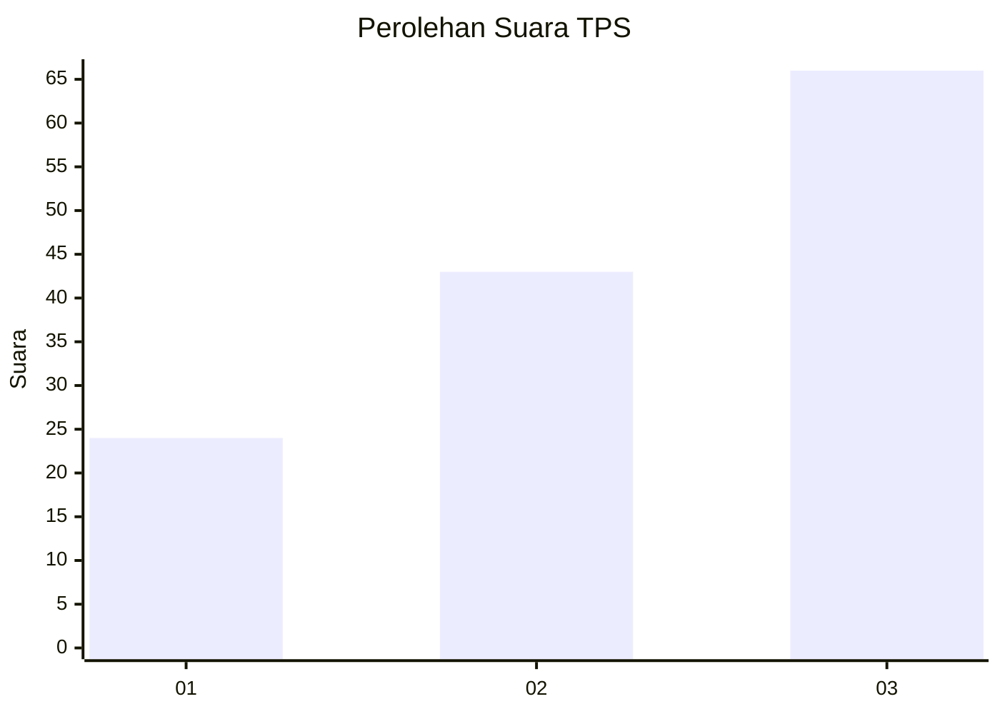
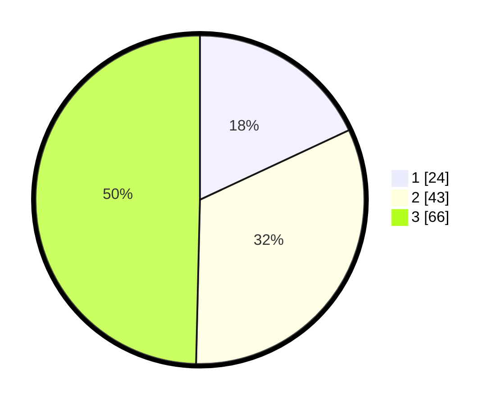

# Hasil

## Grafik

## Tabel

| No. | Nama Paslon    | Suara | Suara (raw) | Persentase |
|:--- |:-------------- | -----:| -----------:| ----------:|
| 1   | ANIES MUHAIMIN | 24    | [24][p-1]   | 18,05      |
| 2   | PRABOWO GIBRAN | 43    | [43][p-2]   | 32,33      |
| 3   | GANJAR MAHFUD  | 66    | [66][p-3]   | 49,62      |

[p-1]: https://github.com/gigit-pemilu/pemilu-2024/blob/main/pilpres/hitung-suara/sub/33-jawa-tengah/sub/09-boyolali/sub/02-ampel/sub/2002-tanduk/sub/008-tps/sub/paslon-1.txt
[p-2]: https://github.com/gigit-pemilu/pemilu-2024/blob/main/pilpres/hitung-suara/sub/33-jawa-tengah/sub/09-boyolali/sub/02-ampel/sub/2002-tanduk/sub/008-tps/sub/paslon-2.txt
[p-3]: https://github.com/gigit-pemilu/pemilu-2024/blob/main/pilpres/hitung-suara/sub/33-jawa-tengah/sub/09-boyolali/sub/02-ampel/sub/2002-tanduk/sub/008-tps/sub/paslon-3.txt

## Foto C Plano

https://sirekap-obj-formc.kpu.go.id/aff5/pemilu/ppwp/33/09/02/20/02/3309022002008-20240214-233406--a8337cad-743c-46cc-be13-607981355a1d.jpg

https://sirekap-obj-formc.kpu.go.id/aff5/pemilu/ppwp/33/09/02/20/02/3309022002008-20240214-233512--61916035-f5eb-4f83-81bb-beeb183ed286.jpg

https://sirekap-obj-formc.kpu.go.id/aff5/pemilu/ppwp/33/09/02/20/02/3309022002008-20240214-233433--b96890d3-5fea-47c0-81d8-8c250d8b6229.jpg

## Metadata

| Key        | Value               |
| ---------- | ------------------- |
| Time Stamp | 2024-02-15 12:00:28 |

