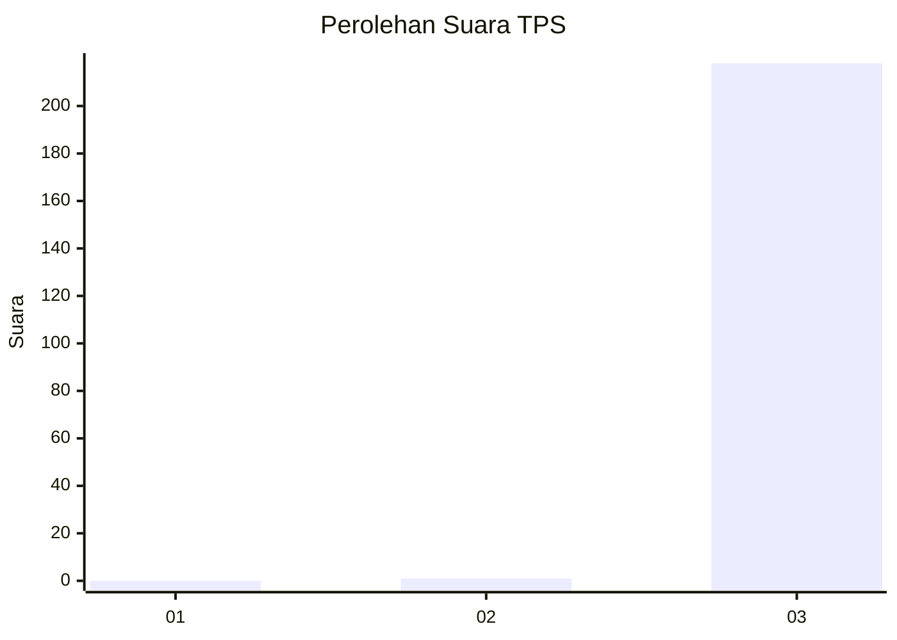
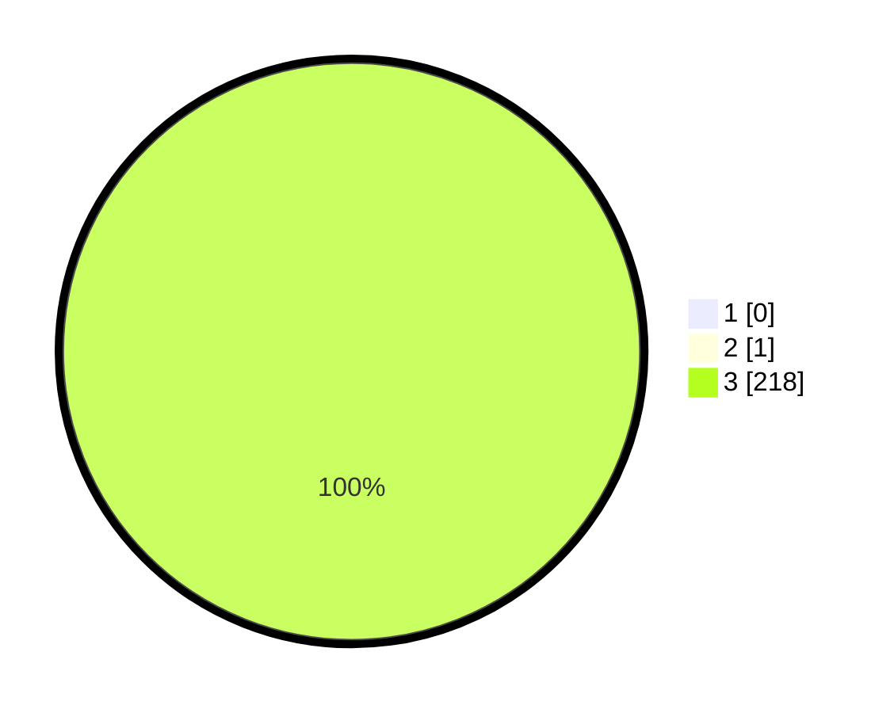

# Hasil

## Grafik

## Tabel

| No. | Nama Paslon    | Suara | Suara (raw) | Persentase |
|:--- |:-------------- | -----:| -----------:| ----------:|
| 1   | ANIES MUHAIMIN | 0     | [0][p-1]    | 0,00       |
| 2   | PRABOWO GIBRAN | 1     | [1][p-2]    | 0,46       |
| 3   | GANJAR MAHFUD  | 218   | [218][p-3]  | 99,54      |

[p-1]: https://github.com/gigit-pemilu/pemilu-2024/blob/main/pilpres/hitung-suara/sub/33-jawa-tengah/sub/09-boyolali/sub/02-ampel/sub/2003-banyuanyar/sub/002-tps/sub/paslon-1.txt
[p-2]: https://github.com/gigit-pemilu/pemilu-2024/blob/main/pilpres/hitung-suara/sub/33-jawa-tengah/sub/09-boyolali/sub/02-ampel/sub/2003-banyuanyar/sub/002-tps/sub/paslon-2.txt
[p-3]: https://github.com/gigit-pemilu/pemilu-2024/blob/main/pilpres/hitung-suara/sub/33-jawa-tengah/sub/09-boyolali/sub/02-ampel/sub/2003-banyuanyar/sub/002-tps/sub/paslon-3.txt

## Foto C Plano

https://sirekap-obj-formc.kpu.go.id/45f5/pemilu/ppwp/33/09/02/20/03/3309022003002-20240215-001915--7f9f0b34-fc5b-4a90-8f4f-0247e6e79245.jpg

https://sirekap-obj-formc.kpu.go.id/45f5/pemilu/ppwp/33/09/02/20/03/3309022003002-20240215-002026--f1b2f734-436d-43a1-9c61-4cd819b84ca9.jpg

https://sirekap-obj-formc.kpu.go.id/45f5/pemilu/ppwp/33/09/02/20/03/3309022003002-20240215-002128--b6d64e19-eba3-4692-9279-0ddd639a34bb.jpg

## Metadata

| Key        | Value               |
| ---------- | ------------------- |
| Time Stamp | 2024-02-15 21:30:27 |

