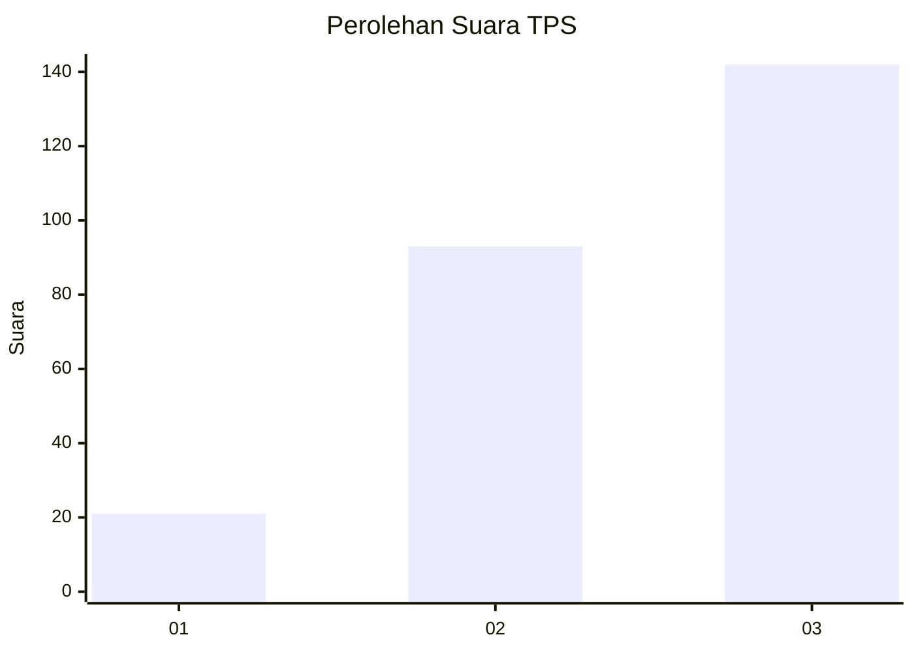
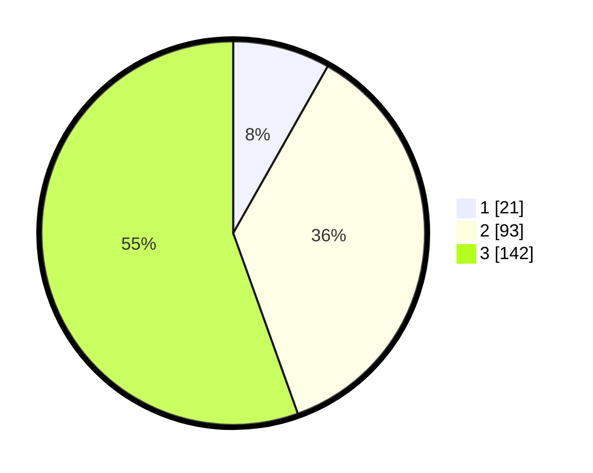

# Hasil

## Grafik

## Tabel

| No. | Nama Paslon    | Suara | Suara (raw) | Persentase |
|:--- |:-------------- | -----:| -----------:| ----------:|
| 1   | ANIES MUHAIMIN | 21    | [21][p-1]   | 8,20       |
| 2   | PRABOWO GIBRAN | 93    | [93][p-2]   | 36,33      |
| 3   | GANJAR MAHFUD  | 142   | [142][p-3]  | 55,47      |

[p-1]: https://github.com/gigit-pemilu/pemilu-2024-33-jawa-tengah/blob/main/pilpres/hitung-suara/sub/33-jawa-tengah/sub/09-boyolali/sub/02-ampel/sub/2003-banyuanyar/sub/004-tps/sub/paslon-1.txt
[p-2]: https://github.com/gigit-pemilu/pemilu-2024-33-jawa-tengah/blob/main/pilpres/hitung-suara/sub/33-jawa-tengah/sub/09-boyolali/sub/02-ampel/sub/2003-banyuanyar/sub/004-tps/sub/paslon-2.txt
[p-3]: https://github.com/gigit-pemilu/pemilu-2024-33-jawa-tengah/blob/main/pilpres/hitung-suara/sub/33-jawa-tengah/sub/09-boyolali/sub/02-ampel/sub/2003-banyuanyar/sub/004-tps/sub/paslon-3.txt

## Foto C Plano

https://sirekap-obj-formc.kpu.go.id/e1d6/pemilu/ppwp/33/09/02/20/03/3309022003004-20240215-000612--45ce4f2b-e3e5-4315-8225-9759bbaf5d48.jpg

https://sirekap-obj-formc.kpu.go.id/e1d6/pemilu/ppwp/33/09/02/20/03/3309022003004-20240215-000707--6ad6aa3b-fd09-4896-bab1-acae1c346eda.jpg

https://sirekap-obj-formc.kpu.go.id/e1d6/pemilu/ppwp/33/09/02/20/03/3309022003004-20240215-000602--77029ed8-f024-4526-80af-e412a1125048.jpg

## Metadata

| Key        | Value               |
| ---------- | ------------------- |
| Time Stamp | 2024-02-15 21:01:18 |

