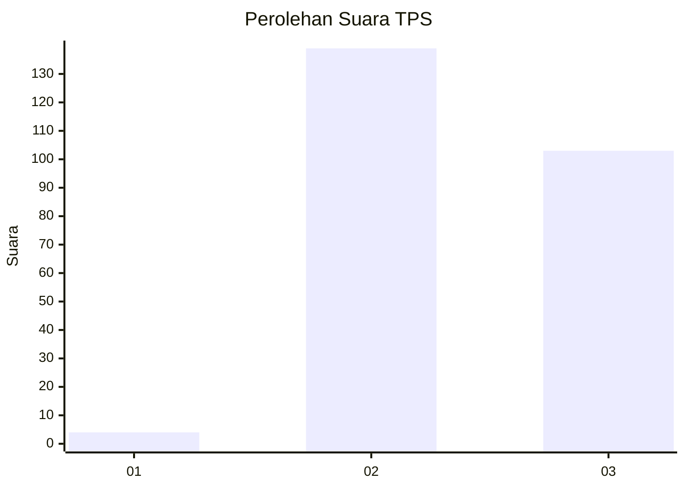
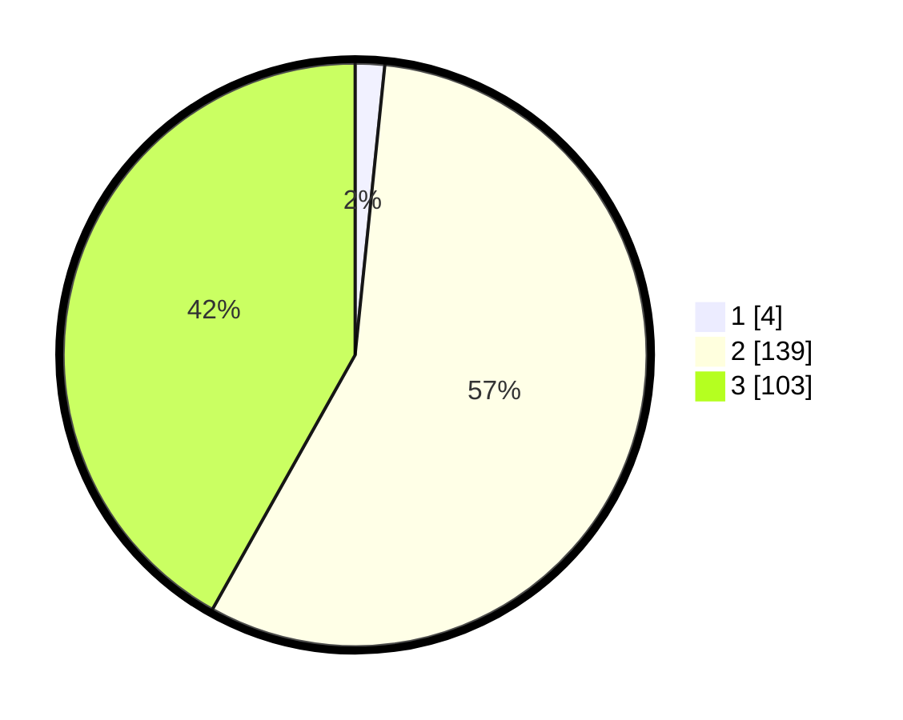

# Hasil

## Grafik

## Tabel

| No. | Nama Paslon    | Suara | Suara (raw) | Persentase |
|:--- |:-------------- | -----:| -----------:| ----------:|
| 1   | ANIES MUHAIMIN | 4     | [4][p-1]    | 1,63       |
| 2   | PRABOWO GIBRAN | 139   | [139][p-2]  | 56,50      |
| 3   | GANJAR MAHFUD  | 103   | [103][p-3]  | 41,87      |

[p-1]: https://github.com/gigit-pemilu/pemilu-2024/blob/main/pilpres/hitung-suara/sub/33-jawa-tengah/sub/09-boyolali/sub/02-ampel/sub/2005-ngargosari/sub/011-tps/sub/paslon-1.txt
[p-2]: https://github.com/gigit-pemilu/pemilu-2024/blob/main/pilpres/hitung-suara/sub/33-jawa-tengah/sub/09-boyolali/sub/02-ampel/sub/2005-ngargosari/sub/011-tps/sub/paslon-2.txt
[p-3]: https://github.com/gigit-pemilu/pemilu-2024/blob/main/pilpres/hitung-suara/sub/33-jawa-tengah/sub/09-boyolali/sub/02-ampel/sub/2005-ngargosari/sub/011-tps/sub/paslon-3.txt

## Foto C Plano

https://sirekap-obj-formc.kpu.go.id/0eea/pemilu/ppwp/33/09/02/20/05/3309022005011-20240214-222355--dfdb688d-32d1-4bdf-8ebd-4ceedf7b1b47.jpg

https://sirekap-obj-formc.kpu.go.id/0eea/pemilu/ppwp/33/09/02/20/05/3309022005011-20240214-211405--55be441b-93a1-42ea-b0aa-f9fce76747f0.jpg

https://sirekap-obj-formc.kpu.go.id/0eea/pemilu/ppwp/33/09/02/20/05/3309022005011-20240214-211602--6ed4bc94-7de0-48f2-8a3b-5fc61e06d13a.jpg

## Metadata

| Key        | Value               |
| ---------- | ------------------- |
| Time Stamp | 2024-02-15 21:01:18 |

