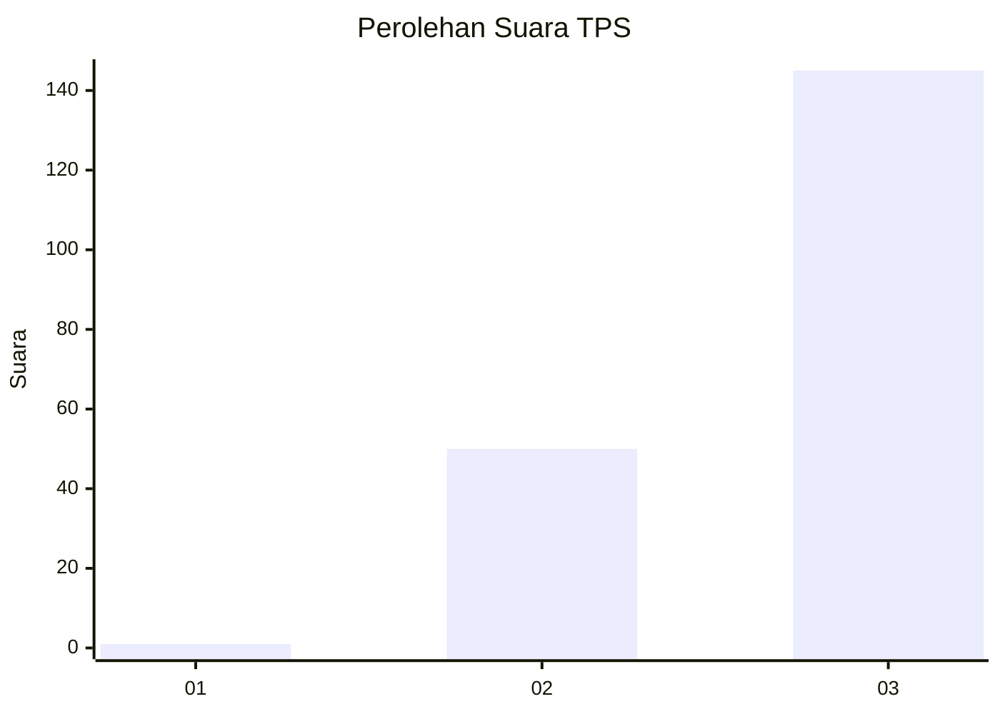
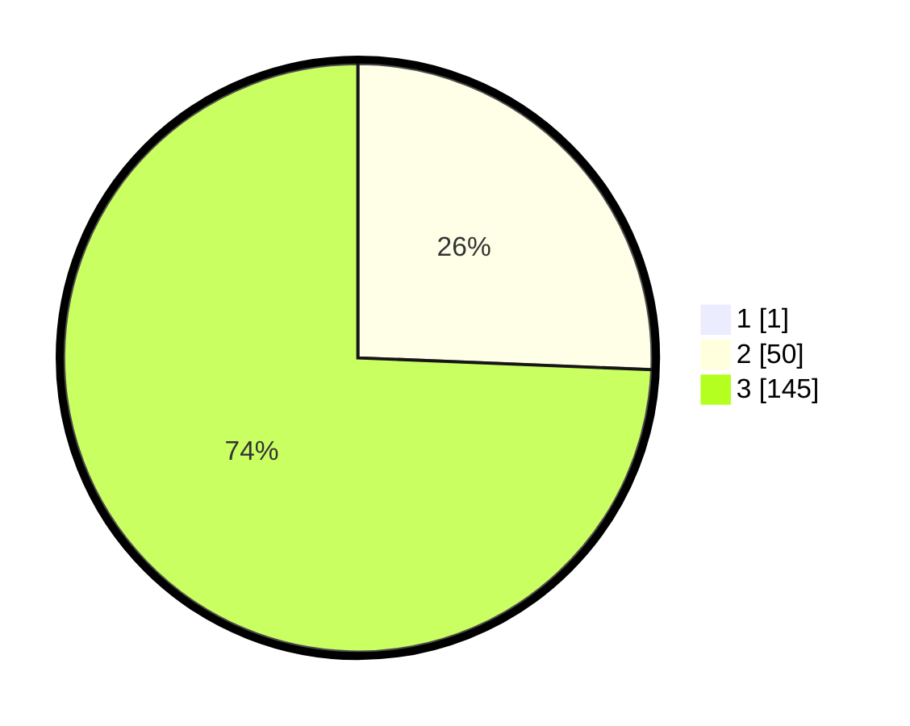

# Hasil

## Grafik

## Tabel

| No. | Nama Paslon    | Suara | Suara (raw) | Persentase |
|:--- |:-------------- | -----:| -----------:| ----------:|
| 1   | ANIES MUHAIMIN | 1     | [1][p-1]    | 0,51       |
| 2   | PRABOWO GIBRAN | 50    | [50][p-2]   | 25,51      |
| 3   | GANJAR MAHFUD  | 145   | [145][p-3]  | 73,98      |

[p-1]: https://github.com/gigit-pemilu/pemilu-2024/blob/main/pilpres/hitung-suara/sub/33-jawa-tengah/sub/09-boyolali/sub/02-ampel/sub/2006-selodoko/sub/010-tps/sub/paslon-1.txt
[p-2]: https://github.com/gigit-pemilu/pemilu-2024/blob/main/pilpres/hitung-suara/sub/33-jawa-tengah/sub/09-boyolali/sub/02-ampel/sub/2006-selodoko/sub/010-tps/sub/paslon-2.txt
[p-3]: https://github.com/gigit-pemilu/pemilu-2024/blob/main/pilpres/hitung-suara/sub/33-jawa-tengah/sub/09-boyolali/sub/02-ampel/sub/2006-selodoko/sub/010-tps/sub/paslon-3.txt

## Foto C Plano

https://sirekap-obj-formc.kpu.go.id/9e25/pemilu/ppwp/33/09/02/20/06/3309022006010-20240214-234451--6509b6d1-e9af-4cb8-bea4-0b2419e32c7e.jpg

https://sirekap-obj-formc.kpu.go.id/9e25/pemilu/ppwp/33/09/02/20/06/3309022006010-20240214-234505--84163602-4653-49c3-bfc0-6b7f94efbae8.jpg

https://sirekap-obj-formc.kpu.go.id/9e25/pemilu/ppwp/33/09/02/20/06/3309022006010-20240214-234721--6e8ddbfe-0841-4eb4-ad6c-22f892461725.jpg

## Metadata

| Key        | Value               |
| ---------- | ------------------- |
| Time Stamp | 2024-02-15 21:30:27 |

