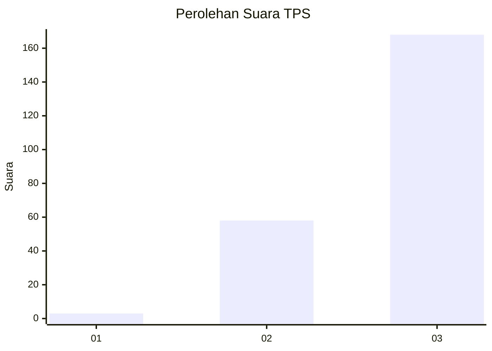
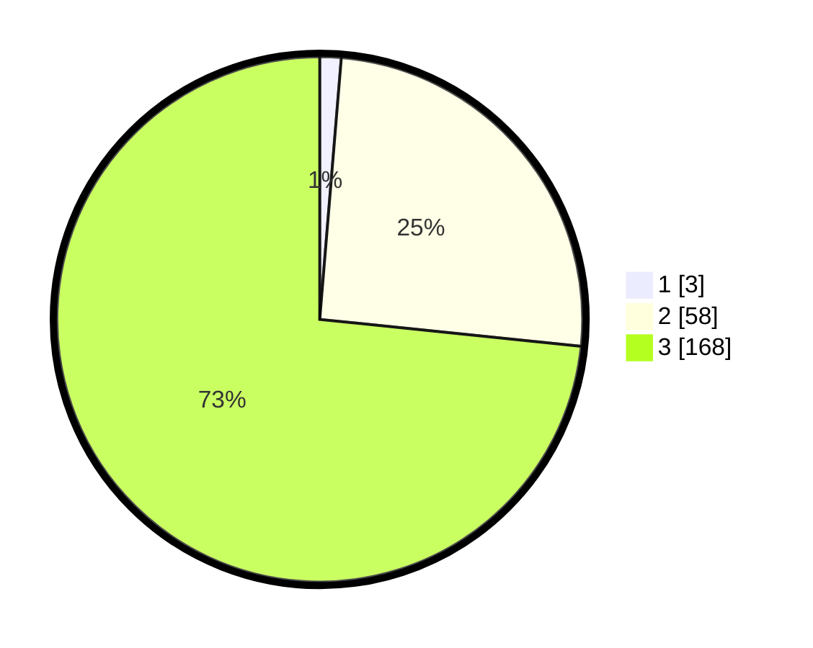

# Hasil

## Grafik

## Tabel

| No. | Nama Paslon    | Suara | Suara (raw) | Persentase |
|:--- |:-------------- | -----:| -----------:| ----------:|
| 1   | ANIES MUHAIMIN | 3     | [3][p-1]    | 1,31       |
| 2   | PRABOWO GIBRAN | 58    | [58][p-2]   | 25,33      |
| 3   | GANJAR MAHFUD  | 168   | [168][p-3]  | 73,36      |

[p-1]: https://github.com/gigit-pemilu/pemilu-2024-33-jawa-tengah/blob/main/pilpres/hitung-suara/sub/33-jawa-tengah/sub/09-boyolali/sub/02-ampel/sub/2006-selodoko/sub/012-tps/sub/paslon-1.txt
[p-2]: https://github.com/gigit-pemilu/pemilu-2024-33-jawa-tengah/blob/main/pilpres/hitung-suara/sub/33-jawa-tengah/sub/09-boyolali/sub/02-ampel/sub/2006-selodoko/sub/012-tps/sub/paslon-2.txt
[p-3]: https://github.com/gigit-pemilu/pemilu-2024-33-jawa-tengah/blob/main/pilpres/hitung-suara/sub/33-jawa-tengah/sub/09-boyolali/sub/02-ampel/sub/2006-selodoko/sub/012-tps/sub/paslon-3.txt

## Foto C Plano

https://sirekap-obj-formc.kpu.go.id/1d31/pemilu/ppwp/33/09/02/20/06/3309022006012-20240215-011916--5fbe02a8-ed8a-4640-b008-3b8bde4047f2.jpg

https://sirekap-obj-formc.kpu.go.id/1d31/pemilu/ppwp/33/09/02/20/06/3309022006012-20240215-012115--fae7d328-b9cd-4089-a130-7f1cc4e00a58.jpg

https://sirekap-obj-formc.kpu.go.id/1d31/pemilu/ppwp/33/09/02/20/06/3309022006012-20240215-012306--c129edc1-dced-406a-95f9-aa9ae468b1b2.jpg

## Metadata

| Key        | Value               |
| ---------- | ------------------- |
| Time Stamp | 2024-02-15 21:01:18 |

