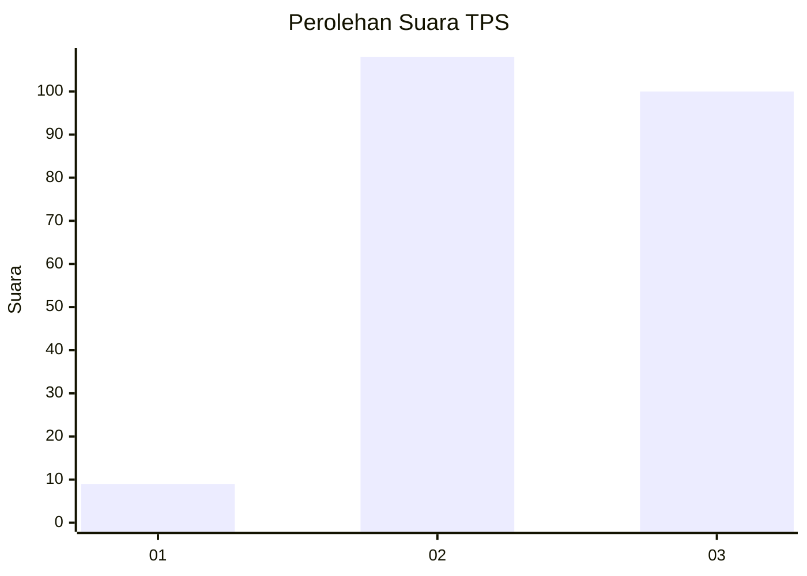
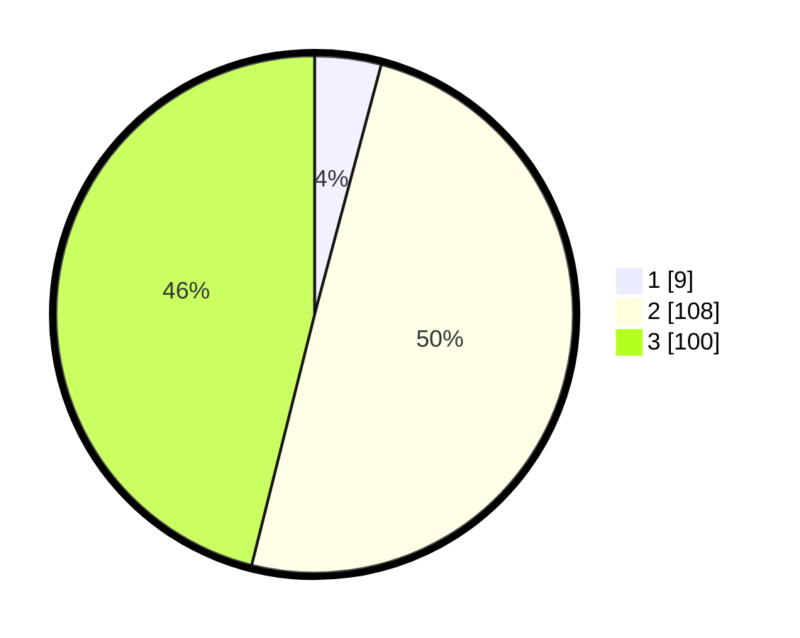

# Hasil

## Grafik

## Tabel

| No. | Nama Paslon    | Suara | Suara (raw) | Persentase |
|:--- |:-------------- | -----:| -----------:| ----------:|
| 1   | ANIES MUHAIMIN | 9     | [9][p-1]    | 4,15       |
| 2   | PRABOWO GIBRAN | 108   | [108][p-2]  | 49,77      |
| 3   | GANJAR MAHFUD  | 100   | [100][p-3]  | 46,08      |

[p-1]: https://github.com/gigit-pemilu/pemilu-2024/blob/main/pilpres/hitung-suara/sub/33-jawa-tengah/sub/09-boyolali/sub/02-ampel/sub/2009-gondangslamet/sub/001-tps/sub/paslon-1.txt
[p-2]: https://github.com/gigit-pemilu/pemilu-2024/blob/main/pilpres/hitung-suara/sub/33-jawa-tengah/sub/09-boyolali/sub/02-ampel/sub/2009-gondangslamet/sub/001-tps/sub/paslon-2.txt
[p-3]: https://github.com/gigit-pemilu/pemilu-2024/blob/main/pilpres/hitung-suara/sub/33-jawa-tengah/sub/09-boyolali/sub/02-ampel/sub/2009-gondangslamet/sub/001-tps/sub/paslon-3.txt

## Foto C Plano

https://sirekap-obj-formc.kpu.go.id/e703/pemilu/ppwp/33/09/02/20/09/3309022009001-20240214-220819--7ca04c7d-9338-41ac-88f4-a935658bd91e.jpg

https://sirekap-obj-formc.kpu.go.id/e703/pemilu/ppwp/33/09/02/20/09/3309022009001-20240214-220847--112f4d58-a86d-4467-912b-80e30d72e0b9.jpg

https://sirekap-obj-formc.kpu.go.id/e703/pemilu/ppwp/33/09/02/20/09/3309022009001-20240214-220914--de193cca-8e0c-43ec-8b71-86a06f07bae4.jpg

## Metadata

| Key        | Value               |
| ---------- | ------------------- |
| Time Stamp | 2024-02-15 21:01:18 |

